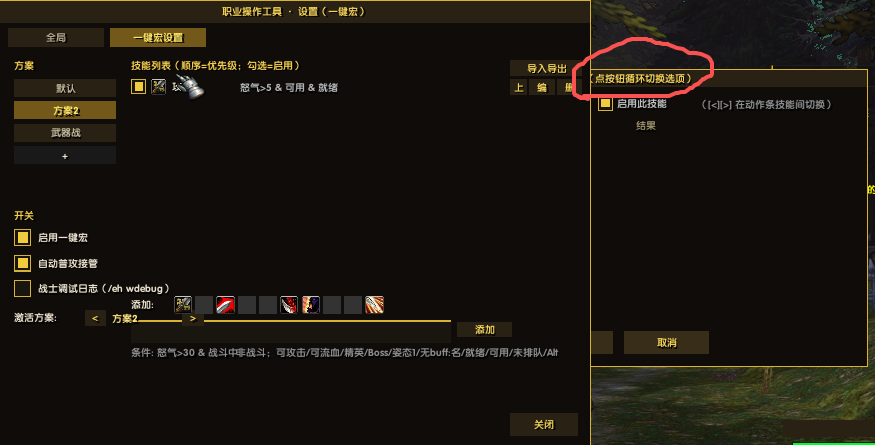
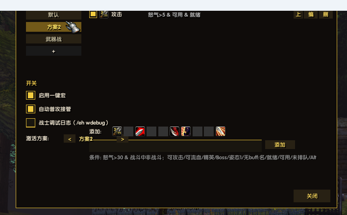
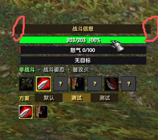
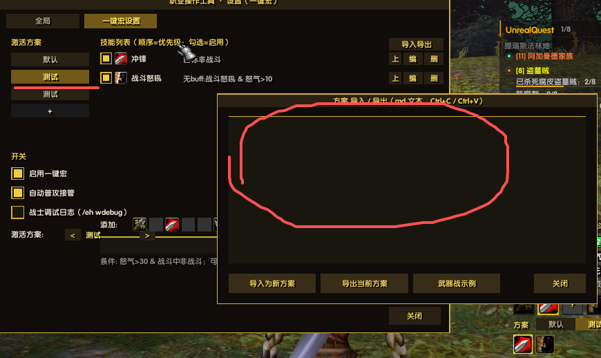

# EVAL_HELP —— 职业操作工具（通用一键宏 · 条件规则引擎驱动）

EmberVeil（1.12.1 / Lua 5.1）职业操作辅助插件：
- **通用一键宏**：宏正文 `/run EVAL_GO()`，条件规则引擎驱动——技能/条件/方案全部可配，不限职业（初始内置战士技能白名单，其他职业按同构方式扩展技能表即可）
- **配置窗口**：小地图左侧金色 EH 图标 或 `/eh cfg`（日志开关/一键开关/阈值滑条，含使用帮助）
- **战斗信息UI**：`/eh ui` 血/能量/目标条 + 技能图标行，标题栏拖动，滚轮缩放；**方案切换行**（点击按钮切激活方案，金色=当前；Shift+按宏 / `/eh go next` 同样可切）+ **方案技能列表行**（当前方案技能图标：亮金描边=条件当前满足，半暗=不满足，灰+停=已停用；悬停 tooltip 显示触发条件明细，点击图标直接开编辑窗）
- **状态信息UI**：`/eh st` Cat 式角色状态变量实时总览（EVAL_HELP_STATE 全部字段）+ **最近释放日志**（每次出手：技能/目标/触发原因/条件逐项判定明细 √×，最近 3 条）
- **状态日志**：`/eh` 输出玩家血量/能量/百分比/战斗状态/目标等一行日志（聊天 + 日志文件）

> 📌 **项目状态**：插件持续优化中……欢迎各位测试并提供宝贵的意见！
> 🐞 **问题反馈 / 建议**：<https://gitee.com/xeval/emberveil_eval_help.git>（Issues）
> 🤖 本插件使用 **DeepSeek Harness AI** 辅助开发，欢迎加入一起开发（见文末「参与开发」）。

## 界面预览

| 配置窗口（一键宏设置） | 技能编辑窗 |
|---|---|
|  |  |

| 战斗信息UI | 方案导入/导出 |
|---|---|
|  |  |

## 快速上手

1. 把技能拖上动作条：攻击 / 战斗姿态 / 冲锋 / 压制 / 断筋 / 撕裂 / 战斗怒吼 / 血性狂暴 / 猛击 / 英勇打击
2. 游戏内输入 `/eh go rescan` 让插件识别槽位（`/eh go` 查看识别结果）
3. 新建宏，正文一行 `/run EVAL_GO()`，拖到按键上连按
4. 小地图旁点金色 EH 图标调阈值；`/eh wdebug` 后聊天框显示每次按键的决策原因
5. 猛击需**按住 Alt** 再按宏键（本客户端无挥击计时 API，用 Alt 代替出手时机）

## 安装

```
Interface/AddOns/
└── EVAL_HELP/
    ├── EVAL_HELP.toc    ← 目录规则：Folder/Folder.toc
    ├── EVAL_HELP.lua
    └── README.md
```

## 命令一览

| 操作 | 效果 |
|---|---|
| `/eh` 或 `/evalhelp` | 立即输出一次状态到聊天框 |
| `/eh log` | 开关「写日志文件」（UELog，默认开） |
| `/eh auto` | 开关「进出战斗时自动输出」（默认关） |
| `/eh ui` | 开关战斗信息UI（血/能量/目标条 + 状态行 + 技能图标行） |
| `/eh st` | 开关状态信息UI（Cat 状态变量实时值总览） |
| `/eh go` | 一键宏：技能槽识别结果 + 冷却就绪总览（`/eh war` 旧命令组仍兼容） |
| `/eh go rescan` | 重扫动作条（技能拖上条后执行一次） |
| `/eh wdebug` 或 `/eh debug` | 调试日志开关（每次按键的决策原因：跳过原因/触发 trace） |
| `/eh cfg` 或小地图旁 EH 图标 | 打开配置窗口（日志开关/一键开关/阈值滑条） |
| `/eh help` | 查看命令 |
| 宏 `/run EVAL_HELP()` | 状态日志函数入口 |
| 宏 `/run EVAL_GO()` 或 `/run EVAL_GO(0)` | 一键宏入口（0 或不传 = 当前激活方案） |
| 宏 `/run EVAL_GO(2)` 或 `/run EVAL_GO2()` | 方案函数式调用：直触方案2（序号 1-4 或方案名 `EVAL_GO("武器战")`），不切激活——不同方案绑不同按键 |

## 战斗信息UI（/eh ui）

- 血条（绿→红渐变 + 数值百分比）、能量条（怒气红/法力蓝/能量黄/集中橙）、目标条；
- 状态行：战斗中/非战斗 · 姿态 · 普攻开关；
- 技能图标行：攻击/冲锋/压制/战斗怒吼/断筋/撕裂/血性狂暴，亮=就绪或已激活，冷却中显示秒数；
- **按住标题栏拖动**换位置（坐标存 SavedVariables，重登恢复）；滚轮缩放 0.5~1.6（整帧重建，
  本客户端 SetScale 有命中区漂移 quirk）；
- OnUpdate 每 0.15s 刷新，窗口隐藏时不刷新。

## 配置窗口（/eh cfg，UI 参考 UnrealQuest 设置面板，Tab 分页）

- 深底金边窗口，标题栏拖动（位置记忆），右下「关闭」按钮；
- **Tab「全局」**（非职业相关）：日志（写日志文件/进出战斗自动输出）、界面（战斗信息UI/状态信息UI 开关）、帮助（上手提示）；
- **Tab「一键宏设置」**（配置窗 560×420）：**多方案技能编辑器**——左侧方案栏（最多 4 个方案，[+] 新建，点击切换）+ 全局开关（**启用一键宏**/自动普攻/调试日志）+ **激活方案下拉选择器**（点按展开全部方案；与方案栏/战斗信息UI方案行/Shift+按宏 全联动）；右侧技能规则列表（顺序=优先级，勾选=技能开关，[上]调序 [编]打开技能编辑窗 [删]移除）+ 列表右上 **[添加技能]** 按钮（直接打开编辑窗新增——技能下拉选择、条件逐行配置、保存即入列表；1.20.0 起替代底部图标选择器+输入框，界面更简洁）；
- **技能编辑窗**（[编] 或点图标打开）：**全部选择器都是下拉**（1.19.0：技能名/条件类型/比较符/姿态号/buff·debuff 技能名——点按即展开全列表，点选即用；下拉面板已泛化为全局件 EVAL_DD_OPEN）+ 启用勾选；**条件逐行独立配置**——每行 = [关系][条件类型][参数设置][结果预览][删]；关系列点按切换 `&`/`|`（首行固定「当」）；条件类型点按循环 23 种（数值/布尔/姿态/buff/debuff/就绪/可用/未排队）；参数随类型变化：数值型=比较符循环+[-][+]步进，布尔/标志型=是/否循环，姿态型=是/非+姿态号，光环型=技能名循环；[+ 添加条件] 加行（最多 8 条）；底部实时预览条件串，[保存] 写回方案；
- **条件语法**：`怒气>30 & 战斗中 | 非战斗`，`&` 组内全过、`|` 组间任一；支持 怒气/目标血/自身血/能量%/进战+比较符、战斗中/非战斗/可攻击/可流血/精英/Boss/目标战斗中/普攻/Alt/Shift/Ctrl、姿态N/非姿态N、无buff:名/有buff:名/无debuff:名/有debuff:名、就绪/可用/未排队、`!` 前缀取反；
- **方案命令兜底**：`/eh go list` / `/eh go add 技能 条件` / `/eh go del N` / `/eh go newprof 名` / `/eh go prof N`；
- **方案重命名**：侧栏方案按钮**右键** → 弹出**重命名窗口**（输入框 + 金色回声行实时显示输入内容——输入框不渲染也能看见打的字；回车/确定生效，Esc/取消关闭）；命令 `/eh go rename 新名`（改当前激活方案）；
- **方案删除**：方案按钮右侧 [删]（**二次确认**：5 秒内再点一次，红色高亮提示）；命令 `/eh go delprof N`（缺省删当前激活）；至少保留一个方案；删除后激活序号自动收敛；
- **方案导入/导出（md 文本）**：`/eh go io` 或一键宏设置 Tab [导入导出]——窗口含保底预览区（EditBox 不渲染也可见）+ 配置文件路径提示（无法复制时：方案自动存盘于 `%LOCALAPPDATA%\Azeroth\Saved\Account\<账号>\SavedVariables\EVAL_HELP.lua`，小退后最新，记事本打开复制）；导出=当前方案转 md 文本并全选（Ctrl+C 存 .md 分享）；导入=粘贴整段方案文本点「导入为新方案」（满 4 个则替换当前）；[武器战示例] 一键填入内置示例（同 `example/zs_wq.md`）；技能名前 `!` = 停用；
- **初始方案文件**：`example/zs_wq.md` 武器战 7 技能方案 + 条件词表；
- 滑条拖动实时生效并自动存档；Tab 选择也会记忆（cfg.cfgTab）。

## 角色状态表 EVAL_HELP_STATE（参考 Cat 全局变量设计）

每次按键宏入口 / UI 心跳 / 目标切换事件时刷新一次，宏只读变量不调 API：

| 字段 | 含义（Cat 对应） |
|---|---|
| hp/hpMax/hpPct | 玩家血量 |
| power/powerMax/powerPct/powerType | 能量（0法力 1怒气 2集中 3能量） |
| inCombat / combatTime | 战斗状态 / 进战秒数（MPInCombat/MPInCombatTime） |
| formIndex / form | 当前姿态 |
| alt / shift / ctrl | 修饰键 |
| autoAttack | 普攻开关（MPAutoAttack） |
| hasTarget / targetName / tLevel | 目标基础 |
| tHp / tHpMax / tHpPct | 目标血量 |
| canAttack | 目标可攻击=存在+未死+UnitCanAttack |
| canBleed | 可流血（MPTargetBleed：元素/机械排除+黑白名单） |
| tCreatureType / tClassification | 生物类型 / 分级 |
| isBoss / isElite | Boss / 精英（MPIsBossTarget） |
| class / race / level | 职业 / 种族 / 等级 |

可流血名单可运行时扩充：`/run EVAL_BLEED_BLACKLIST["怪名"]=true`（或 WHITELIST 强制可流血）。
其他职业一键宏直接 `EVAL_HELP_UPDATE_STATE()` 后读 `EVAL_HELP_STATE` 字段即可复用。

## 配置化技能释放规则引擎（EVAL_RULE_RUN）

每个技能 = 一条规则：`{ skill="技能名", when={...条件...}, why="日志原因" }`，按顺序评估，第一条全过的出手。

| 条件 | 含义 | 状态来源 |
|---|---|---|
| combat=true/false | 战斗中/非战斗 | inCombat |
| combatTime={">",3} | 进战秒数 | combatTime |
| power={">",30} / powerPct | 怒气/能量值、% | power/powerPct |
| hpPct={"<",50} | 自身血% | hpPct |
| tHpPct={">",10} | 目标血% | tHpPct |
| canAttack=true | 释放对象：敌对可攻击 | canAttack |
| canBleed=true | 目标可流血 | canBleed |
| isBoss / isElite | 目标分级 | isBoss/isElite |
| tInCombat | 目标战斗中 | tInCombat |
| form=1 / formNot=1 | 姿态 | formIndex |
| alt/shift/ctrl=true | 修饰键 | alt/shift/ctrl |
| autoAttack | 普攻开关 | autoAttack |
| hasBuff/noBuff="战斗怒吼" | 自身 buff 有无 | playerBuffs |
| hasDebuff/noDebuff="断筋" | 目标 debuff 有无 | targetDebuffs |
| ready=true | 冷却就绪（技能侧） | GetActionCooldown |
| usable=true | 可用·压制类（技能侧） | IsUsableAction |
| notQueued=true | 未排进下次普攻 | IsCurrentAction |

宏里也能直接用：`/run EVAL_RULE_RUN({ {skill="压制", when={usable=true}} })`
做不了的条件：目标施法中打断（客户端无 UnitCastingInfo）、距离、挥击计时。

## 一键宏（/run EVAL_GO()）

需先把技能拖上动作条：攻击 / 战斗姿态 / 冲锋 / 压制 / 断筋 / 撕裂 / 战斗怒吼 / 血性狂暴 / 猛击 / 英勇打击。
每次按键只做一个动作：目标→姿态/冲锋→普攻→压制→怒吼→断筋→撕裂→血性狂暴→猛击(按住Alt)→英勇打击。
出手动作写日志文件；`/eh wdebug` 后聊天框显示每个技能跳过的原因，方便调阈值。

## 开发要点（参考 OneJudge / EmberveilQoL / Cat）

1. SavedVariables 等 VARIABLES_LOADED 后再读；OnEvent 事件名在第 1/2 参或全局 event 三种兼容；
2. 判断函数返回 true/false/nil（不是 1/nil），宽松真值判断；
3. 插件不能调 Protected 函数（CastSpellByName 等），施法走 UseAction(动作条格子)；
4. UI 构件：纹理填充条代替 StatusBar；字体 FZLBJW→FRIZQT→ARIALN 回退；SetScale 有 quirk，缩放走重建；
5. 拖动坐标保存要除以 GetEffectiveScale；EnableMouseWheel 全程 pcall；
6. UnrealQuest ClientAPI 实测补充：纯色纹理用 Interface\Buttons\WHITE8X8 + SetVertexColor；
   **不用 Slider 控件**（自绘 track Frame + thumb Button + RegisterForDrag）；
   拖动配方含 warm-up 两步（StartMoving→StopMovingOrSizing→StartMoving）；
   小地图按钮 parent 用 UIParent 而非 Minimap，锚链 Minimap→MinimapCluster→UIParent；
   按钮要 RegisterForClicks("LeftButtonUp")；悬停高亮用 OnEnter/OnLeave 改边框色；
7. **拖拽手柄必须是 Button**（CreateFrame("Frame") 的 OnDragStart 在本客户端不触发——标题栏拖不动的根因），
   抬高用 SetFrameLevel(+10)，**不能用 strata**（记录在案的失败做法）；
   拖动开始时 SetMovable(true) + warm-up 两步，松手 StopMovingOrSizing。

日志文件：`%LOCALAPPDATA%\Azeroth\Saved\Logs`
配置存盘：`%LOCALAPPDATA%\Azeroth\Saved\Account\<你的账号>\SavedVariables\EVAL_HELP.lua`（小退/重载时写入）

## 异常自救（遇到问题先看这里）

1. **先 `/reload`**：技能不识别、界面异常、刚更新过插件文件——绝大多数情况重载即恢复（配置已存盘不会丢）；
2. 技能换了位置/新拖上动作条 → `/eh go rescan` 重扫；
3. 开了调试看决策过程 → `/eh debug`（每个技能为什么放/为什么不放，逐条件 √×）；
4. 仍未解决 → 到 <https://gitee.com/xeval/emberveil_eval_help.git> 提 Issue（附 `/eh st` 状态截图 + 日志文件更有助于定位）。

## 参与开发（欢迎加入！）

- 仓库：<https://gitee.com/xeval/emberveil_eval_help.git>（`git clone` 后把 `EVAL_HELP/` 软链或复制到 `Interface/AddOns/` 即可开发调试）；
- **开发指南**：见 `DEVELOPMENT.md`（架构地图 / 本客户端实测 UI 配方 / 规则引擎与方案数据结构 / 提交前必跑的语法检查）；
- **AI 协作记忆**：`CLAUDE.md` 是本项目的 AI 开发记忆体（DeepSeek Harness / Claude Code 等 AI 助手读它即可快速进入上下文）；
- 开发流程约定：每次改动递增版本号（lua 头注释 + `local VERSION` + toc 三处同步），改完跑 `node luacheck.js` 全量语法解析；
- 扩展新职业：技能白名单 `WAR_SKILLS` 目前内置战士 10 技能，其他职业按同构方式加技能表即可（规则引擎/方案/UI 全部职业无关）；
- 本插件由 **DeepSeek Harness AI** 辅助开发——也欢迎你带着 AI 一起来。

## 致谢

- UI 实测配方参考：UnrealQuest（ClientAPI.lua）；状态变量设计参考：Cat（TurtleWoW）；最初参考：OneJudge。
- 感谢每一位测试与反馈的玩家。