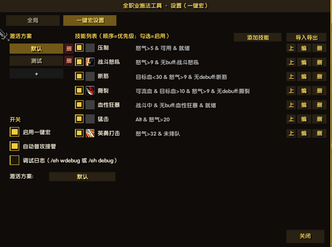
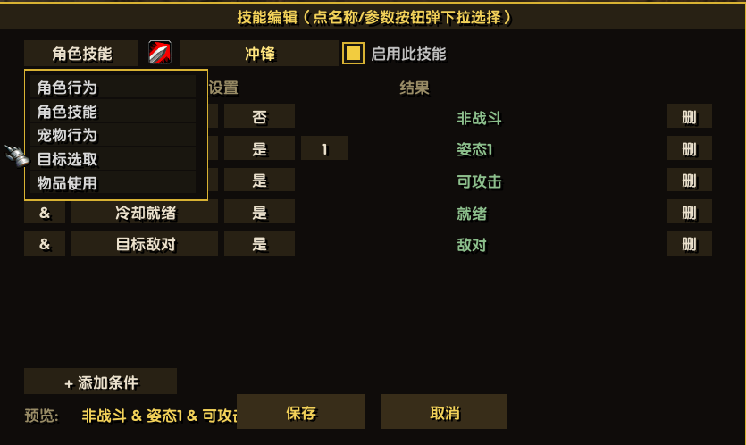
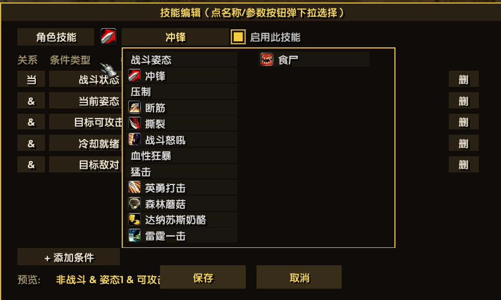
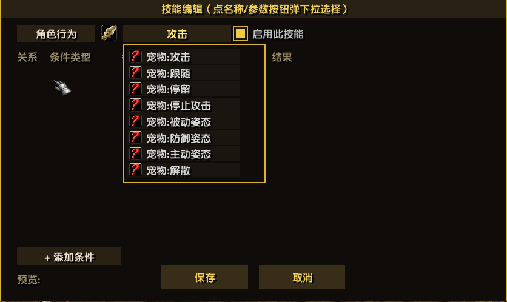
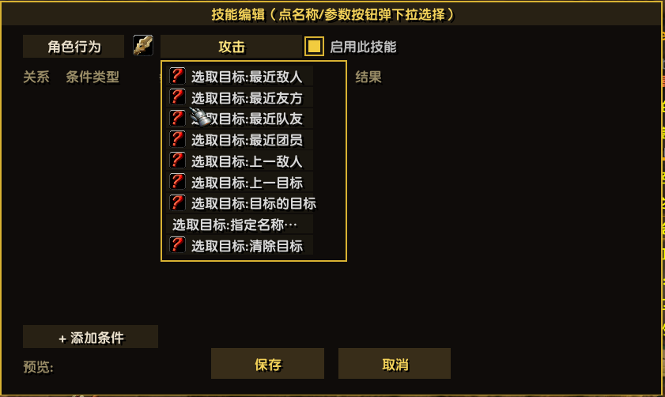
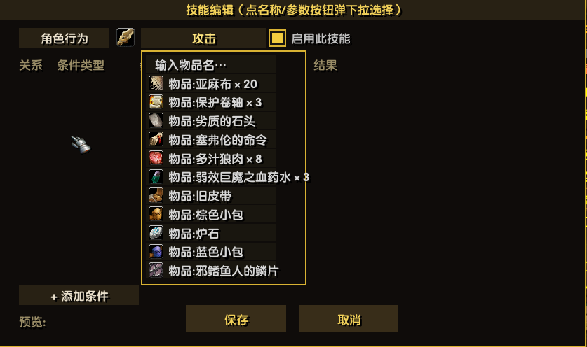
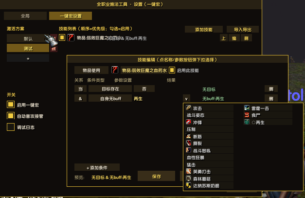
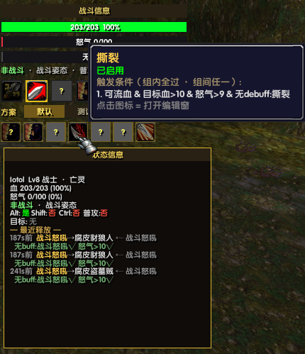

# EvalHelp —— 全职业施法工具

> 🌍 Languages: **中文** · [English](README_en.md) · [Русский](README_ru.md)（游戏内语言：配置窗右上角国旗切换）

> EmberVeil（1.12.1 / Lua 5.1）**全职业施法辅助插件**：宏正文一行 `/run EVAL_GO()`，规则引擎驱动——**技能五分类**（角色行为/角色技能/宠物行为/目标选取/物品使用）× **28 种条件**（分组下拉）× 多方案绑定按键，全部可视化配置，不限职业。

| 模块 | 入口 | 一览 |
| :-- | :-- | :-- |
| 🗡️ **通用一键宏** | 宏 `/run EVAL_GO()` | 技能五分类：角色行为（攻击/姿态切换）/技能/宠物指令/目标选取/物品使用；方案技能数不限（列表可滚动）；多方案 ≤12 各绑按键直触 |
| ⚙️ **配置窗口** | 小地图 EH 图标 · `/eh cfg` | 方案/技能/条件全可视化编辑，文本导入导出分享 |
| 📊 **战斗信息UI** | `/eh ui` | 血/能量/目标条 + 方案切换行 + 技能图标行（亮金=条件满足，点开编辑） |
| 🔍 **状态信息UI** | `/eh st` | 状态变量实时总览 + 最近释放条件逐项判定 √× |
| 📝 **状态日志** | `/eh` | 聊天框 + 日志文件双写 |

> 📌 持续优化中，欢迎测试反馈！　🐞 [问题反馈 / 建议](https://gitee.com/xeval/emberveil_eval_help.git)（Issues）　🤖 DeepSeek Harness AI 辅助开发（见文末「参与开发」）

## 更新日志

| 版本 | 主题 | 一句话亮点 |
| :-- | :-- | :-- |
| **1.52.0** | 📏 自动攻击距离检测 | 自动射击/魔杖超程（IsActionInRange=0）自动降档近战普攻，贴脸猎人不再空挥弓 |
| **1.51.0** | 🎯 射击状态条件 | 新条件 自动射击/魔杖射击（是/否切换）；顺带修复 ! 取反对全部布尔条件失效的老 bug |
| **1.50.0** | 🏹 自动攻击 | 「自动普攻接管」改名「自动攻击」+ 优先级：自动射击>射击(魔杖)>近战普攻，不可用自动降档，带悬停说明 |
| **1.49.3** | 🚑 取消施法修复 | SpellStopCasting 本客户端 Protected 插件直调无效 → 改 RunScript 聊天脚本同路径执行 |
| **1.49.2** | 🔍 残留审计 | 接管泛化（猎人自动射击生效）+ 怒气/姿态日志动态化 + T_RANGE 重复定义删除 + 残留文件清理 |
| **1.49.1** | ▶️ 空条件直放 | 技能不配条件=无条件直接执行（旧行为：空条件技能永远不触发） |
| **1.49.0** | 🎯 选敌前置删除 | 按宏不再先抢选最近敌人——与「选取目标:最近友方」类规则打架；选敌全交给规则 |
| **1.48.0** | 🧹 白名单清零 | 技能下拉/参数下拉纯动作条扫描——法师不再看到战士技能；新装默认方案改空（案例模版起手） |
| **1.47.0** | 🏹 角色行为扩充 | 新增 取消施法/自动射击/射击；姿态支持序号（姿态:2）；修普攻状态与接管开关耦合 |
| **1.46.0** | 🧩 图标带合一 | 战斗UI 两行图标合并为一行（方案下方，8格/行超过自动换行≤16格）；修重扫后图标全 ? 的表引用 bug |
| **1.45.1** | 🔧 开关对齐 | 配置窗勾选框与文字改为共中心线锚定（旧写法方框视觉偏低） |
| **1.45.0** | 🎯 方案驱动显示 | 战斗UI技能图标行/重扫核对/状态总览全部以激活方案技能为准——旧版固定战士技能清单废弃，真·全职业 |
| **1.44.1** | 🛟 宏入口兜底 | 引擎未加载完整时 EVAL_GO 不再弹 nil 红框，改聊天框给出 /reload 与插件启用排查指引 |
| **1.44.0** | 📋 案例模版 | 导入弹窗新增「案例模版」选单：按职业分组点选直接导入（武器战模版首发）；修导入上限残留+condTrim 漏桥 |
| **1.43.0** | ⚔️ 姿态切换技能 | 角色行为新增「姿态:X」——姿态栏直切不占动作条（CastShapeshiftForm 不受保护），已激活守门 |
| **1.42.0** | 📚 方案上限12 | 方案数 4→12：配置窗紧凑排列+战斗UI切换行12窄格+EVAL_GO1~12 全套直触 |
| **1.41.2** | 🌉 漏桥终审 | 静态分析器 split_audit.js 扫出拆分 6 处漏桥全补，审计 CLEAN |
| **1.41.1** | 🚑 EVAL_GO热修 | Engine 裸 cfg 引用（直取形式漏网）致按宏崩溃，改全局直读 |
| **1.41.0** | 🎬 自身施法三条件 | 施法中支持任意施法（空参数）+ 自身读条进行/剩余秒数；修 1.39.0 拆分漏桥 |
| **1.40.0** | 🔮 目标施法状态 | 条件「目标施法中/读条已进行/读条剩余」——聊天文本事件驱动+读条时长自学习 |
| **1.39.0** | 🧱 模块化重构 | 单文件 4758 行拆成 Core/Engine/UI 三模块，跨模块全局桥导出 |
| **1.38.1** | 📊 读条进度条 | 战斗信息UI 目标条下方新增施法读条（进度+剩余秒；状态UI已有施法行） |
| **1.38.0** | 🎬 施法中条件 | SPELLCAST_* 事件驱动读条跟踪，「施法中:X」防读条截断 |
| **1.37.0** | 📏 距离分档+射程条件 | 目标距离分档显示（近战/冲锋距/远程外）+ 条件「范围内:X」IsActionInRange |
| **1.36.4** | 🚑 免疫开关热修 | immBtn 误嵌 sDrop 调用内导致刷新 nil 报错，已归位（i18n 分支） |
| **1.36.3** | 🔘 免疫开关 | 「目标免疫技能」参数区加 免疫/未免疫 切换按钮（i18n 分支） |
| **1.36.2** | 📏 预览归位 | 编辑窗预览挪到「+添加条件」右侧同行，不再压保存/取消按钮（i18n 分支） |
| **1.36.1** | 🧬 免疫条件类型 | 条件「免疫:技能/未免疫:技能」读学习表，免疫行为可编程（i18n 分支） |
| **1.36.0** | 🛡️ 免疫学习器 | 免疫文本事件自动学习（技能@怪名），同名怪不再尝试该技能（i18n 分支） |
| **1.35.2** | 🧹 编辑窗瘦身 | 条件参数 [v] 箭头全取消——参数文字本身就是按钮（i18n 分支） |
| **1.35.1** | 🛡️ 免疫探针 | /eh go probe immune 抓免疫事件原型（i18n 分支） |
| **1.35.0** | 🌐 国际化 P1 | 编辑窗/导入导出/弹窗/提示全翻译，28 条件名入包，三语 README（i18n 分支） |
| **1.34.1** | 📐 宽语言自适应 | 英/俄窗口加宽 560→700，右侧按钮列右锚定，长文不再重叠（i18n 分支） |
| **1.34.0** | 🌍 国际化 P0 | 中/英/俄三语骨架+配置窗国旗选择器，UI 文案走语言包（i18n 分支） |
| **1.33.4** | 🧽 上限残留清除 | /eh go add 的 8 技能上限漏网已删；README 简介场景全面刷新 |
| **1.33.3** | 🚑 滚动热修 | 1.33.0 ROWS 作用域报错热修（改用行池实长） |

> 📜 各版本详细说明见 **[CHANGELOG.md](CHANGELOG.md)**；更早历史见 git 提交记录。

## 💡 实用场景案例

> **Buff 职业一键自动给周围特定职业补特定 Buff** —— 牧师团本外挨个补韧、小德全团拍爪子、法师逐个上智力，从此一个宏键搞定，不用手点队友、不用记谁还没补。

```
# 方案: 一键补韧（牧师示例——配置窗 [导入导出] 直接粘贴即用）
- 真言术:韧 | 非战斗 & 选取目标:最近友方 & 目标职业:战士/盗贼/猎人
```

| 要点 | 说明 |
| :-- | :-- |
| 🎹 **按键节奏** | 连按即可——第一下「选取目标:最近友方」立即把目标切到身边队友（副作用条件），第二下状态已刷新、职业匹配 → 出手补韧 |
| 🧩 **条件组合** | `目标职业` 多选=或关系，想补哪几个职业勾几个；`非战斗` 防止战斗中误切目标 |
| 🎯 **指定 MT 变体** | `真言术:韧 | 非战斗 & 选取目标:指定名称:主坦名字`（v1.29.0：名称下拉给最近 5 个目标，也可 ✎ 自定义输入） |
| 🔄 **换目标** | 「最近友方」按距离选人，站着不动会一直补同一位——挪两步换个最近目标即可轮着补 |

> **猎人/术士一键指挥宝宝**（v1.29.0+ 特殊技能「宠物指令」，不占动作条）：
> ```
> # 方案: 宠物助手
> - 宠物:攻击 | 战斗中 & 可攻击
> - 宠物:被动姿态 | 非战斗
> - 宠物:跟随 | 非战斗
> ```
> 进战宝宝自动咬、脱战自动收——8 种指令（攻击/跟随/停留/停止攻击/三姿态/解散）详见 [CHANGELOG](CHANGELOG.md)。

> **一键补给 / 换装**（v1.32.0+ 特殊技能「物品使用」——编辑窗二级下拉实时扫描背包，带图标和数量点选）：
> ```
> # 方案: 一键补给
> - 物品:弱效巨魔之血药水 | 无buff:再生     ← 身上没有「再生」就喝一瓶
> - 物品:烤鹌鹑 | 无buff:进食充分           ← 没有「进食充分」就吃一口
> ```
> 药品/食物给的 buff（再生、进食充分…）在条件「自身无buff」下拉里直接点选：○=当前激活 / ◇=见过一次永久记住（跨会话）。
> 换装同理：`物品:夜幕 | 非战斗`——UseContainerItem 对装备=自动穿上（BoE 未绑定会先弹确认），一键换武器/饰品。

## 界面预览

**配置窗口 · 全局页**（`/eh cfg` 或小地图旁 EH 图标）：日志/界面开关 + 内置帮助说明


**配置窗口 · 一键宏设置页**：左侧方案栏（多方案 ≤4，点选切换/右键改名）+ 技能列表（顺序=优先级，勾选=启用，条件一屏尽览）+ [添加技能] / [导入导出]



**技能编辑窗**（点 [编] 或技能图标打开）：条件逐行独立配置——条件类型/参数全部下拉选择（28 种条件类型，按 自身/目标/光环/技能 分组），关系列切 &（组内全过）/ |（组间任一），实时预览



**技能二级下拉**：技能行 = [分类▾][具体项▾] 并排双下拉，选项配图标——角色技能（白名单+动作条扫描全技能）：



**宠物行为**：8 种宠物指令（不占动作条直调 Pet API），指令图标经宠物动作条自学习：



**目标选取**：9 种切换方式（最近敌人/上一目标/目标的目标/指定名称/清除目标…），按宏先切目标再出手：



**物品使用**：背包实时扫描（带图标+数量）+ 自定义名称——消耗品直接使用、装备自动穿上：



**药品 buff 全链路**：药品/食物类 buff（如「再生」）可显示（○实时项）、可选择、可匹配——条件「无buff:再生」驱动一键喝药：



**战斗信息UI + 状态信息UI**（`/eh ui` / `/eh st`）：血/能量/目标条 + 方案切换行 + 技能图标行（悬停 tooltip 看触发条件，亮金=条件当前满足，点击图标直开编辑窗）；状态信息窗实时显示全部状态变量 + 最近释放日志（每次出手的技能/目标/条件逐项判定 √×）



## 快速上手

1. 把技能拖上动作条：攻击 / 战斗姿态 / 冲锋 / 压制 / 断筋 / 撕裂 / 战斗怒吼 / 血性狂暴 / 猛击 / 英勇打击
2. 游戏内输入 `/eh go rescan` 让插件识别槽位（`/eh go` 查看识别结果）
3. 新建宏，正文一行 `/run EVAL_GO()`，拖到按键上连按
4. 小地图旁点金色 EH 图标调阈值；`/eh wdebug` 后聊天框显示每次按键的决策原因
5. 猛击需**按住 Alt** 再按宏键（本客户端无挥击计时 API，用 Alt 代替出手时机）

## 安装

**方式一：下载发布包（推荐）** —— [Releases 页面](https://gitee.com/xeval/emberveil_eval_help/releases) 下载最新 `EvalHelp-vX.Y.Z.zip`，解压到 `Interface/AddOns/`（解压后应为 `AddOns/EvalHelp/EvalHelp.toc`）：

```
https://gitee.com/xeval/emberveil_eval_help/releases/download/v1.24.1/EvalHelp-v1.24.1.zip
```

**方式二：克隆源码** —— `git clone git@gitee.com:xeval/emberveil_eval_help.git`，把整个目录放到 `Interface/AddOns/` 并确保目录名为 `EvalHelp`。

目录结构：

```
Interface/AddOns/
└── EvalHelp/
    ├── EvalHelp.toc     ← 目录规则：Folder/Folder.toc
    ├── EvalHelp.lua
    └── README.md
```

## 命令一览

| 操作 | 效果 |
|---|---|
| `/eh` 或 `/evalhelp` | 立即输出一次状态到聊天框 |
| `/eh log` | 开关「写日志文件」（UELog，默认开） |
| `/eh auto` | 开关「进出战斗时自动输出」（默认关） |
| `/eh ui` | 开关战斗信息UI（血/能量/目标条 + 状态行 + 技能图标行） |
| `/eh st` | 开关状态信息UI（Cat 状态变量实时值总览） |
| `/eh go` | 一键宏：技能槽识别结果 + 冷却就绪总览（`/eh war` 旧命令组仍兼容） |
| `/eh go rescan` | 重扫动作条（技能拖上条后执行一次） |
| `/eh wdebug` 或 `/eh debug` | 调试日志开关（每次按键的决策原因：跳过原因/触发 trace） |
| `/eh cfg` 或小地图旁 EH 图标 | 打开配置窗口（日志开关/一键开关/阈值滑条） |
| `/eh help` | 查看命令 |
| 宏 `/run EVAL_HELP()` | 状态日志函数入口 |
| 宏 `/run EVAL_GO()` 或 `/run EVAL_GO(0)` | 一键宏入口（0 或不传 = 当前激活方案） |
| 宏 `/run EVAL_GO(2)` 或 `/run EVAL_GO2()` | 方案函数式调用：直触方案2（序号 1-4 或方案名 `EVAL_GO("武器战")`），不切激活——不同方案绑不同按键 |

## 战斗信息UI（/eh ui）

- 血条（绿→红渐变 + 数值百分比）、能量条（怒气红/法力蓝/能量黄/集中橙）、目标条；
- 状态行：战斗中/非战斗 · 姿态 · 普攻开关；
- 技能图标行：攻击/冲锋/压制/战斗怒吼/断筋/撕裂/血性狂暴，亮=就绪或已激活，冷却中显示秒数；
- **按住标题栏拖动**换位置（坐标存 SavedVariables，重登恢复）；滚轮缩放 0.5~1.6（整帧重建，
  本客户端 SetScale 有命中区漂移 quirk）；
- OnUpdate 每 0.15s 刷新，窗口隐藏时不刷新。

## 配置窗口（/eh cfg，UI 参考 UnrealQuest 设置面板，Tab 分页）

- 深底金边窗口，标题栏拖动（位置记忆），右下「关闭」按钮；
- **Tab「全局」**（非职业相关）：日志（写日志文件/进出战斗自动输出）、界面（战斗信息UI/状态信息UI 开关）、帮助（上手提示）；
- **Tab「一键宏设置」**（配置窗 560×420）：**多方案技能编辑器**——左侧方案栏（最多 4 个方案，[+] 新建，点击切换）+ 全局开关（**启用一键宏**/自动普攻/调试日志）+ **激活方案下拉选择器**（点按展开全部方案；与方案栏/战斗信息UI方案行/Shift+按宏 全联动）；右侧技能规则列表（顺序=优先级，勾选=技能开关，[上]调序 [编]打开技能编辑窗 [删]移除）+ 列表右上 **[添加技能]** 按钮（直接打开编辑窗新增——技能下拉选择、条件逐行配置、保存即入列表；1.20.0 起替代底部图标选择器+输入框，界面更简洁）；
- **技能编辑窗**（[编] 或点图标打开）：**全部选择器都是下拉**（1.19.0：技能名/条件类型/比较符/姿态号/buff·debuff 技能名——点按即展开全列表，点选即用；下拉面板已泛化为全局件 EVAL_DD_OPEN）+ 启用勾选；**条件逐行独立配置**——每行 = [关系][条件类型][参数设置][结果预览][删]；关系列点按切换 `&`/`|`（首行固定「当」）；条件类型下拉 28 种按 自身/目标/光环/技能 分组（数值/布尔/姿态/buff/debuff/就绪/可用/未排队/目标存在/目标关系/目标职业/连击点数…）；参数随类型变化：数值型=比较符下拉+[-][+]步进，布尔/标志型=是/否循环，姿态型=是/非+姿态号下拉，光环型=技能名下拉（追加实时项：◆当前目标debuff / ○当前自身buff——选中即把名称→纹理学习进配置，此后怪给的非动作条 debuff 也能正常匹配；需先选过目标再开下拉才有实时项），选取目标=目标种类下拉（最近敌人/最近友方/最近队友/最近团员/上一敌人/上一目标/目标的目标/指定名称/清除目标；**指定名称**选后弹名称下拉=最近 5 敌名+✎自定义输入弹窗，未设名的规则不触发），目标职业=**多选下拉**（猎人/牧师/法师/术士/萨满/盗贼/战士/德鲁伊，点按切换 √ 不关面板，多选为或关系——比对 UnitClass 英文 token，跨语言稳定）；**选取目标为副作用条件**——求值通过时立即切换当前目标（恒为通过），用于「冲锋前先选最近敌人」这类规则；[+ 添加条件] 加行（最多 8 条）；底部实时预览条件串，[保存] 写回方案；
- **条件语法**：`怒气>30 & 战斗中 | 非战斗`，`&` 组内全过、`|` 组间任一；支持 怒气/目标血/自身血/能量%/进战/连击+比较符（连击=GetComboPoints，盗贼/德鲁伊专用，其他职业恒 0）、战斗中/非战斗/可攻击/可流血/精英/Boss/目标战斗中/普攻/Alt/Shift/Ctrl、姿态N/非姿态N、无buff:名/有buff:名/无debuff:名/有debuff:名（可加层数门槛 `有debuff:破甲攻击>=3` / `无debuff:破甲攻击<3`，1.31.0）、就绪/可用/未排队、选取目标:种类（如 `选取目标:最近敌人`、`选取目标:目标的目标`、`选取目标:指定名称:嗜血者`，种类同编辑窗下拉）、目标职业:名/名（如 `目标职业:战士/法师`，分隔符支持 `/` `、` `，`；因 `|` 是组间或分隔符故不能用它分职业；也认英文 token `tClass:WARRIOR/MAGE`）、`!` 前缀取反；
- **方案命令兜底**：`/eh go list` / `/eh go add 技能 条件` / `/eh go del N` / `/eh go newprof 名` / `/eh go prof N`；
- **方案重命名**：侧栏方案按钮**右键** → 弹出**重命名窗口**（输入框 + 金色回声行实时显示输入内容——输入框不渲染也能看见打的字；回车/确定生效，Esc/取消关闭）；命令 `/eh go rename 新名`（改当前激活方案）；
- **方案删除**：方案按钮右侧 [删]（**二次确认**：5 秒内再点一次，红色高亮提示）；命令 `/eh go delprof N`（缺省删当前激活）；至少保留一个方案；删除后激活序号自动收敛；
- **方案导入/导出（md 文本）**：`/eh go io` 或一键宏设置 Tab [导入导出]——窗口含保底预览区（EditBox 不渲染也可见）+ 配置文件路径提示（无法复制时：方案自动存盘于 `%LOCALAPPDATA%\Azeroth\Saved\Account\<账号>\SavedVariables\EVAL_HELP.lua`，小退后最新，记事本打开复制）；导出=当前方案转 md 文本并全选（Ctrl+C 存 .md 分享）；导入=粘贴整段方案文本点「导入为新方案」（满 12 个则替换当前）；**[案例模版]** 打开按职业分组的模版库点选直导（武器战模版首发）；技能名前 `!` = 停用；
- 滑条拖动实时生效并自动存档；Tab 选择也会记忆（cfg.cfgTab）。

## 角色状态表 EVAL_HELP_STATE（参考 Cat 全局变量设计）

每次按键宏入口 / UI 心跳 / 目标切换事件时刷新一次，宏只读变量不调 API：

| 字段 | 含义（Cat 对应） |
|---|---|
| hp/hpMax/hpPct | 玩家血量 |
| power/powerMax/powerPct/powerType | 能量（0法力 1怒气 2集中 3能量） |
| inCombat / combatTime | 战斗状态 / 进战秒数（MPInCombat/MPInCombatTime） |
| formIndex / form | 当前姿态 |
| alt / shift / ctrl | 修饰键 |
| autoAttack | 普攻开关（MPAutoAttack） |
| hasTarget / targetName / tLevel | 目标基础 |
| tHp / tHpMax / tHpPct | 目标血量 |
| canAttack | 目标可攻击=存在+未死+UnitCanAttack |
| canBleed | 可流血（MPTargetBleed：元素/机械排除+黑白名单） |
| tCreatureType / tClassification | 生物类型 / 分级 |
| isBoss / isElite | Boss / 精英（MPIsBossTarget） |
| class / race / level | 职业 / 种族 / 等级 |

可流血名单可运行时扩充：`/run EVAL_BLEED_BLACKLIST["怪名"]=true`（或 WHITELIST 强制可流血）。
其他职业一键宏直接 `EVAL_HELP_UPDATE_STATE()` 后读 `EVAL_HELP_STATE` 字段即可复用。

## 配置化技能释放规则引擎（EVAL_RULE_RUN）

每个技能 = 一条规则：`{ skill="技能名", when={...条件...}, why="日志原因" }`，按顺序评估，第一条全过的出手。

| 条件 | 含义 | 状态来源 |
|---|---|---|
| combat=true/false | 战斗中/非战斗 | inCombat |
| combatTime={">",3} | 进战秒数 | combatTime |
| power={">",30} / powerPct | 怒气/能量值、% | power/powerPct |
| hpPct={"<",50} | 自身血% | hpPct |
| tHpPct={">",10} | 目标血% | tHpPct |
| canAttack=true | 释放对象：敌对可攻击 | canAttack |
| canBleed=true | 目标可流血 | canBleed |
| isBoss / isElite | 目标分级 | isBoss/isElite |
| tInCombat | 目标战斗中 | tInCombat |
| form=1 / formNot=1 | 姿态 | formIndex |
| alt/shift/ctrl=true | 修饰键 | alt/shift/ctrl |
| autoAttack | 普攻开关 | autoAttack |
| hasBuff/noBuff="战斗怒吼" | 自身 buff 有无 | playerBuffs |
| hasDebuff/noDebuff="断筋" | 目标 debuff 有无 | targetDebuffs |
| ready=true | 冷却就绪（技能侧） | GetActionCooldown |
| usable=true | 可用·压制类（技能侧） | IsUsableAction |
| notQueued=true | 未排进下次普攻 | IsCurrentAction |

宏里也能直接用：`/run EVAL_RULE_RUN({ {skill="压制", when={usable=true}} })`
做不了的条件：目标施法中打断（客户端无 UnitCastingInfo）、距离、挥击计时。

## 一键宏（/run EVAL_GO()）

需先把技能拖上动作条：攻击 / 战斗姿态 / 冲锋 / 压制 / 断筋 / 撕裂 / 战斗怒吼 / 血性狂暴 / 猛击 / 英勇打击。
每次按键只做一个动作：目标→姿态/冲锋→普攻→压制→怒吼→断筋→撕裂→血性狂暴→猛击(按住Alt)→英勇打击。
出手动作写日志文件；`/eh wdebug` 后聊天框显示每个技能跳过的原因，方便调阈值。

## 开发要点（参考 OneJudge / EmberveilQoL / Cat）

1. SavedVariables 等 VARIABLES_LOADED 后再读；OnEvent 事件名在第 1/2 参或全局 event 三种兼容；
2. 判断函数返回 true/false/nil（不是 1/nil），宽松真值判断；
3. 插件不能调 Protected 函数（CastSpellByName 等），施法走 UseAction(动作条格子)；
4. UI 构件：纹理填充条代替 StatusBar；字体 FZLBJW→FRIZQT→ARIALN 回退；SetScale 有 quirk，缩放走重建；
5. 拖动坐标保存要除以 GetEffectiveScale；EnableMouseWheel 全程 pcall；
6. UnrealQuest ClientAPI 实测补充：纯色纹理用 Interface\Buttons\WHITE8X8 + SetVertexColor；
   **不用 Slider 控件**（自绘 track Frame + thumb Button + RegisterForDrag）；
   拖动配方含 warm-up 两步（StartMoving→StopMovingOrSizing→StartMoving）；
   小地图按钮 parent 用 UIParent 而非 Minimap，锚链 Minimap→MinimapCluster→UIParent；
   按钮要 RegisterForClicks("LeftButtonUp")；悬停高亮用 OnEnter/OnLeave 改边框色；
7. **拖拽手柄必须是 Button**（CreateFrame("Frame") 的 OnDragStart 在本客户端不触发——标题栏拖不动的根因），
   抬高用 SetFrameLevel(+10)，**不能用 strata**（记录在案的失败做法）；
   拖动开始时 SetMovable(true) + warm-up 两步，松手 StopMovingOrSizing。

日志文件：`%LOCALAPPDATA%\Azeroth\Saved\Logs`
配置存盘：`%LOCALAPPDATA%\Azeroth\Saved\Account\<你的账号>\SavedVariables\EVAL_HELP.lua`（小退/重载时写入）

## 异常自救（遇到问题先看这里）

1. **先 `/reload`**：技能不识别、界面异常、刚更新过插件文件——绝大多数情况重载即恢复（配置已存盘不会丢）；
2. 技能换了位置/新拖上动作条 → `/eh go rescan` 重扫；
3. 开了调试看决策过程 → `/eh debug`（每个技能为什么放/为什么不放，逐条件 √×）；
4. 仍未解决 → 到 <https://gitee.com/xeval/emberveil_eval_help.git> 提 Issue（附 `/eh st` 状态截图 + 日志文件更有助于定位）。

## 参与开发（欢迎加入！）

- 仓库：<https://gitee.com/xeval/emberveil_eval_help.git>（`git clone` 后把 `EvalHelp/` 软链或复制到 `Interface/AddOns/` 即可开发调试）；
- **开发指南**：见 `DEVELOPMENT.md`（架构地图 / 本客户端实测 UI 配方 / 规则引擎与方案数据结构 / 提交前必跑的语法检查）；
- **AI 协作记忆**：`CLAUDE.md` 是本项目的 AI 开发记忆体（DeepSeek Harness / Claude Code 等 AI 助手读它即可快速进入上下文）；
- 开发流程约定：每次改动递增版本号（lua 头注释 + `local VERSION` + toc 三处同步），改完跑 `node luacheck.js` 全量语法解析；
- 扩展新职业：技能白名单 `WAR_SKILLS` 目前内置战士 10 技能，其他职业按同构方式加技能表即可（规则引擎/方案/UI 全部职业无关）；
- 本插件由 **DeepSeek Harness AI** 辅助开发——也欢迎你带着 AI 一起来。

## 致谢

- UI 实测配方参考：UnrealQuest（ClientAPI.lua）；状态变量设计参考：Cat（TurtleWoW）；最初参考：OneJudge。
- 感谢每一位测试与反馈的玩家。