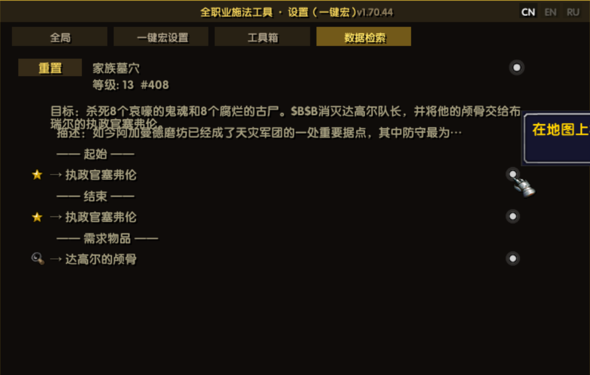
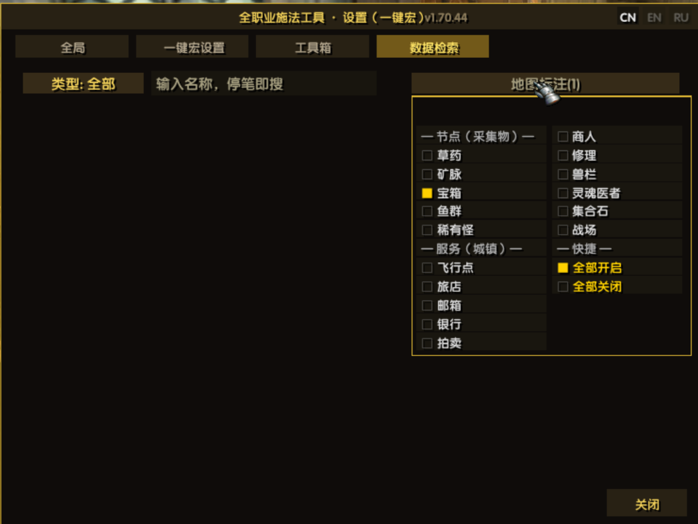
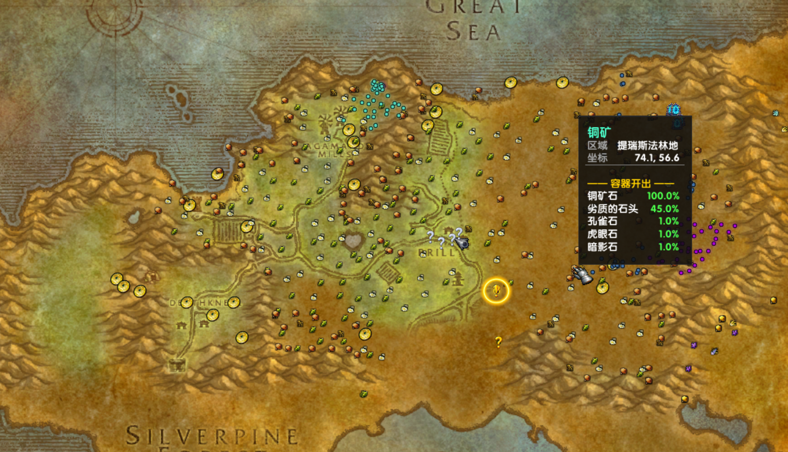

# EvalHelp — Помощник каста для всех классов

> 🌍 Языки: [中文](README.md) · [English](README_en.md) · **Русский**（язык в игре: флаги в правом верхнем углу окна настроек）

> Аддон-помощник каста **для всех классов** EmberVeil (1.12.1 / Lua 5.1): тело макроса — одна строка `/run EVAL_GO()`, движок правил — **пять категорий навыков** (действия персонажа / навыки персонажа / поведение питомца / выбор цели / использование предметов) × **49 типов условий** (выпадающий список с группами; плюс 4 типа условий «кандидат», появляются только в строке выбора участника) × несколько профилей на разных клавишах. Полностью визуальная настройка, без привязки к классу. Плюс три встроенные страницы: **Инструменты** (торговец / общение / задания), **Поиск данных** (задания / предметы / существа·NPC + слой меток на карте мира, нужен UnrealQuest) и **Библиотека иконок** (встроенные иконки макросов клиента: группировка по префиксу, путь при наведении, поиск и постраничный просмотр).
>
> 📌 Текст правил (имена навыков / слова условий / импорт-экспорт) остаётся на языке клиента — переводится только оболочка интерфейса.

| Модуль | Вход | Кратко |
| :-- | :-- | :-- |
| **1.71.22** | 🎯 方案快捷键真正生效：接管 ActionButtonUp 派发 | 四次试错后的最终定案 —— ①CLICK 劫持鼠标、②裸命令名不派发、③**Bindings.xml 本客户端根本不读**（把 ArchiTotem 启用后完整重启，它的 CAST_EARTH_TOTEM 依然不在命令表里；unrealUI 源码注释在 2026-08-19 也记录过同一结论「60 commands were absent from a 225-entry binding table」）→ ④**可行路线 = 命令名用客户端自带的 ACTIONBUTTON<n> + 插件接管全局 ActionButtonDown/Up**（/eh go diag 实测四者 	ype=function、SetOverrideBindingClick=nil）。★零成本：不占宏名额、不占动作格、不抢已有键位、**游戏运行中立即生效**；补回 unrealUI 警告的组合键守卫（按住 Alt/Ctrl/Shift 且该组合另有归属时不吞）；格号分配两轮挑（优先「格空 + 命令没人绑键」的完全无主格）；清理解绑时**把格交还客户端**。变异 6/6 全捕获 |
| 🗡️ **Универсальный макрос** | макрос `/run EVAL_GO()` | Пять категорий навыков: действия персонажа (атака / автовыстрел / выстрел жезлом / отмена каста / смена стойки) / навыки / команды питомца / выбор цели / предметы; число навыков в профиле не ограничено (список прокручивается); до 12 профилей, каждый на своей клавише с прямым запуском |
| ⚙️ **Окно настроек** | значок EH у миникарты · `/eh cfg` | Профили/навыки/условия — полностью визуальное редактирование, текстовый импорт/экспорт для обмена |
| 🧩 **Шаблоны примеров** | окно настроек, вкладка «Макрос», кнопка `[Шаблоны]` внизу | **11 групп, 27 штук**, сгруппированы по классам, **группы в две колонки + перенос строк внутри группы**; клик = мгновенный импорт готового профиля |
| 🧰 **Инструменты** | окно настроек, вкладка 3 | Помощник торговца (авторемонт / продажа серых / покупка и удаление по имени) + группа и общение (автоподтверждение готовности / скрытие уведомлений о согильдийцах / скрытие уведомлений «вход в канал / выход из канала») + автоприём и сдача заданий (удерживайте Shift — пауза) + канал уведомлений о заданиях |
| 🗺️ **Поиск данных** | окно настроек, вкладка 4 | Поиск: задания / предметы / существа·NPC / объекты — сразу по вводу, вложенность без ограничений; **слой меток на карте мира** (16 категорий, перерисовка вместе с картой) и переход к точке из любой строки с координатами (нужен UnrealQuest) |
| 🖼️ **Библиотека иконок** | окно настроек, вкладка 5 | Встроенные иконки макросов клиента сгруппированы по префиксу, при наведении показывается путь, есть поиск и постраничный просмотр |
| 📊 **Боевая панель** | `/eh ui` | Полосы HP/энергии/цели + строка переключения профилей + строка иконок навыков (золото = условия выполнены, клик = редактор) |
| 🔍 **Панель состояния** | `/eh st` | Обзор переменных состояния в реальном времени + разбор условий последнего срабатывания √× |
| 📝 **Журнал состояния** | `/eh` | Двойная запись: чат + файл журнала |

> 📌 Аддон активно развивается — отзывы и тесты приветствуются!　🐞 [Отчёты об ошибках / предложения](https://gitee.com/xeval/emberveil_eval_help.git)（Issues）　🤖 Разработано при поддержке DeepSeek Harness AI (см. «Участие в разработке» в конце)

## Журнал обновлений

| Версия | Тема | Главное одной строкой |
| :-- | :-- | :-- |
| **1.71.21** | 📦 Bindings.xml идёт с аддоном (ноль настройки) + самопроверка при входе | Файл поставляется с аддоном (12 команд, ноль настройки), привязка делается полностью в окне (ноль ручной работы), пользователю нужно лишь **один раз перезапустить клиент**; из документации: для диспетчера нужен обработчик на стороне клиента, который аддоны зарегистрировать не могут (`SetConsoleKey` — задокументированная заглушка) → единственный путь — стартовая таблица команд; самопроверка `EVAL_BIND_XML_STATUS()` честно напоминает о перезапуске; ★утверждения точного префикса, 2/2 мутаций поймано |
| **1.71.20** | 🖨 ЛКМ по надписи «Профили» = показать текущие привязки | Новое действие ЛКМ: печатает «профиль = клавиша» построчно (только печать, привязки не тронуты), либо честно сообщает об их отсутствии; подсказка дополнена 4-й строкой (3 языка); пробник `/eh go bind3` (CLICK без хвоста; пути, требующие перезапуска, отклонены пользователем); ★утверждения идут через настоящие ЛКМ/наведение, 4/4 мутаций поймано |
| **1.71.19** | 🏷 Подсказка у надписи «Профили» + ПКМ снимает ВСЕ привязки | Надпись стала кликабельной: при наведении — три строки подсказки (ЛКМ = активировать / ПКМ = назначить клавишу / ПКМ по надписи = снять все, 3 языка); ПКМ действительно **отвязывает каждую клавишу + чистит таблицу + сохраняет** (возвращает число, идемпотентно); ЛКМ ничего не делает; ★утверждения идут через настоящие ПКМ/наведение, 4/4 мутаций поймано |
| **1.71.18** | 🔧 Диспетчер привязки: вместо CLICK — голые имена команд (клавиша не срабатывала + захват кнопок мыши) | Практика показала: клиент неверно разбирает CLICK — клавиша не срабатывала, а левая/правая кнопки мыши потеряли поворот камеры (но аддон срабатывал — цепочка живая) → теперь **голые имена `EVAL_GO<i>`** (встроенные команды — глобальные функции в camelCase; `EVAL_GO1~12` уже существуют); ★новая проверка «каждое имя должно указывать на реальную глобальную функцию», 3/3 мутаций поймано |
| **1.71.17** | 🖼 Иконка по умолчанию — «Благословение силы» (выбор пользователя) | После того как пользователь сам выбрал золотой кулак `Spell_Holy_BlessingOfStrength` в библиотеке, он попросил **такую же иконку по умолчанию** — теперь она первая в кандидатах автоподбора; ручной выбор по-прежнему важнее всего; ★чистая проверка «благословение важнее гаечного ключа», 2/2 мутаций поймано |
| **1.71.16** | ⌨ Привязка клавиш профилям (ПКМ по профилю → окно привязки, клавиши по группам: клавиатура/мышь/модификаторы) | Сначала проверка (`/eh go bind` доказал, что SetBinding принимает свои имена команд) → **ПКМ по любому профилю** в боевой панели открывает аккуратное окно: **выпадающий список клавиш по группам** (функциональные/цифровые/буквенные/мышь/модификаторы) + подсказка о конфликте; вызов через **CLICK по скрытой кнопке** (нажатие = клиент кликает `EVAL_GO_KEY_i` → выполнить и активировать); при смене клавиши старая освобождается, сохранение сразу; пробник `/eh go bind2`; ★утверждения идут через настоящий ПКМ, 6/6 мутаций поймано |
| **1.71.15** | 🖱 ПКМ в библиотеке иконок = иконка кнопки у миникарты | Автовыбранная иконка не подошла («иконка не та») → пусть выбирает сама: **правый клик** по любой иконке в библиотеке назначает её кнопке у миникарты (сохраняется, есть подсказка), **выбранная вручную всегда важнее** автоподбора; левый клик по-прежнему печатает путь; `/eh go mbicon [reset]` — посмотреть/сбросить; ★утверждения идут через настоящий OnClick правой кнопки, 3/3 мутаций поймано |
| **1.71.14** | 🧹 Вкладка «Общее»: группа «Макрос» прижата к низу (исправление наложения) | После добавления двух подпереключателей в группу «Интерфейс» заголовок группы «Макрос» наложился на «Панель состояния» (скриншот пользователя) → вся группа теперь **привязана снизу вверх от нижнего ряда кнопок**: нижний край ряда антидребезга в 6px над рядом навигации/закрытия, шаг строк прежний; ★утверждения читают позиции **реальных контролов** (нет наложения / привязка к низу / шаг / в пределах окна), 3/3 мутаций поймано |
| **1.71.13** | 🖼 Кнопка у миникарты заменена иконкой + 💬 улучшенная подсказка | Кнопка — одна иконка макроса (выбирается во время работы из таблицы иконок по приоритету имён: гаечный ключ > инженерия > шестерёнка — путь не зашит), 26×26 как ячейка библиотеки иконок, без рамки; если иконку найти не удалось — старый стиль «золотая рамка + EH» (кнопка не остаётся пустой); подсказка теперь описывает три функции (**макрос одной кнопки / ящик инструментов / поиск по базе мира**, 3 языка); добавлен пробник `/eh go bind` (проверка назначения клавиш) |

> 📜 Подробности по каждой версии — в **[CHANGELOG.md](CHANGELOG.md)**; более ранняя история — в записях git.

## 💡 Практические сценарии

> **Класс с баффами: одной клавишей автоматически вешать нужный бафф на нужные классы вокруг** — жрец по очереди раздаёт стойкость вне рейда, друид хлопает лапой по всему рейду, маг раздаёт интеллект — теперь одна клавиша макроса, без ручного тыканья по согруппникам и без запоминания, кто ещё без баффа.

```
# 方案: 一键补韧（пример жреца — в окне настроек [Импорт/Экспорт] просто вставьте и пользуйтесь）
- 真言术:韧 | 非战斗 & 选取目标:最近友方 & 目标职业:战士/盗贼/猎人
```

| Суть | Пояснение |
| :-- | :-- |
| 🎹 **Ритм нажатий** | Просто жмите подряд — первое нажатие «选取目标:最近友方» сразу переключает цель на ближайшего согруппника (условие с побочным эффектом), второе — состояние уже обновлено, класс совпал → стойкость повешена |
| 🧩 **Комбинация условий** | `目标职业` мультивыбор = отношение «ИЛИ» — отметьте классы, которым раздавать; `非战斗` не даёт случайно сменить цель в бою |
| 🎯 **Вариант с заданным MT** | `真言术:韧 | 非战斗 & 选取目标:指定名称:主坦名字`（v1.29.0: выпадающий список имён даёт 5 последних целей, есть и ✎ ручной ввод） |
| 🔄 **Смена цели** | «最近友方» выбирает по дистанции — стоя на месте вы будете баффать одного и того же; шагните в сторону, чтобы ближайшим стал другой, и баффайте по кругу |

> **Охотник/чернокнижник: команды питомцу одной клавишей**（v1.29.0+ специальный навык «команда питомца», не занимает слот панели）:
> ```
> # 方案: 宠物助手
> - 宠物:攻击 | 战斗中 & 可攻击
> - 宠物:被动姿态 | 非战斗
> - 宠物:跟随 | 非战斗
> ```
> В бою питомец сам бросается в атаку, после боя сам возвращается — 8 команд (атака/следовать/стоять/прекратить атаку/три стойки/отпустить) подробно в [CHANGELOG](CHANGELOG.md).

> **Пополнение припасов / смена экипировки одной клавишей**（v1.32.0+ специальный навык «использование предмета» — двухуровневый список в редакторе сканирует сумки в реальном времени, выбор с иконками и количеством）:
> ```
> # 方案: 一键补给
> - 物品:弱效巨魔之血药水 | 无buff:再生     ← нет «再生» на себе — выпить бутылку
> - 物品:烤鹌鹑 | 无buff:进食充分           ← нет «进食充分» — перекусить
> ```
> Баффы от зелий/еды (再生、进食充分…) выбираются прямо в списке условия «нет баффа на себе»: ○ = активен сейчас / ◇ = увиден однажды — запомнен навсегда (между сессиями).
> Смена экипировки аналогично: `物品:夜幕 | 非战斗` — UseContainerItem для экипировки = автоматически надеть (для несвязанного BoE сначала появится подтверждение), смена оружия/тринкетов одной клавишей.

## Предпросмотр интерфейса

**Окно настроек · вкладка «Общие»**（`/eh cfg` или значок EH у миникарты）: переключатели журнала/интерфейса + встроенная справка


**Окно настроек · вкладка «Макрос»**: слева панель профилей (до 12, клик = переключить / правая кнопка = переименовать) + список навыков (порядок = приоритет, галочка = включён, условия видны сразу) + [Добавить навык] / [Импорт/Экспорт]; внизу = три переключателя и кнопки [Шаблоны] / [Поделиться] / [Закрыть]


**Окно шаблонов**（кнопка `[Шаблоны]` внизу вкладки макроса）: 11 групп / 27 готовых профилей, **две колонки по группам + перенос внутри группы**, один клик — и профиль импортирован


**Редактор навыка**（кнопка [Изм.] или клик по иконке навыка）: условия настраиваются построчно — тип условия/параметры только из выпадающих списков (49 типов условий по группам Себя / Цель / Ауры / члены группы·рейда / Навык, плюс 4 типа условий «кандидат», появляющихся только в строке выбора участника), колонка связи переключает & (все внутри группы) / | (любая из групп), превью в реальном времени


**Двухуровневый список навыков · четыре вида** (строка навыка в редакторе = `[категория ▾][пункт ▾]` — два списка рядом, пункты с иконками):

- **Навыки персонажа**: белый список + сканирование всей панели действий
- **Команды питомца**: 8 команд питомца (прямой вызов Pet API, слот панели не нужен), иконки самообучаются по панели питомца
- **Выбор цели**: 9 способов переключения (ближайший враг / предыдущая цель / цель цели / по имени / сброс цели…); макрос сначала переключает цель, затем действует
- **Предметы**: сканирование сумок в реальном времени (иконки + количество) + ручной ввод имени — расходники используются сразу, экипировка надевается автоматически

**Проверки аур (4 типа)**: свой бафф / дебафф цели / бафф цели / свой дебафф (переключатель да/нет, реальные ◆○●▲) — «无buff:再生» запускает выпить зелье, «无目标buff:奥术智慧» — раздачу баффов:

**Боевая панель + панель состояния**（`/eh ui` / `/eh st`）: полосы HP/энергии/цели + строка профилей + строка иконок навыков (наведите — tooltip с условиями срабатывания, золото = условия выполнены прямо сейчас, клик по иконке открывает редактор); панель состояния показывает все переменные в реальном времени + журнал последних срабатываний (навык/цель/поусловный разбор √× для каждого действия)


**Инструменты (вкладка 3)**: помощник торговца (авторемонт экипировки / автопродажа серых предметов / автопокупка и автоудаление заданных предметов) + группа и общение (автоподтверждение готовности / скрытие уведомлений о входе согильдийцев) + автоприём и сдача заданий + канал уведомлений о заданиях (выкл / себе / сказать / группа)


> ⚠️ **Требуется** аддон **UnrealQuest** — все записи на этой странице (задания / предметы / существа / NPC) берутся из его базы. Если он не установлен или отключён, страница покажет только инструкцию, а элементы управления будут скрыты.

**Поиск данных (вкладка 4)**: четыре вида поиска — задания / предметы / существа·NPC / объекты; ввод ищет сразу (первые 10 совпадений); вложенность без ограничений, наведение на строку предмета показывает игровой tooltip

**Поиск данных · подробности и вложенность**: подробности задания / предмета / существа — цели и описание, NPC выдачи и завершения, требуемые предметы; каждая ссылка кликабельна для дальнейшего перехода, у строк с координатами есть значок карты



**Поиск данных · метки на карте**: кнопка «Метки карты (N)» = общий переключатель + выбор категорий (16 категорий: 5 ресурсов + 11 городских услуг, с быстрыми «все включить / все выключить»); отмеченные категории рисуются вместе с картой



**Поиск данных · привязка к карте**: клик по значку карты в конце строки открывает карту мира на нужной зоне; наведение на метку показывает её содержимое (например, таблицу дропа из жилы)



## Быстрый старт

1. Перетащите нужные навыки на панель действий
2. В игре введите `/eh go rescan`, чтобы аддон распознал слоты (`/eh go` — посмотреть результат распознавания)
3. Создайте макрос с телом в одну строку `/run EVAL_GO()`, перетащите на клавишу и жмите
4. Быстрый старт с шаблонов: окно настроек → вкладка «Макрос» → [Импорт/Экспорт] → **[Шаблоны]** — библиотека сгруппирована по классам, клик = импорт готового профиля, дальше подгоните под себя
5. `/eh debug` — в чате показывается причина каждого решения при нажатии, удобно настраивать пороги

## Установка

**Способ 1: скачать релиз (рекомендуется)** — скачайте свежий `EvalHelp-vX.Y.Z.zip` со [страницы Releases](https://gitee.com/xeval/emberveil_eval_help/releases), распакуйте в `Interface/AddOns/` (после распаковки должно получиться `AddOns/EvalHelp/EvalHelp.toc`):

```
https://gitee.com/xeval/emberveil_eval_help/releases/download/v1.24.1/EvalHelp-v1.24.1.zip
```

**Способ 2: клонировать исходники** — `git clone git@gitee.com:xeval/emberveil_eval_help.git`, поместите весь каталог в `Interface/AddOns/` и убедитесь, что каталог называется `EvalHelp`.

Структура каталога:

```
Interface/AddOns/
└── EvalHelp/
    ├── EvalHelp.toc     ← правило каталогов: Folder/Folder.toc
    ├── EvalHelp.lua
    └── README.md
```

## Список команд

| Действие | Эффект |
|---|---|
| `/eh` или `/evalhelp` | Немедленно вывести состояние в чат |
| `/eh log` | Переключить «запись журнала в файл» (UELog, по умолчанию вкл.) |
| `/eh auto` | Переключить «автовывод при входе/выходе из боя» (по умолчанию выкл.) |
| `/eh ui` | Переключить боевую панель (полосы HP/энергии/цели + строка состояния + строка иконок навыков) |
| `/eh st` | Переключить панель состояния (обзор переменных состояния Cat в реальном времени) |
| `/eh go` | Макрос: результат распознавания слотов + обзор готовности перезарядок (старая группа `/eh war` по-прежнему совместима) |
| `/eh go rescan` | Пересканировать панель действий (выполните после перетаскивания навыков на панель) |
| `/eh wdebug` или `/eh debug` | Переключить журнал отладки (причина решения каждого нажатия: причины пропуска / trace срабатывания) |
| `/eh cfg` или значок EH у миникарты | Открыть окно настроек (журнал / главный переключатель / ползунки порогов) |
| `/eh help` | Показать команды |
| макрос `/run EVAL_HELP()` | Вход функции журнала состояния |
| макрос `/run EVAL_GO()` или `/run EVAL_GO(0)` | Вход макроса (0 или без аргумента = текущий активный профиль) |
| макрос `/run EVAL_GO(2)` или `/run EVAL_GO2()` | Функциональный вызов профиля: прямой запуск профиля 2 (номер 1-12 или имя `EVAL_GO("武器战")`), активация не переключается — разные профили на разных клавишах |

## Боевая панель (/eh ui)

- Полоса HP (градиент зелёный→красный + числовой процент), полоса энергии (ярость красная/мана синяя/энергия жёлтая/концентрация оранжевая), полоса цели;
- Строка состояния: в бою/вне боя · стойка · переключатель обычной атаки;
- Строка иконок навыков: динамически следует за активным профилем, яркая = готова или активна, при перезарядке показываются секунды;
- **Перетаскивание за заголовок** для смены позиции (координаты в SavedVariables, восстанавливаются после перезахода); колесо мыши — масштаб 0.5~1.6 (кадр перестраивается целиком,
  у этого клиента SetScale даёт дрейф области нажатия);
- Обновление OnUpdate каждые 0.15 с, при скрытом окне не обновляется.

## Окно настроек (/eh cfg, UI по образцу панели настроек UnrealQuest, вкладки)

- Тёмное окно с золотой рамкой, перетаскивание за заголовок (позиция запоминается), кнопка «Закрыть» справа внизу;
- **Вкладка «Общие»** (не связано с классом): журнал (запись в файл / автовывод при входе-выходе из боя), интерфейс (переключатели боевой панели/панели состояния), помощь (подсказки для старта);
- **Вкладка «Макрос»** (окно 560×420, для широких языков 700): **редактор навыков с несколькими профилями** — слева панель профилей (до 12, [+] создать, клик = переключить) + глобальные переключатели (**Включить макрос** / автоатака / отладка) + **выпадающий выбор активного профиля** (раскрывает все профили; полностью связан с панелью профилей/строкой боевой панели/Shift+клавиша макроса); справа список правил навыков (порядок = приоритет, галочка = переключатель навыка, [вверх] сдвинуть [Изм.] открыть редактор [Уд.] удалить) + кнопка **[Добавить навык]** справа вверху списка (сразу открывает редактор: выбор навыка из списка, построчная настройка условий, сохранение = в список; с 1.20.0 заменила нижний выбор иконок + поле ввода — интерфейс чище);
- **Редактор навыка**（[Изм.] или клик по иконке）: **все селекторы — выпадающие списки** (1.19.0: имя навыка/тип условия/оператор сравнения/номер стойки/имя баффа·дебаффа — клик раскрывает полный список, выбор = готово; панель списка обобщена в глобальный виджет EVAL_DD_OPEN) + галочка включения; **условия настраиваются построчно** — каждая строка = [связь][тип условия][параметры][превью результата][удалить]; колонка связи переключает `&`/`|` (первая строка фиксирована «Если»); список типов условий — 49 типов по группам Себя / Цель / Ауры / члены группы·рейда / Навык + 4 типа условий «кандидат», появляющихся только в строке выбора участника (числовые/булевы/стойка/бафф/дебафф/готово/доступно/не в очереди/цель есть/отношение цели/класс цели/комбо-очки…); параметры зависят от типа: числовые = список операторов + шаг [-][+], булевы/флаги = цикл да/нет, стойка = да/нет + список номеров, ауры = список имён навыков (с живыми пунктами: ◆ дебаффы текущей цели / ○ баффы на себе — выбор обучает имя→текстуру в конфиге, после чего дебаффы мобов вне панели действий тоже сопоставляются; чтобы живые пункты появились, сначала возьмите цель, потом откройте список), выбор цели = список видов цели (ближайший враг/ближайший союзник/ближайший член группы/ближайший член рейда/предыдущий враг/предыдущая цель/цель цели/по имени/сброс цели; **по имени** — после выбора открывается список имён = 5 последних врагов + ✎ ручной ввод, правило без имени не срабатывает), класс цели = **мультивыбор** (охотник/жрец/маг/чернокнижник/шаман/разбойник/воин/друид, клик переключает √ не закрывая панель, мультивыбор = отношение «ИЛИ» — сравнение по английским токенам UnitClass, стабильно между языками); **выбор цели — условие с побочным эффектом** — при успешной оценке немедленно переключает текущую цель (всегда успешно), для правил вида «перед рывком выбрать ближайшего врага»; [+ Добавить условие] добавляет строку (до 8); внизу превью строки условий в реальном времени, [Сохранить] пишет обратно в профиль;
- **Синтаксис условий**: `怒气>30 & 战斗中 | 非战斗`, `&` — все внутри группы, `|` — любая из групп; поддерживаются 怒气/目标血/自身血/能量%/进战/连击+операторы сравнения (连击=GetComboPoints, только разбойник/друид, у остальных всегда 0), 战斗中/非战斗/可攻击/可流血/精英/Boss/目标战斗中/普攻/Alt/Shift/Ctrl, 姿态N/非姿态N, 无buff:名/有buff:名/无debuff:名/有debuff:名（с порогом стаков `有debuff:破甲攻击>=3` / `无debuff:破甲攻击<3`, 1.31.0）, 就绪/可用/未排队, 选取目标:种类（например `选取目标:最近敌人`, `选取目标:目标的目标`, `选取目标:指定名称:嗜血者`, виды как в списке редактора）, 目标职业:名/名（например `目标职业:战士/法师`, разделители `/` `、` `,`; `|` нельзя — это разделитель групп ИЛИ; также принимаются английские токены `tClass:WARRIOR/MAGE`）, префикс `!` — отрицание; текст правил всегда на языке клиента;
- **Запасные команды профилей**: `/eh go list` / `/eh go add 技能 条件` / `/eh go del N` / `/eh go newprof 名` / `/eh go prof N`;
- **Переименование профиля**: **правая кнопка** по кнопке профиля в боковой панели → **окно переименования** (поле ввода + золотая строка-эхо, показывающая ввод в реальном времени — видно, что печатаешь, даже если поле не рендерится; Enter/OK применяет, Esc/отмена закрывает); команда `/eh go rename 新名` (переименовать текущий активный);
- **Удаление профиля**: [Уд.] справа от кнопки профиля (**двойное подтверждение**: повторный клик в течение 5 секунд, красная подсветка-подсказка); команда `/eh go delprof N` (по умолчанию удаляет активный); минимум один профиль сохраняется; после удаления номер активного сходится автоматически;
- **Импорт/экспорт профиля (md-текст)**: `/eh go io` или кнопка [Импорт/Экспорт] во вкладке «Макрос» — окно со страховочной зоной превью (видно, даже если EditBox не рендерится) + подсказка пути конфига (если копирование не работает: профили сохраняются автоматически в `%LOCALAPPDATA%\Azeroth\Saved\Account\<аккаунт>\SavedVariables\EVAL_HELP.lua`, после выхода в меню персонажей — самое свежее, откройте Блокнотом и скопируйте); экспорт = текущий профиль в md-текст с выделением всего (Ctrl+C, сохраните как .md и делитесь); импорт = вставьте весь текст профиля и нажмите «Импорт как новый профиль» (при 12 заполненных заменяет текущий); **[Шаблоны]** открывает библиотеку, сгруппированную по классам, клик = прямой импорт (первый — шаблон оружейного воина); `!` перед именем навыка = отключён;
- Ползунки применяются в реальном времени и сохраняются автоматически; выбранная вкладка тоже запоминается (cfg.cfgTab).

## Таблица состояния персонажа EVAL_HELP_STATE (по образцу глобальных переменных Cat)

Обновляется один раз при входе макроса / тике UI / событии смены цели, макрос только читает переменные, не вызывая API:

| Поле | Значение (соответствие Cat) |
|---|---|
| hp/hpMax/hpPct | HP игрока |
| power/powerMax/powerPct/powerType | Ресурс (0 мана 1 ярость 2 концентрация 3 энергия) |
| inCombat / combatTime | Состояние боя / секунды в бою (MPInCombat/MPInCombatTime) |
| formIndex / form | Текущая стойка |
| alt / shift / ctrl | Модификаторы |
| autoAttack | Переключатель обычной атаки (MPAutoAttack) |
| hasTarget / targetName / tLevel | База цели |
| tHp / tHpMax / tHpPct | HP цели |
| canAttack | Цель атакуема = есть + жива + UnitCanAttack |
| canBleed | Кровоточит (MPTargetBleed: исключение элементалей/механизмов + чёрный/белый списки) |
| tCreatureType / tClassification | Тип существа / ранг |
| isBoss / isElite | Босс / элита (MPIsBossTarget) |
| class / race / level | Класс / раса / уровень |

Списки кровотечения расширяются на лету: `/run EVAL_BLEED_BLACKLIST["怪名"]=true` (или WHITELIST — принудительно кровоточит).
Макросы других классов могут просто вызвать `EVAL_HELP_UPDATE_STATE()` и читать поля `EVAL_HELP_STATE`.

## Настраиваемый движок правил каста (EVAL_RULE_RUN)

Каждый навык = одно правило: `{ skill="技能名", when={...条件...}, why="日志原因" }`, оценка по порядку, срабатывает первое полностью прошедшее.

| Условие | Значение | Источник состояния |
|---|---|---|
| combat=true/false | В бою/вне боя | inCombat |
| combatTime={">",3} | Секунды в бою | combatTime |
| power={">",30} / powerPct | Ярость/энергия, значение и % | power/powerPct |
| hpPct={"<",50} | Своё HP % | hpPct |
| tHpPct={">",10} | HP цели % | tHpPct |
| canAttack=true | Объект каста: враждебная атакуемая цель | canAttack |
| canBleed=true | Цель кровоточит | canBleed |
| isBoss / isElite | Ранг цели | isBoss/isElite |
| tInCombat | Цель в бою | tInCombat |
| form=1 / formNot=1 | Стойка | formIndex |
| alt/shift/ctrl=true | Модификаторы | alt/shift/ctrl |
| autoAttack | Переключатель обычной атаки | autoAttack |
| hasBuff/noBuff="战斗怒吼" | Наличие баффа на себе | playerBuffs |
| hasDebuff/noDebuff="断筋" | Наличие дебаффа на цели | targetDebuffs |
| ready=true | Перезарядка готова (сторона навыка) | GetActionCooldown |
| usable=true | Доступно, типа Подавления (сторона навыка) | IsUsableAction |
| notQueued=true | Не в очереди на следующую обычную атаку | IsCurrentAction |

Можно вызывать прямо из макроса: `/run EVAL_RULE_RUN({ {skill="压制", when={usable=true}} })`
Условия, которые невозможны: прерывание каста цели (в клиенте нет UnitCastingInfo), точная дистанция, таймер замаха.

## Макрос (/run EVAL_GO())

Нужные навыки должны лежать на панели действий (команды питомца/выбор цели/предметы/смена стойки слота не требуют). Каждое нажатие делает одно действие — первое правило активного профиля, чьи условия все прошли; навык без условий выполняется безусловно.
Переключатель «Автоатака» действует по приоритету: автовыстрел > выстрел жезлом > ближний бой, с проверкой дистанции (IsActionInRange): вне дальности автоматически понижается на ступень ниже, в конце — обычная атака с троттлингом 2 с.
Каждое действие пишется в файл журнала; после `/eh debug` в чате видна причина пропуска каждого навыка — удобно настраивать пороги.

## Заметки для разработчиков (по образцу OneJudge / EmberveilQoL / Cat)

1. SavedVariables читать после VARIABLES_LOADED; имя события OnEvent совместимо в трёх видах: 1-й/2-й аргумент или глобаль event;
2. Функции-предикаты возвращают true/false/nil (не 1/nil), проверка истинности нестрогая;
3. Аддон не может вызывать Protected-функции (CastSpellByName и т.п.), каст идёт через UseAction(слот панели);
4. Конструкция UI: полосы из текстур вместо StatusBar; шрифты FZLBJW→FRIZQT→ARIALN с откатом; у SetScale quirk, масштаб = перестройка геометрии;
5. Координаты перетаскивания сохранять с делением на GetEffectiveScale; EnableMouseWheel — всегда через pcall;
6. Дополнения из практики UnrealQuest ClientAPI: одноцветная текстура Interface\Buttons\WHITE8X8 + SetVertexColor;
   **не использовать виджет Slider** (самодельный track Frame + thumb Button + RegisterForDrag);
   рецепт перетаскивания включает прогрев в два шага (StartMoving→StopMovingOrSizing→StartMoving);
   родитель кнопки миникарты — UIParent, не Minimap, цепочка якорей Minimap→MinimapCluster→UIParent;
   кнопкам нужен RegisterForClicks("LeftButtonUp"); подсветка при наведении — OnEnter/OnLeave со сменой цвета рамки;
7. **Ручка перетаскивания обязана быть Button** (OnDragStart у CreateFrame("Frame") в этом клиенте не срабатывает — коренная причина неподвижных заголовков),
   поднимать через SetFrameLevel(+10), **strata нельзя** (задокументированный провальный подход);
   в начале перетаскивания SetMovable(true) + прогрев в два шага, при отпускании StopMovingOrSizing.

Файл журнала: `%LOCALAPPDATA%\Azeroth\Saved\Logs`
Сохранение конфига: `%LOCALAPPDATA%\Azeroth\Saved\Account\<ваш аккаунт>\SavedVariables\EVAL_HELP.lua` (пишется при выходе в меню персонажей/перезагрузке)

## Самопомощь при сбоях (при проблемах смотрите сюда)

1. **Сначала `/reload`**: навыки не распознаются, глючит интерфейс, только что обновили файлы аддона — в большинстве случаев перезагрузка всё чинит (конфиг сохранён и не пропадёт);
2. Навыки сменили позицию / новые перетащены на панель → `/eh go rescan` пересканировать;
3. Включите отладку и смотрите процесс решений → `/eh debug` (почему каждый навык кастуется / не кастуется, поусловно √×);
4. Не решено → заведите Issue на <https://gitee.com/xeval/emberveil_eval_help.git> (скриншот состояния `/eh st` + файл журнала сильно помогают локализации).

## Участие в разработке (добро пожаловать!)

- Репозиторий: <https://gitee.com/xeval/emberveil_eval_help.git> (после `git clone` свяжите или скопируйте `EvalHelp/` в `Interface/AddOns/` — можно разрабатывать и отлаживать);
- **Руководство разработчика**: см. `DEVELOPMENT.md` (карта архитектуры / проверенные на этом клиенте рецепты UI / движок правил и структуры данных профилей / обязательная проверка синтаксиса перед коммитом);
- **Память для ИИ-совместной работы**: `CLAUDE.md` — тело памяти ИИ-разработки этого проекта (DeepSeek Harness / Claude Code и другие ИИ-ассистенты быстро входят в контекст, прочитав его);
- Соглашения процесса: каждое изменение увеличивает номер версии (комментарий в шапке lua + `local VERSION` + toc — три места синхронно), после правок прогонять `node luacheck.js` — полный разбор синтаксиса;
- Расширение на новые классы: никаких белых списков навыков нет — навыки берутся чистым сканированием панели действий, поэтому любой класс работает из коробки: перетащите навыки на панель, пересканируйте и соберите профиль (движок правил/профили/UI полностью класс-независимы);
- Этот аддон разработан при поддержке **DeepSeek Harness AI** — приходите и вы вместе со своим ИИ.

## Благодарности

- Рецепты UI из практики: UnrealQuest (ClientAPI.lua); дизайн переменных состояния: Cat (TurtleWoW); самый первый ориентир: OneJudge.
- Спасибо каждому игроку за тесты и отзывы.
