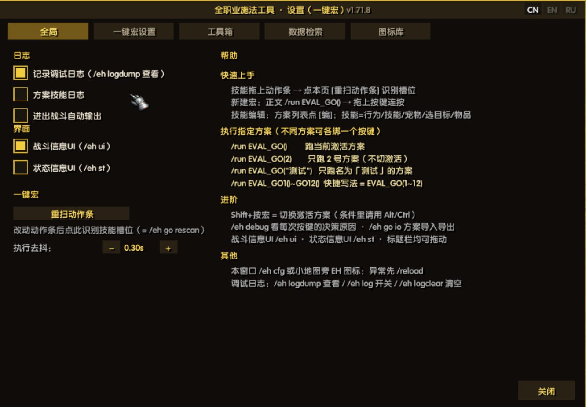
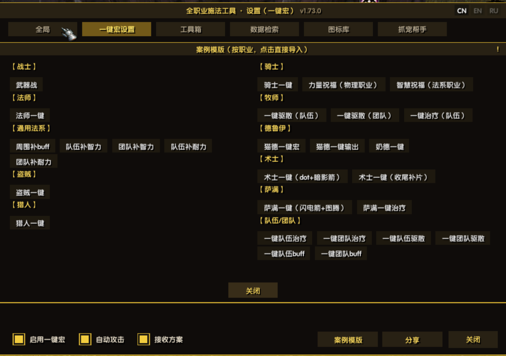
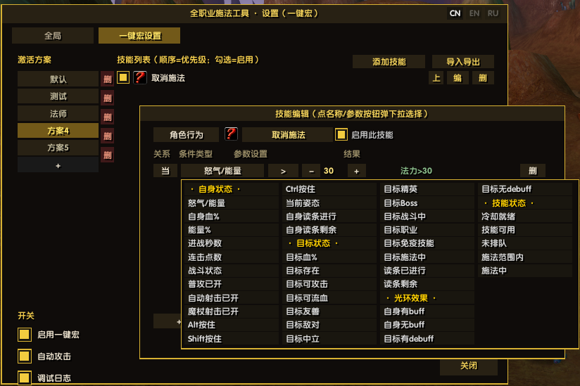
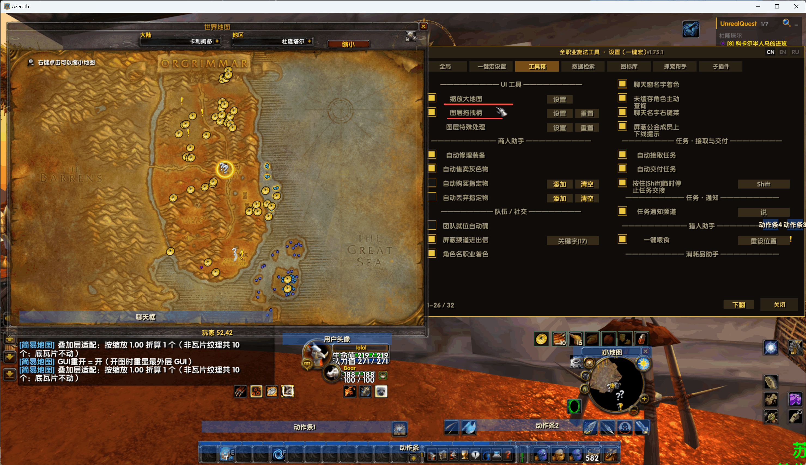
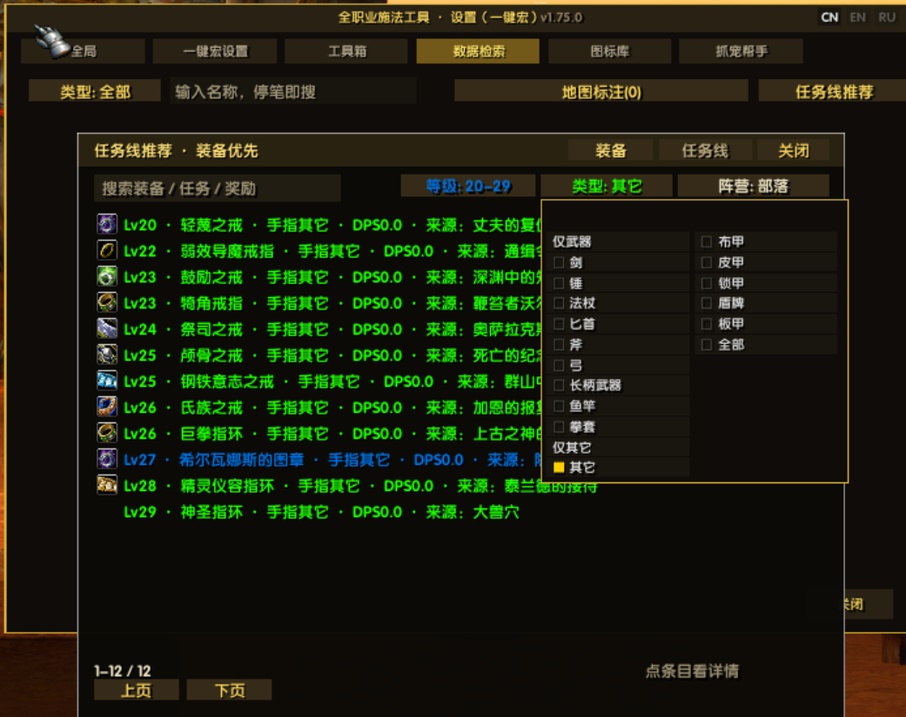
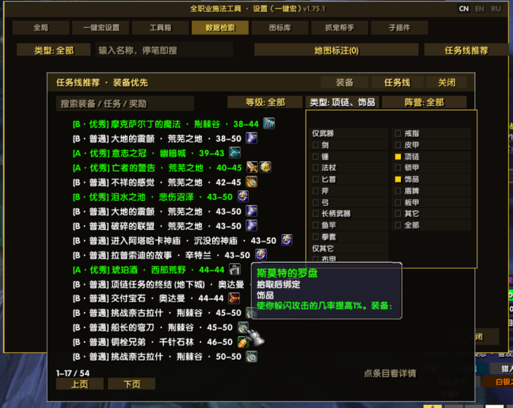

# EvalHelp — Инструмент для всех классов

> 🌍 Языки: [中文](README.md) · [English](README_en.md) · **Русский**（язык в игре: флаги в правом верхнем углу окна настроек）

> Аддон-инструмент **для всех классов** EmberVeil (1.12.1 / Lua 5.1): тело макроса — одна строка `/run EVAL_GO()`, движок правил — **пять категорий навыков** (действия персонажа / навыки персонажа / поведение питомца / выбор цели / использование предметов) × **49 типов условий** (выпадающий список с группами; плюс 4 типа условий «кандидат», появляются только в строке выбора участника) × несколько профилей на разных клавишах. Полностью визуальная настройка, без привязки к классу. Плюс пять встроенных страниц: **Инструменты** (торговец / общение / задания / три помощника / трансляция редких), **Квесты и вещи** (цепочки · снаряжение · четыре вида поиска + слой меток на карте мира, нужен UnrealQuest), **Библиотека иконок** (встроенные иконки макросов клиента: группировка по префиксу, путь при наведении, поиск и постраничный просмотр), **Помощник питомцев** (способности → источник приручения → точки спауна) и **Суб-аддоны** (включение / отключение необязательных суб-аддонов).
>
> 📌 Текст правил (имена навыков / слова условий / импорт-экспорт) остаётся на языке клиента — переводится только оболочка интерфейса.

| Модуль | Вход | Кратко |
| :-- | :-- | :-- |
| 🗡️ **Универсальный макрос** | макрос `/run EVAL_GO()` | Пять категорий навыков: действия персонажа (атака / автовыстрел / выстрел жезлом / отмена каста / смена стойки) / навыки / команды питомца / выбор цели / предметы; число навыков в профиле не ограничено (список прокручивается); до 12 профилей, каждый на своей клавише с прямым запуском |
| ⚙️ **Окно настроек** | значок EH у миникарты · `/eh cfg` | Профили/навыки/условия — полностью визуальное редактирование, текстовый импорт/экспорт; **семь вкладок**: Общие · Макрос · Инструменты · Квесты и вещи · Иконки · Помощник питомцев · Суб-аддоны |
| 📤 **Обмен профилями** | `[Поделиться]` на вкладке макроса / ссылка в чате | посылает частями в гильдию/группу/сказать (с ограничением частоты), получатель жмёт [Импорт]; **ранговая обложка** (`[ранг · имя]` кликабельной ссылкой + окно-подтверждение) · **ранги по очкам** (с 1.74.21: ≥50 очков **и** охват 4+ из 5 групп условий для Божественного · 5 цветов) · **гача титулов** (5×15 · свой титул) · пасхалка «Создатель» · получатель лотерейно отвечает ролевой репликой (ранг титула × ранг трактата) |
| 🧩 **Шаблоны примеров** | окно настроек, вкладка «Макрос», кнопка `[Шаблоны]` внизу | **12 групп, 38 штук**, сгруппированы по классам, **группы в две колонки + перенос строк внутри группы**; клик = мгновенный импорт готового профиля |
| 🧰 **Инструменты** | окно настроек, вкладка 3 | **UI-инструменты** (масштаб карты / ручки перетаскивания / правки слоёв) · помощник торговца (авторемонт / продажа серых / покупка и удаление по имени) · группа и общение (автоподтверждение готовности / скрытие уведомлений о согильдийцах / скрытие уведомлений «вход в канал / выход из канала» (мультивыбор) / окраска имён по классу / меню по правому клику / запрос /who) · задания (автоприём и сдача, Shift — пауза / канал уведомлений) · **три помощника** (кормление питомца / расходники / спешивание) · **трансляция редких** (строка в чат, когда аддон заданий заметил редкого — клик по имени выбирает цель) |
| 🧭 **Квесты и вещи** | окно настроек, вкладка 4 | **Вид цепочек**: цепочка узел за узлом (задание · уровень · награда, у каждого узла лупа); **вид снаряжения**: доступные предметы по уровням (оружие вперёд · мультивыбор видов · заглушка без иконки); **четыре вида поиска**: задания / предметы / существа·NPC / объекты (сразу по вводу, вложенность без ограничений); **слой меток на карте мира** (16 категорий, перерисовка вместе с картой; **лупа справа открывает список категорий**, клик вне закрывает; метки **рисуются и на миникарте**; нужен UnrealQuest) |
| 🖼️ **Библиотека иконок** | окно настроек, вкладка 5 | Встроенные иконки макросов клиента сгруппированы по префиксу, при наведении показывается путь, есть поиск и постраничный просмотр |
| 🐾 **Помощник питомцев** | окно настроек, вкладка 6 | Поиск способностей питомцев (иконка + список рангов) → описание / нужный уровень / **источник приручения** (какой моб, где) → лупа ведёт в «Квесты и вещи» к точкам спауна |
| 🧩 **Суб-аддоны** | окно настроек, вкладка 7 | Включение / отключение необязательных суб-аддонов и вход в их интерфейс (сейчас **отладка слоёв** EH_DebugBox); простая карта и прочее стали модулями инструментов основного аддона |
| 📊 **Боевая панель** | `/eh ui` | Полосы HP/энергии/цели + строка переключения профилей + строка иконок навыков (золото = условия выполнены, клик = редактор) |
| 🔍 **Панель состояния** | `/eh st` | Обзор переменных состояния в реальном времени + разбор условий последнего срабатывания √× |
| 📝 **Журнал состояния** | `/eh` | Двойная запись: чат + файл журнала |

> 📌 Аддон активно развивается — отзывы и тесты приветствуются!　🐞 [Отчёты об ошибках / предложения](https://gitee.com/xeval/emberveil_eval_help.git)（Issues）　🤖 Разработано при поддержке DeepSeek Harness AI (см. «Участие в разработке» в конце)

## 🏁 Вехи (1.52.0 → 1.75.13)

- **🔍 Метки на карте: лупа справа + список категорий + закрытие кликом вне окна** (1.75.13): лупа у правого края карты (текстура взята у аддона заданий, с подтверждением `GetTexture()` и текстовым запасным вариантом) по ЛКМ открывает список категорий с множественным выбором, рядом всегда видно число категорий; ★список закрывается кликом **в любом месте вне него** (новый полноэкранный перехватчик плюс подъём уровня каждого дочернего элемента — подъём родителя **не поднимает детей**, иначе получается чёрный прямоугольник или нерабочие строки); метки **рисуются и на миникарте** (используется собственный рецепт миникарты аддона заданий); ★также: вспышка затемнения карты убрана через `alpha 0 + Hide` (при закрытии не восстанавливается), тестовый каркас полностью удалён (единственный гейт — `node luacheck.js`).
- **🗺️ Исходные значения слоя исследования: только память сессии · очистка при закрытии · перечитывание и пересчёт при каждом открытии** (1.75.5): исходные значения **больше не сохраняются** (старые ключи удаляются, штамп версии не пишется); по требованию пользователя запись **очищается в момент закрытия карты** и **перечитывается с повторным применением масштаба при следующем открытии** — очистка выполняется только после **возврата свёрнутой геометрии к натуральному масштабу и строгой проверки** (иначе свёрнутые значения были бы приняты за исходные = двойное масштабирование); исправлено «**при /reload 0 записей считались завершённым захватом**» (нет подходящих слоёв ⇒ без защёлки, повтор раз в 1 с, затем автодобор); захват больше не перезапускается каждый кадр, масштаб карты не дрожит; исправлено «**текстуры слоя исследования рисуются поверх игрового мира**» (якоря теперь разрешаются в объекты фреймов); новая команда **`/ehm fitnow`** (карта → натуральный масштаб → 2 с → чтение → масштаб → свёртка, с печатью каждого шага) + тихий/подробный режим.
- **🔔 Ретрансляция редких = уведомление + исходные значения слоя исследования с привязкой к карте** (1.75.4): ретрансляция редких переведена на **независимый от гейта выход** (это уведомление, а не журнал, поэтому звучит и при выключенном гейте), добавлены кольцо диагностики `rareProbe`, **самопроверка хука** (переустанавливается при снятии обёртки), совместимость с переименованным входом `Test` и честный подсчёт ошибок колбэка; **исправлено «на некоторых картах слой исследования теряет координаты, и все слои сваливаются влево-вниз»** — исходные значения теперь **разложены по идентичности карты** (одни и те же имена текстур на разных картах — разные прямоугольники), **сбрасываются при смене карты** и считываются заново после стабилизации раскладки, затрагиваются только слои, **используемые текущей картой**, восстановление пишет лишь то, что мы меняли на этой карте, а старые сохранения **сами отбрасывают грязные значения**; новая диагностика только для чтения **`/ehm mapfit dump`**.
- **🎯 Семейство выбора цели + фикс увода цели + осада + данные цепочек** (1.75.3): в редакторе появилось «Выбор цели → **цель игрока**» и условия «Цель — игрок: X», «Цель мертва»; **исправлено «цель скачет между трупом и живым мобом без нажатий»** — добор автоатаки нажимается **только когда цель атакуема** и перенесён **после** таблицы правил (`AttackTarget()` на практике меняет цель), плюс диагностика `/eh go tsel log`; новые условия «**Осаждают меня**», «**10с в бою**» и проба ближнего боя; данные цепочек — **полный сбор** с фильтрами уровня и типа и заглушкой иконки; строки ящика переименованы в «Перетаскивание слоёв» / «Скрытие элементов слоёв».
- **🎯 Условие «отслеживание» + общий чат-гейт + завершение масштаба карты** (1.75.2): ① новое условие «**Тип отслеживания**» (одиночный выбор; проверенная таблица `TRK.hint` из 13 записей; точное сопоставление текстуры и вида; дорогое чтение tooltip — только при смене отслеживания); ② «**Журнал отладки**» стал **общим гейтом вывода в чат** (выкл ⇒ `say`/`EVAL_SAY` и кольцо лога молчат; всегда включены лишь подтверждение самого переключателя и аварийный вывод); ③ **завершение масштаба карты**: ноль действий при выключенном, сначала проба (каскадирует ли клиент), исходные значения только в натуральном масштабе, без умножения после выкл→вкл, снятие и **повторная установка** хуков, кольцо диагностики `mapFitTrace`, конфиг через ленивый прокси.
- **🔀 Слияние двух ветвей + ширина/высота только для окон чата + панель питомца** (1.75.1): ветки `probe/map-scale` (перетаскивание рамок / правки слоёв / масштаб карты) и цепочек заданий **слиты в master** (5 конфликтов разобраны, 3 побочных эффекта исправлены, плюс правило `TEST LOAD ORDER CHECK`); **ширина/высота при перетаскивании слоёв — только для ОКОН ЧАТА** (единственный источник `dfSizeOK`; у остальных окон строки **скрываются**, высота окна возвращается) и **сохраняется в SavedVariables** (запись при перезаходе / применении профиля); в постоянные слои добавлена **панель питомца** (появляется по требованию ⇒ ограниченное сопровождение `UNIT_PET`); формулировка аддона «**Помощник каста для всех классов**» → «**Инструмент для всех классов**», вкладка 4 «Поиск данных» → «**Квесты и вещи**»; также исправлено «классические цепочки не находятся по названию шага» («Of Love and Family» была в комплекте как шаг 4/5 автоцепочки «Искупление», но названия шагов терялись в `#id`) ⇒ восстановлено **1585 названий шагов** + новый гейт по сгенерированному файлу.
- **🧭 Поиск цепочек: полный сбор 4-60, сортировка по награде, оружие вперёд** (1.75.0; вкладка 4 теперь «Квесты и вещи»): **62 курируемые классические цепочки + 611 автоматических цепочек (всего 673 в списке: 18 с ≥10 шагами · 17 открывающих подземелья/эпических · самая длинная 24 шага)** плюс полный сбор — **751** задание с наградой-снаряжением / **1262** предмета (**990** в виде снаряжения), каждая проверена по `database.emberveil.org`; **награды показываются первыми** (редкое оружие сверху: оружие Вихря, Кулак Веригана, Посох Западного края, Лунный посох/Крыло клинка, Скипетр надгробия, Сабля изгоя), у каждой цепочки — **полный порядок шагов** (id · уровень · зона); награды дают **родную подсказку предмета при наведении**, шаги **открывают задание по клику**; скрипты сбора данных лежат **отдельно в `quest/`** (нулевая связанность; пересборка — `node quest/build.js`); данные идут с аддоном, поэтому цепочки работают **и без UnrealQuest**; справа от кнопки карты — окно **[Цепочки]**: предметы идут по доступному уровню с настоящими иконками, клик по предмету показывает **из какой цепочки** он и её полные шаги, а одна кнопка отправляет в базу данных; фракция — строгое деление на три (Альянс / Орда / Общая), у **каждого задания есть лупа** (своя иконка `database`), которая открывает поиск по названию задания **не закрывая окно**, список **заполняет всё окно** (число строк считается от высоты), в карточке предмета — **крупная иконка и заголовок** с подсказкой при наведении, листание — **текстовые кнопки [Назад][Вперёд]** слева рядом с [Назад] и видны в обоих режимах, подсказка корректно скрывается при уходе фокуса, плюс фильтры уровня/типа/ранга, список со страницами и колесом, перетаскивается.
- **⏱️ Таймер выстрела + условие «До выстрела» + три доработки интерфейса** (1.74.29 → 1.74.30): у авто-выстрела охотника **свой таймер** (проба на живом клиенте: якорь — строка канала заклинаний со словами «Авто-выстрел», скорость — `UnitRangedDamage[1]`, независимо от ближнего боя) и новое условие «До выстрела»; активная ячейка профиля в боевом интерфейсе **обведена цветом ранга**; окна выбора обоих помощников показывают **нативные сведения**; помощник кормления обводит иконку по `GetPetHappiness()` (**счастлив = ярко-зелёный**); ЛКМ помощника расходников больше не открывает окно.
- **🔔 Пороги рангов + настройки по персонажам + трансляция редких** (1.74.19 → 1.74.28): ранги профилей переделаны (пустой навык = 0 баллов · условия весят 1/2/3 · лимит 12 на навык · ограничение по охвату менее четырёх семейств · **божественный ≥ 50 очков**), настройки трёх помощников хранятся **по персонажам**, в шаблоны паладина добавлен профиль игрока («Божественная буря»), и **трансляция оповещения о редких** — строка в чате в момент, когда аддон заданий нашёл редкого (имя окрашено по рангу и кликабельно: **ЛКМ берёт в цель / ПКМ отмечает точку появления на карте**; клик по имени — один вызов функции выбора цели, промах — сообщение об ошибке; всё вынесено в `tools/RareWatch.lua` с выключателем; списки в окнах помощников теперь фильтруют непригодные предметы).
- **🎬 Замкнутый цикл обмена** (1.74.1 → 1.74.6): 40 сцен (принять/отклонить × с целью/без × 3 языка; титул окрашен по рангу, и выведено правило «цветокод обязан нести ссылку») · **автор/источник** профиля (4 вида) + подсказка в списке (ранг · источник · число навыков) · все **8 веток «окно не всплыло» в журнале** · пасхалка-реакция **отключена от проводки** (сохранена) · исправлено ложное «эхо своего профиля» (чужой обмен съедался, если такой профиль уже был).
## Журнал обновлений

| Версия | Тема | Главное одной строкой |
| :-- | :-- | :-- |
| **1.75.13** | 🔍 **Метки на карте: лупа справа + список категорий + закрытие кликом вне окна · фикс вспышки затемнения · удаление тестового каркаса** | ① **лупа** справа от карты мира (текстура — `search-icon` аддона UnrealQuest, с подтверждением `GetTexture()` и текстовым запасным вариантом; выравнивание по правому краю окна карты, свои константы DX/DY) — **ЛКМ открывает список категорий** с множественным выбором, рядом всегда видно число категорий; ★список закрывается кликом **в любом месте вне него** (полноэкранный перехватчик `EVAL_HELP_DD_CATCH`, единый выход с `EVAL_DD_HIDE`); ② метки **рисуются и на миникарте** (собственный рецепт миникарты аддона заданий, `Client.CreateMinimapPin`; метки — дочерние элементы Minimap и скрываются вместе с ней); ③ у панели настроек SimpleMap то же **закрытие кликом вне** (`EH_SM_CFG_CATCH`); ④ ★**два твёрдых факта о всплывающих окнах**: подъём родительского фрейма **не поднимает детей** ⇒ строки и поле поиска нужно поднимать **по одному** (иначе фон закрывает строки = чёрный прямоугольник, либо строки остаются под ним = не нажимаются); ⑤ завершение борьбы со вспышкой затемнения (`SetAlpha(0)` против вспышки + `Hide()` ради мыши — прозрачный полноэкранный фрейм всё равно перехватывает клики; ограниченное повторение 0.6 с покадрово; **при закрытии карты ничего не восстанавливается**, только при выключении функции, и исходная alpha сначала считывается с проверкой); ⑥ тестовый каркас удалён (`tests/` + `test_assert.lua` + `test_engine.js` + `check.js` + `mutate.js`); единственный гейт — `node luacheck.js`. |
| **1.75.5** | 🗺️ **Исходные значения слоя исследования — только в памяти сессии + очистка при закрытии карты (перечитываются и пересчитываются при каждом открытии)** | ① исходные значения больше не сохраняются (память сессии по картам; старые ключи удаляются один раз, штамп версии не пишется); ② **при закрытии карты запись очищается, при следующем открытии значения перечитываются и масштаб применяется заново** (сначала возврат свёрнутой геометрии к натуральному масштабу и строгая проверка — если проверка не прошла, ничего не очищается); ③ исправлено «**при /reload 0 записей считались завершённым захватом**» (без защёлки + повтор раз в 1 с, затем автодобор); ④ захват больше не перезапускается каждый кадр, масштаб карты не дрожит, переходный es не пересчитывается, приняты оба варианта чтения; ⑤ исправлено «**текстуры слоя исследования рисуются поверх игрового мира**» (якоря теперь разрешаются в объекты фреймов); ⑥ новая команда `/ehm fitnow` (5 шагов вручную) + тихий/подробный режим логов. |
| **1.75.4** | 🔔 **Ретрансляция редких = уведомление (в обход общего гейта журнала) + исходные значения слоя исследования с привязкой к карте (фикс «потеря координат / всё свалено влево-вниз»)** | ① ретрансляция редких теперь идёт через **независимый от гейта выход** — это **уведомление**, а не отладочный журнал, поэтому она звучит и при выключенном общем гейте (причина: `say`/`logLine` глушились вместе, из-за чего сообщалось «нет уведомления о редком» **и** в кольце журнала не было следов); плюс отдельное кольцо диагностики `rareProbe` (30 строк, без гейта), **самопроверка хука** (переустанавливается, если нашу обёртку сняли), совместимость с переименованным входом теста `Test` у соседнего аддона и **честный подсчёт ошибок колбэка**; ② **Масштаб карты / слой исследования**: исходные значения теперь **разложены по идентичности карты** (`GetMapInfo`: имя файла + размер текстуры), **сбрасываются при каждой смене карты** и считываются заново, затрагиваются только слои, **реально используемые текущей картой** (`IsShown`/`GetTexture`), захват ждёт стабилизации раскладки (0.4 с), восстановление пишет только те слои, которые мы сами меняли на этой карте, а штамп сохранения 2→3 **автоматически отбрасывает грязные значения**; новая команда только для чтения **`/ehm mapfit dump`**. |
| **1.75.3** | 🎯 **Семейство выбора цели + фикс «автоатака уводит цель» + условия осады + полнота данных цепочек** | ① в редакторе навыков появилось «Выбор цели → **цель игрока**» (`AssistByName`, то же семейство, что «по имени») и условия «**Цель — игрок: X**» и «**Цель мертва**»; ② **исправлено «цель скачет между трупом и живым мобом без нажатий»**: добор автоатаки нажимается **только когда цель атакуема** и выполняется **после** таблицы правил (`AttackTarget()` на практике меняет цель), плюс новая **диагностика точек вызова** `/eh go tsel log` (единый вход `tselInvoke`); ③ новые числовые условия «**Осаждают меня**» и «**10с в бою**» + проба ближнего боя `/eh go melee`; ④ данные цепочек и снаряжения — **полный сбор** (`quest/QuestBulk.lua`) с фильтром уровня, фильтром типа, заглушкой иконки (макрос 961) и постоянно работающим насосом запросов; ⑤ строки ящика инструментов переименованы в «**Перетаскивание слоёв**» / «**Скрытие элементов слоёв**». |
| **1.75.2** | 🎯 **Условие отслеживания + общий чат-гейт + завершение масштаба карты** | ① Новое условие «состояние → **Тип отслеживания**» (одиночный выбор · проверенная таблица из 13 записей · дорогое чтение только при смене); ② «**Журнал отладки**» — **общий гейт вывода в чат** (выкл ⇒ `say`/`EVAL_SAY` и кольцо лога молчат; всегда включены лишь подтверждение переключателя и аварийный вывод); ③ завершение масштаба карты (ноль действий при выключенном · проба перед масштабированием · исходные значения только в натуральном масштабе · без умножения после выкл→вкл · снятие и повторная установка хуков · кольцо диагностики · ленивый прокси конфига). |
| **1.75.1** | 🔀 **Слияние двух ветвей + ширина/высота только для окон чата + панель питомца** | ① Ветки `probe/map-scale` (перетаскивание рамок / правки слоёв / масштаб карты) и цепочек заданий **слиты в master**: 5 конфликтов разобраны по одному, 3 побочных эффекта слияния исправлены, плюс новое правило `TEST LOAD ORDER CHECK` (в харнессе `test_assert.lua` обязан идти после всех `tools/*.lua`); ② **перетаскивание слоёв: ширина/высота только для ОКОН ЧАТА и с сохранением** (единственный источник `dfSizeOK`; у остальных окон эти две строки **скрываются**, а высота окна возвращается — не блокируются; сохранение сначала читает исходное значение, затем пишет новое, и живёт в SavedVariables); ③ в список постоянных слоёв добавлена **панель питомца** (имя кадра ищется на месте + ограниченное сопровождение по `UNIT_PET`; `PET_BAR_UPDATE` без локальных доказательств, поэтому не регистрируется); ④ формулировка аддона «**Помощник каста для всех классов**» → «**Инструмент для всех классов**», вкладка 4 «Поиск данных» → «**Квесты и вещи**» (ширина вкладки 74/78 → 84/88); ⑤ помощник охотника теперь показывает **явную подсказку + предупреждающий цвет** вместо расплывчатого «не распознано»; ⑥ **классические цепочки теперь ищутся по названию шага** (пользователь не нашёл «Of Love and Family» — она *была* в комплекте, шаг 4/5 автоцепочки «Искупление», но названия шагов терялись и показывались как `#id`): восстановлено **1585 названий шагов**, поиск по названию шага работает, плюс новый гейт по сгенерированному файлу; ★строки шагов больше не показывают `#id` (**тот же баг был в двух слоях** — терялся при сборке и был недоступен при отрисовке) |
| **1.75.0** | 🧭 **Цепочки заданий в поиске данных** + окно **«Цепочки» (сначала предметы, фракции, лупа у каждого задания)**: классические цепочки + **полный сбор 4-60**, сортировка по награде, оружие вперёд | **Итог**: **62** курируемые цепочки + **611** автоматических (**673** всего · 18 с ≥10 шагами · 17 открывающих/эпических · самая длинная 24) + **751** задание с наградой-снаряжением / **1262** предмета (**990** в виде снаряжения), уровни **4-60** — проверены по `database.emberveil.org`; награды первыми (редкое оружие сверху: топор/меч/молот Вихря, Кулак Веригана, Посох Западного края, Лунный посох, Крыло клинка, Скипетр надгробия, Сабля изгоя) и **полный порядок шагов** (уровень + зона); награды — **родная подсказка предмета**, шаги — **открытие задания**; фильтр «Цепочка» на пустом запросе показывает все цепочки; скрипты лежат **отдельно в `quest/`**; данные идут с аддоном — цепочки работают **и без UnrealQuest** |
| **1.74.30** | ⏱️ **Таймер выстрела** (авто-выстрел охотника) + новое условие **«До выстрела»** + ЛКМ по помощнику расходников больше не открывает окно | Проба на живом клиенте всё решила: якорь — строка `CHAT_MSG_SPELL_SELF_DAMAGE` со словами «Авто-выстрел» (**включая крит**), скорость — 1-й возврат `UnitRangedDamage` (замерено 2.09с). Ближний бой и стрельба держат **два независимых якоря**; золотая полоса, строка состояния и условие `swingLeft` сами переключаются во время авто-выстрела (подписи «до выстрела» / «до атаки»). Самокалибровка срабатывает только при **явном отклонении** (джиттер клиента за хасту не считается). Новое числовое условие «До выстрела» (текст `shotLeft<0.5`, начальное значение **0**); также исправлена ошибка наследования, из-за которой `30.0` попадало в условия-время. ЛКМ по главной иконке помощника расходников **больше не открывает окно** (только ПКМ; ЛКМ — перетаскивание) |
| **1.74.29** | 🖼️ Боевой интерфейс: **подсветка активного профиля рамкой** + нативные сведения о предметах в окнах обоих помощников + **рамка по настроению питомца** | Активная ячейка профиля получает четыре 1px текстуры рамки цветом ранга (золото как запасной вариант) и обновляется при переключении; в окне выбора при наведении сначала рисуется **нативная подсказка предмета** (качество / тип / «Использование:» / цена), затем строки помощника; рамка иконки помощника кормления считается по `GetPetHappiness()`: **счастлив = ярко-зелёный**, обычное = золото, недоволен = красный, без питомца = золото по умолчанию |
| **1.74.28** | Списки в окнах помощников теперь **фильтруют предметы по типу** + команда-проверка | Трёхуровневая оценка (качество -> `GetItemInfo(ссылка)` -> невидимый tooltip, который заодно прогревает кэш); оружие / броня / серое / **травы, руда, материалы** / задания / контейнеры / стрелы / ключи / рецепты отбрасываются, неизвестное остаётся |

> 📜 Подробности по каждой версии — в **[CHANGELOG.md](CHANGELOG.md)**; более ранняя история — в записях git.

## 🧩 Шаблоны примеров (12 групп, 38 готовых профилей)

> Не нужно собирать с нуля. Окно настроек → вкладка «Макрос» → внизу **`[Шаблоны]`** → выберите по классу, **щелчок — и профиль импортирован**.

| Пункт | Описание |
| :-- | :-- |
| **Вход** | Окно настроек, вкладка «Макрос», кнопка `[Шаблоны]` внизу |
| **Содержимое** | **12 групп / 38 профилей**: 战士 / 骑士 / 猎人 / 盗贼 / 牧师 / 萨满 / 法师 / 术士 / 德鲁伊 / 通用法系 / 通用 / 队伍·团队（заголовки групп — внутренние имена аддона） |
| **Раскладка** | Две колонки по группам, перенос внутри группы; **наведение** показывает навыки и условия шаблона |
| **Импорт** | Один щелчок создаёт профиль — дальше правьте, переименовывайте, назначайте клавишу |

Группа **«Отряд·Рейд»** (6 профилей) — это лечение и развеивание одной кнопкой. Все они записаны как
«**конкретный навык + условие по участнику отряда (рейда)**»: условие само сканирует группу, выбирает
самого раненого, переключает цель, кастует и возвращает прежнюю цель — **по союзникам кликать не нужно**.

> 💬 Есть удачный профиль? Делитесь им в комментариях к аддону или используйте `[Поделиться]` в окне настроек.

## Предпросмотр интерфейса

**Окно настроек · вкладка «Общие»**（`/eh cfg` или значок EH у миникарты）: переключатели журнала/интерфейса + встроенная справка



**Окно шаблонов**（кнопка `[Шаблоны]` внизу вкладки макроса）: 12 групп / 38 готовых профилей, **две колонки по группам + перенос внутри группы**, один клик — и профиль импортирован



**Редактор навыка**（кнопка [Изм.] или клик по иконке навыка）: условия настраиваются построчно — тип условия/параметры только из выпадающих списков (49 типов условий по группам Себя / Цель / Ауры / члены группы·рейда / Навык, плюс 4 типа условий «кандидат», появляющихся только в строке выбора участника), колонка связи переключает & (все внутри группы) / | (любая из групп), превью в реальном времени



**Двухуровневый список навыков · четыре вида** (строка навыка в редакторе = `[категория ▾][пункт ▾]` — два списка рядом, пункты с иконками):

- **Навыки персонажа**: белый список + сканирование всей панели действий
- **Команды питомца**: 8 команд питомца (прямой вызов Pet API, слот панели не нужен), иконки самообучаются по панели питомца
- **Выбор цели**: 9 способов переключения (ближайший враг / предыдущая цель / цель цели / по имени / сброс цели…); макрос сначала переключает цель, затем действует
- **Предметы**: сканирование сумок в реальном времени (иконки + количество) + ручной ввод имени — расходники используются сразу, экипировка надевается автоматически

**Проверки аур (4 типа)**: свой бафф / дебафф цели / бафф цели / свой дебафф (переключатель да/нет, реальные ◆○●▲) — «无buff:再生» запускает выпить зелье, «无目标buff:奥术智慧» — раздачу баффов:

**Боевая панель + панель состояния**（`/eh ui` / `/eh st`）: полосы HP/энергии/цели + строка профилей + строка иконок навыков (наведите — tooltip с условиями срабатывания, золото = условия выполнены прямо сейчас, клик по иконке открывает редактор); панель состояния показывает все переменные в реальном времени + журнал последних срабатываний (навык/цель/поусловный разбор √× для каждого действия)

**Инструменты (вкладка 3)**: **UI-инструменты** (масштаб карты / ручки перетаскивания / правки слоёв) · помощник торговца (авторемонт / продажа серых / покупка и удаление по имени) · группа и общение (автоподтверждение готовности / скрытие уведомлений о согильдийцах / скрытие уведомлений о каналах / окраска имён по классу / меню по правому клику / запрос /who) · автоприём и сдача заданий + канал уведомлений (выкл / себе / сказать / группа; Shift — пауза) · **три помощника** (кормление питомца / расходники / спешивание) · **трансляция редких**



> ⚠️ **Требуется** аддон **UnrealQuest** — все записи на этой странице (задания / предметы / существа / NPC) берутся из его базы. Если он не установлен или отключён, страница покажет только инструкцию, а элементы управления будут скрыты.

**Квесты и вещи (вкладка 4)**: **вид цепочек** (цепочка от начала до конца, узел за узлом: задание · уровень · награда, у каждого узла лупа) + **вид снаряжения** (доступные предметы по уровням, оружие вперёд, мультивыбор видов) + **четыре вида поиска** (задания / предметы / существа·NPC / объекты; сразу по вводу, первые 10 совпадений, вложенность без ограничений, подсказка предмета при наведении); **слой меток на карте мира** (16 категорий, перерисовка вместе с картой)року предмета показывает игровой tooltip

**Вид снаряжения**: подробности задания / предмета / существа — цели и описание, NPC выдачи и завершения, требуемые предметы; каждая ссылка кликабельна для дальнейшего перехода, у строк с координатами есть значок карты



**Вид цепочек**: кнопка «Метки карты (N)» = общий переключатель + выбор категорий (16 категорий: 5 ресурсов + 11 городских услуг, с быстрыми «все включить / все выключить»); отмеченные категории рисуются вместе с картой



**Помощник питомцев (вкладка 6)**: поиск способностей питомцев (иконка + список рангов) → на странице деталей описание / нужный уровень / **источник приручения** (какой моб, где) → лупа ведёт в «Квесты и вещи» к точкам спауна — от «какой питомец учит способность» до «где приручить»


## Быстрый старт

1. Перетащите нужные навыки на панель действий
2. В игре введите `/eh go rescan`, чтобы аддон распознал слоты (`/eh go` — посмотреть результат распознавания)
3. **Привязка клавиши (рекомендуется, только клики)**: ПКМ по любому профилю (строка профиля в боевом интерфейсе или список в настройках) → управление профилем → выберите клавишу → [Сохранить]. **Альтернатива** для любителей макросов: `/run EVAL_GO()` одной строкой и перетащить на клавишу.
4. Быстрый старт с шаблонов: окно настроек → вкладка «Макрос» → [Импорт/Экспорт] → **[Шаблоны]** — библиотека сгруппирована по классам, клик = импорт готового профиля, дальше подгоните под себя
5. **Впервые здесь?** Введите `/eh guide` — руководство из четырёх шагов (боевой интерфейс → первый профиль → привязка клавиши → журнал способностей); при первом входе оно показывается автоматически.
6. `/eh debug` — в чате показывается причина каждого решения при нажатии, удобно настраивать пороги

## Установка

**Способ 1: скачать релиз (рекомендуется)** — скачайте свежий `EvalHelp-vX.Y.Z.zip` со [страницы Releases](https://gitee.com/xeval/emberveil_eval_help/releases), распакуйте в `Interface/AddOns/` (после распаковки должно получиться `AddOns/EvalHelp/EvalHelp.toc`):

```
https://gitee.com/xeval/emberveil_eval_help/releases/download/v1.75.1/EvalHelp-v1.75.1.zip
```

**Способ 2: клонировать исходники** — `git clone git@gitee.com:xeval/emberveil_eval_help.git`, поместите весь каталог в `Interface/AddOns/` и убедитесь, что каталог называется `EvalHelp`.

Структура каталога:

```
Interface/AddOns/
└── EvalHelp/
    ├── EvalHelp.toc     ← правило каталогов: Folder/Folder.toc
    ├── EvalHelp.lua
    └── README.md
```

## Самопомощь при сбоях (при проблемах смотрите сюда)

1. **Сначала `/reload`**: навыки не распознаются, глючит интерфейс, только что обновили файлы аддона — в большинстве случаев перезагрузка всё чинит (конфиг сохранён и не пропадёт);
2. Навыки сменили позицию / новые перетащены на панель → `/eh go rescan` пересканировать;
3. Включите отладку и смотрите процесс решений → `/eh debug` (почему каждый навык кастуется / не кастуется, поусловно √×);
4. Не решено → заведите Issue на <https://gitee.com/xeval/emberveil_eval_help.git> (скриншот состояния `/eh st` + файл журнала сильно помогают локализации).
5. **Чужой профиль не применяет часть способностей**: обычно текстура ауры не изучалась на этой машине — теперь она ищется по имени и запоминается; `/eh go tex` — список, `/eh go texdel <имя>` — удалить одну, `/eh go texclear` — очистить;

## Участие в разработке (добро пожаловать!)

- Репозиторий: <https://gitee.com/xeval/emberveil_eval_help.git> (после `git clone` свяжите или скопируйте `EvalHelp/` в `Interface/AddOns/` — можно разрабатывать и отлаживать);
- **Руководство разработчика**: см. `DEVELOPMENT.md` (карта архитектуры / проверенные на этом клиенте рецепты UI / движок правил и структуры данных профилей / обязательная проверка синтаксиса перед коммитом);
- **Память для ИИ-совместной работы**: `CLAUDE.md` — тело памяти ИИ-разработки этого проекта (DeepSeek Harness / Claude Code и другие ИИ-ассистенты быстро входят в контекст, прочитав его);
- Соглашения процесса: каждое изменение увеличивает номер версии (комментарий в шапке lua + `local VERSION` + toc — три места синхронно), после правок прогонять `node luacheck.js` — полный разбор синтаксиса;
- Расширение на новые классы: никаких белых списков навыков нет — навыки берутся чистым сканированием панели действий, поэтому любой класс работает из коробки: перетащите навыки на панель, пересканируйте и соберите профиль (движок правил/профили/UI полностью класс-независимы);
- Этот аддон разработан при поддержке **DeepSeek Harness AI** — приходите и вы вместе со своим ИИ.

## Поддержать нас

EvalHelp был и всегда будет бесплатным и открытым.

Если аддон вам помог и хочется поддержать автора, можно проспонсировать немного вычислительных ресурсов ☕. Всё идёт в дело: аккуратная полировка, быстрые исправления и готовые шаблоны для новых классов.

И конечно, даже звезда, замечание или рассказ согильдийцу — уже большая поддержка. Спасибо, что дочитали.

| Alipay | WeChat |
| :---: | :---: |
|  |  |

## Благодарности

- Рецепты UI из практики: UnrealQuest (ClientAPI.lua); дизайн переменных состояния: Cat (TurtleWoW); самый первый ориентир: OneJudge.
- Спасибо каждому игроку за тесты и отзывы.
