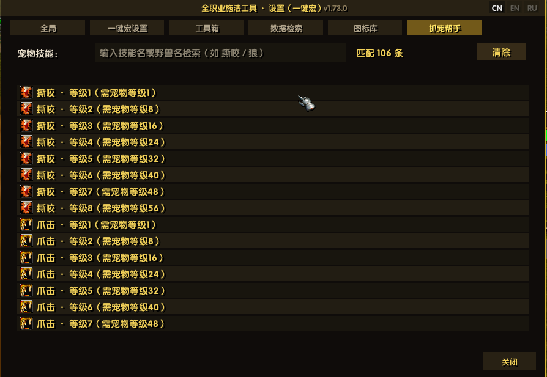
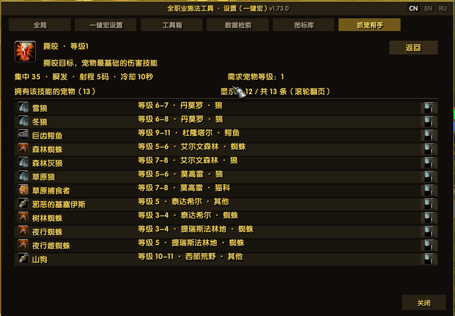

# EvalHelp — Помощник каста для всех классов

> 🌍 Языки: [中文](README.md) · [English](README_en.md) · **Русский**（язык в игре: флаги в правом верхнем углу окна настроек）

> Аддон-помощник каста **для всех классов** EmberVeil (1.12.1 / Lua 5.1): тело макроса — одна строка `/run EVAL_GO()`, движок правил — **пять категорий навыков** (действия персонажа / навыки персонажа / поведение питомца / выбор цели / использование предметов) × **49 типов условий** (выпадающий список с группами; плюс 4 типа условий «кандидат», появляются только в строке выбора участника) × несколько профилей на разных клавишах. Полностью визуальная настройка, без привязки к классу. Плюс три встроенные страницы: **Инструменты** (торговец / общение / задания), **Поиск данных** (задания / предметы / существа·NPC + слой меток на карте мира, нужен UnrealQuest) и **Библиотека иконок** (встроенные иконки макросов клиента: группировка по префиксу, путь при наведении, поиск и постраничный просмотр).
>
> 📌 Текст правил (имена навыков / слова условий / импорт-экспорт) остаётся на языке клиента — переводится только оболочка интерфейса.

| Модуль | Вход | Кратко |
| :-- | :-- | :-- |
| 🗡️ **Универсальный макрос** | макрос `/run EVAL_GO()` | Пять категорий навыков: действия персонажа (атака / автовыстрел / выстрел жезлом / отмена каста / смена стойки) / навыки / команды питомца / выбор цели / предметы; число навыков в профиле не ограничено (список прокручивается); до 12 профилей, каждый на своей клавише с прямым запуском |
| ⚙️ **Окно настроек** | значок EH у миникарты · `/eh cfg` | Профили/навыки/условия — полностью визуальное редактирование, текстовый импорт/экспорт для обмена |
| 📤 **Обмен профилями** | `[Поделиться]` на вкладке макроса / ссылка в чате | посылает частями в гильдию/группу/сказать (с ограничением частоты), получатель жмёт [Импорт]; **ранговая обложка** (`[ранг · имя]` кликабельной ссылкой + окно-подтверждение) · **ранги по очкам** (25+ Божественный · 5 цветов) · **гача титулов** (5×15 · свой титул) · пасхалка «Создатель» · получатель лотерейно отвечает ролевой репликой (ранг титула × ранг трактата) |
| 🧩 **Шаблоны примеров** | окно настроек, вкладка «Макрос», кнопка `[Шаблоны]` внизу | **11 групп, 29 штук**, сгруппированы по классам, **группы в две колонки + перенос строк внутри группы**; клик = мгновенный импорт готового профиля |
| 🧰 **Инструменты** | окно настроек, вкладка 3 | Помощник торговца (авторемонт / продажа серых / покупка и удаление по имени) + группа и общение (автоподтверждение готовности / скрытие уведомлений о согильдийцах / скрытие уведомлений «вход в канал / выход из канала») + автоприём и сдача заданий (удерживайте Shift — пауза) + канал уведомлений о заданиях |
| 🗺️ **Поиск данных** | окно настроек, вкладка 4 | Поиск: задания / предметы / существа·NPC / объекты — сразу по вводу, вложенность без ограничений; **слой меток на карте мира** (16 категорий, перерисовка вместе с картой) и переход к точке из любой строки с координатами (нужен UnrealQuest) |
| 🖼️ **Библиотека иконок** | окно настроек, вкладка 5 | Встроенные иконки макросов клиента сгруппированы по префиксу, при наведении показывается путь, есть поиск и постраничный просмотр |
| 📊 **Боевая панель** | `/eh ui` | Полосы HP/энергии/цели + строка переключения профилей + строка иконок навыков (золото = условия выполнены, клик = редактор) |
| 🔍 **Панель состояния** | `/eh st` | Обзор переменных состояния в реальном времени + разбор условий последнего срабатывания √× |
| 📝 **Журнал состояния** | `/eh` | Двойная запись: чат + файл журнала |

> 📌 Аддон активно развивается — отзывы и тесты приветствуются!　🐞 [Отчёты об ошибках / предложения](https://gitee.com/xeval/emberveil_eval_help.git)（Issues）　🤖 Разработано при поддержке DeepSeek Harness AI (см. «Участие в разработке» в конце)

## 🏁 Вехи (1.52.0 → 1.74.6)

- **🎬 Замкнутый цикл обмена** (1.74.1 → 1.74.6): 40 сцен (принять/отклонить × с целью/без × 3 языка; титул окрашен по рангу, и выведено правило «цветокод обязан нести ссылку») · **автор/источник** профиля (4 вида) + подсказка в списке (ранг · источник · число навыков) · все **8 веток «окно не всплыло» в журнале** · пасхалка-реакция **отключена от проводки** (сохранена) · исправлено ложное «эхо своего профиля» (чужой обмен съедался, если такой профиль уже был).
- **🧰 Два помощника + типы снятия** (1.74.5 → 1.74.6): **Охотник → автокормление** и **помощник расходников** (одна сетка иконок 8×N · множественный выбор · серый цвет, когда предмет кончился; непроверенное помечено **жёлтым «к тесту»**) · **дебаффы на себе/цели: поддержка «типа снятия»** — та же семантика, что у дебаффов группы/кандидатов (пустое имя + тип = «любой дебафф этого типа»).
- **🎉 Переделка обмена: обложка · ранги · титулы · пасхалка · реакции** (1.73.35 → 1.74.0): 85 коммитов разом — строка-обложка (`[ранговый трактат · имя]` кликабельной ссылкой, клик открывает окно-подтверждение вместо авто-импорта), ранги по очкам (25+ = Божественный, 5 цветов вкл. тёмно-красный), **гача титулов** (5 рангов × 15 карт, только вверх, свой титул + цвет), пасхалка «Создатель» (шлюз из 3 условий) + **ролевые реакции** (ранг титула × ранг трактата, лотерея, гильдия/сказать/группа, имя схемы — кликабельная ссылка).
- **🧪 Полевая диагностика ссылок/цветокодов** (1.73.35 → 1.74.0): проходят ли свои ссылки через сервер, реальный предел сообщения 250 Б, механика наведения, журналы на диске — зафиксированы «правила отправки цветокодов» (один цветокод первым + **обязательна ссылка**, 1 сообщ./с, распознаётся только `[EHPF#]`).
- **🖥 Значки в заголовке + окраска по рангу** (1.73.55 → 1.74.0): заголовки боевого HUD и окна состояния по одной схеме — имя → титул → значок ранга → текущий профиль; строки профилей окрашены по рангу (HUD + конфиг + шаблоны по одной схеме).
- **💬 Имена в чате: подсветка + меню по ПКМ** (1.73.12 → 1.73.29): выяснив, что имя приходит в `arg2`, а слот имени **не разбирает** форматирование, план A (съесть строку клиента и собрать свою) наконец красит имена по классу; ПКМ по имени даёт **шёпот / пригласить / цель / в гильдию / копировать имя** (копировать = **только вставить `/s имя`, без отправки**); меню полупрозрачное, узкое, высота адаптивная.
- **🧰 Регламент окон инструментов** (1.73.30 → 1.73.34): лестница уровней (конфиг 10 · редактор 100 · ввод 220 · инструменты 200 · выпадающий 250), ручка перетаскивания обязана быть Button, единый источник геометрии колонок, и **полоса прокрутки** по регламенту (единый источник направления `EVAL_WHEEL_DIR` · отдельный жёлоб · целые номера страниц · скрытие стрелок на краях).
- **🔋 Имена условий и синтаксический шлюз** (1.73.27 → 1.73.28): имена ресурсов считаются **в момент отображения** через `UnitPowerType` (мана / концентрация / ярость / энергия, друид зависит от формы), парсер принимает все написания (экспорт и импорт больше не теряют условия); `luacheck` теперь разбирает **все файлы** (27 `.lua`).
- **🔍 Починка аур из чужих профилей + руководство при каждой загрузке** (1.72.2): если текстура дебаффа не изучалась, теперь **работает поиск по имени с самообучением** (попадание запоминает имя→текстуру, дальше быстрый путь); руководство печатается **при каждой загрузке**; также исправлено имя фрейма `EVAL_DS_HUD`, затенявшее одноимённую функцию (`/eh ds hud` молча не работал)
- **⌨️ Горячие клавиши профилей реально работают** (1.71.16 → 1.72.0): после четырёх тупиков — `ACTIONBUTTON<n>` + перехват `ActionButtonDown/Up`; ноль затрат: без ячеек макросов, клавиши не отнимаются, работает на ходу.


## Журнал обновлений

| Версия | Тема | Главное одной строкой |
| :-- | :-- | :-- |
| **1.74.6** | ☠️ **Дебаффы на себе/цели: поддержка «типа снятия»** | Та же схема, что у дебаффов группы/кандидатов: разбор `имя(тип)` · фильтр по типу при проверке (**имя совпало, тип другой = нет**) · **пустое имя + тип = «любой дебафф этого типа»** · один общий форматтер (в экспорт — токены, на экран — локализованные имена); заодно возвращён суффикс типа, который терял `candDebuff` |
| **1.74.5** | 🎬 «Сцены» при обмене + 🧰 два помощника (кормление / расходники) | 40 сцен (принять/отклонить × с целью/без × 3 языка; титул окрашен по рангу, ровно один цветокод) · автор/источник профиля (4 вида) + подсказка в списке · все 8 веток «окно не всплыло» теперь в журнале · пасхалка-реакция **отключена от проводки** (сохранена) · помощники кормления и расходников делят одну сетку иконок 8×N (непроверенное помечено «к тесту») |
| **1.74.4** | 🐞 Фикс «приглашение уже в группе»: требуем, чтобы цель НЕ была в группе | 1.74.1 смотрел только на вас → лидер + цель в группе давали и «Пригласить», и «Исключить»; теперь: цели нет в группе И (не в группе или вы лидер) |
| **1.74.3** | 📥 Фикс «шар в группу не открывается» (репорт) | В 1.12 сообщения от **лидера** идут отдельными событиями `CHAT_MSG_PARTY_LEADER`/`CHAT_MSG_RAID_LEADER`; приёмник регистрировал только обычные → шар лидера не доходил. Теперь оба варианта зарегистрированы |
| **1.74.2** | 🖱 Ячейка навыка в боевой панели: **ЛКМ = вкл/выкл · ПКМ = редактор** | Раньше любой клик открывал редактор → ЛКМ переключает на месте (пишет `r.enabled` + двойное обновление), ПКМ открывает окно настройки |
| **1.74.1** | 🖱 Правки условий меню группы + выход | «Пригласить» видно, если не в группе **или** вы лидер · «Исключить» требует лидерства + цель — член группы · новое «Покинуть группу» · скриншоты синхронизированы |
| **1.74.0** | 🎉 Переделка обмена: обложка · ранги · титулы · пасхалка · реакции | строка-обложка (кликабельная ранговая ссылка, окно-подтверждение) · ранги по очкам (25+ Божественный, тёмно-красный) · гача титулов (5×15, свой титул) · пасхалка «Создатель» (шлюз из 3 условий) · ролевые реакции (лотерея по гильдия/сказать/группа, имя — кликабельная ссылка) · значки в заголовке (ранг/титул/профиль) |
| **1.73.34** | 🧰 Регламент окон инструментов + 💬 меню по ПКМ на имя | Лестница уровней / ручка перетаскивания / полоса прокрутки по регламенту (вкл. 6 исправлений); ПКМ по имени: шёпот · пригласить · цель · в гильдию · копировать имя (**только вставить, не отправлять**); имена ресурсов вычисляются на месте; `luacheck` проверяет **все файлы** |
| **1.73.0** | 🐾 Питомцы | 6-я вкладка: поиск способностей (иконки + ранги) -> детали с источниками -> лупа ведёт в поиск данных |
| **1.72.2** | 🔍 Починка аур из чужих профилей + руководство при каждой загрузке | Неизученные ауры теперь ищутся по имени с самообучением; руководство печатается при каждой загрузке; исправлено затенение функции именем фрейма |

> 📜 Подробности по каждой версии — в **[CHANGELOG.md](CHANGELOG.md)**; более ранняя история — в записях git.

## 🧩 Шаблоны примеров (11 групп, 29 готовых профилей)

> Не нужно собирать с нуля. Окно настроек → вкладка «Макрос» → внизу **`[Шаблоны]`** → выберите по классу, **щелчок — и профиль импортирован**.

| Пункт | Описание |
| :-- | :-- |
| **Вход** | Окно настроек, вкладка «Макрос», кнопка `[Шаблоны]` внизу |
| **Содержимое** | **11 групп / 29 профилей**: 战士 / 法师 / 通用法系 / 盗贼 / 猎人 / 骑士 / 牧师 / 德鲁伊 / 术士 / 萨满 / 队伍·团队（заголовки групп — внутренние имена аддона） |
| **Раскладка** | Две колонки по группам, перенос внутри группы; **наведение** показывает навыки и условия шаблона |
| **Импорт** | Один щелчок создаёт профиль — дальше правьте, переименовывайте, назначайте клавишу |

Группа **«Отряд·Рейд»** (6 профилей) — это лечение и развеивание одной кнопкой. Все они записаны как
«**конкретный навык + условие по участнику отряда (рейда)**»: условие само сканирует группу, выбирает
самого раненого, переключает цель, кастует и возвращает прежнюю цель — **по союзникам кликать не нужно**.

> 💬 Есть удачный профиль? Делитесь им в комментариях к аддону или используйте `[Поделиться]` в окне настроек.

## Предпросмотр интерфейса

**Окно настроек · вкладка «Общие»**（`/eh cfg` или значок EH у миникарты）: переключатели журнала/интерфейса + встроенная справка


**Окно шаблонов**（кнопка `[Шаблоны]` внизу вкладки макроса）: 11 групп / 29 готовых профилей, **две колонки по группам + перенос внутри группы**, один клик — и профиль импортирован


**Редактор навыка**（кнопка [Изм.] или клик по иконке навыка）: условия настраиваются построчно — тип условия/параметры только из выпадающих списков (49 типов условий по группам Себя / Цель / Ауры / члены группы·рейда / Навык, плюс 4 типа условий «кандидат», появляющихся только в строке выбора участника), колонка связи переключает & (все внутри группы) / | (любая из групп), превью в реальном времени


**Двухуровневый список навыков · четыре вида** (строка навыка в редакторе = `[категория ▾][пункт ▾]` — два списка рядом, пункты с иконками):

- **Навыки персонажа**: белый список + сканирование всей панели действий
- **Команды питомца**: 8 команд питомца (прямой вызов Pet API, слот панели не нужен), иконки самообучаются по панели питомца
- **Выбор цели**: 9 способов переключения (ближайший враг / предыдущая цель / цель цели / по имени / сброс цели…); макрос сначала переключает цель, затем действует
- **Предметы**: сканирование сумок в реальном времени (иконки + количество) + ручной ввод имени — расходники используются сразу, экипировка надевается автоматически

**Проверки аур (4 типа)**: свой бафф / дебафф цели / бафф цели / свой дебафф (переключатель да/нет, реальные ◆○●▲) — «无buff:再生» запускает выпить зелье, «无目标buff:奥术智慧» — раздачу баффов:

**Боевая панель + панель состояния**（`/eh ui` / `/eh st`）: полосы HP/энергии/цели + строка профилей + строка иконок навыков (наведите — tooltip с условиями срабатывания, золото = условия выполнены прямо сейчас, клик по иконке открывает редактор); панель состояния показывает все переменные в реальном времени + журнал последних срабатываний (навык/цель/поусловный разбор √× для каждого действия)


**Инструменты (вкладка 3)**: помощник торговца (авторемонт экипировки / автопродажа серых предметов / автопокупка и автоудаление заданных предметов) + группа и общение (автоподтверждение готовности / скрытие уведомлений о входе согильдийцев) + автоприём и сдача заданий + канал уведомлений о заданиях (выкл / себе / сказать / группа)


> ⚠️ **Требуется** аддон **UnrealQuest** — все записи на этой странице (задания / предметы / существа / NPC) берутся из его базы. Если он не установлен или отключён, страница покажет только инструкцию, а элементы управления будут скрыты.

**Поиск данных (вкладка 4)**: четыре вида поиска — задания / предметы / существа·NPC / объекты; ввод ищет сразу (первые 10 совпадений); вложенность без ограничений, наведение на строку предмета показывает игровой tooltip

**Поиск данных · подробности и вложенность**: подробности задания / предмета / существа — цели и описание, NPC выдачи и завершения, требуемые предметы; каждая ссылка кликабельна для дальнейшего перехода, у строк с координатами есть значок карты


**Поиск данных · метки на карте**: кнопка «Метки карты (N)» = общий переключатель + выбор категорий (16 категорий: 5 ресурсов + 11 городских услуг, с быстрыми «все включить / все выключить»); отмеченные категории рисуются вместе с картой


**Помощник питомцев (вкладка 6)**: поиск способностей питомцев (иконка + список рангов) → на странице деталей описание / нужный уровень / **источник приручения** (какой моб, где) → лупа ведёт в «Поиск данных» к точкам спауна — от «какой питомец учит способность» до «где приручить»





## Быстрый старт

1. Перетащите нужные навыки на панель действий
2. В игре введите `/eh go rescan`, чтобы аддон распознал слоты (`/eh go` — посмотреть результат распознавания)
3. **Привязка клавиши (рекомендуется, только клики)**: ПКМ по любому профилю (строка профиля в боевом интерфейсе или список в настройках) → управление профилем → выберите клавишу → [Сохранить]. **Альтернатива** для любителей макросов: `/run EVAL_GO()` одной строкой и перетащить на клавишу.
4. Быстрый старт с шаблонов: окно настроек → вкладка «Макрос» → [Импорт/Экспорт] → **[Шаблоны]** — библиотека сгруппирована по классам, клик = импорт готового профиля, дальше подгоните под себя
5. **Впервые здесь?** Введите `/eh guide` — руководство из четырёх шагов (боевой интерфейс → первый профиль → привязка клавиши → журнал способностей); при первом входе оно показывается автоматически.
6. `/eh debug` — в чате показывается причина каждого решения при нажатии, удобно настраивать пороги

## Установка

**Способ 1: скачать релиз (рекомендуется)** — скачайте свежий `EvalHelp-vX.Y.Z.zip` со [страницы Releases](https://gitee.com/xeval/emberveil_eval_help/releases), распакуйте в `Interface/AddOns/` (после распаковки должно получиться `AddOns/EvalHelp/EvalHelp.toc`):

```
https://gitee.com/xeval/emberveil_eval_help/releases/download/v1.24.1/EvalHelp-v1.24.1.zip
```

**Способ 2: клонировать исходники** — `git clone git@gitee.com:xeval/emberveil_eval_help.git`, поместите весь каталог в `Interface/AddOns/` и убедитесь, что каталог называется `EvalHelp`.

Структура каталога:

```
Interface/AddOns/
└── EvalHelp/
    ├── EvalHelp.toc     ← правило каталогов: Folder/Folder.toc
    ├── EvalHelp.lua
    └── README.md
```

## Самопомощь при сбоях (при проблемах смотрите сюда)

1. **Сначала `/reload`**: навыки не распознаются, глючит интерфейс, только что обновили файлы аддона — в большинстве случаев перезагрузка всё чинит (конфиг сохранён и не пропадёт);
2. Навыки сменили позицию / новые перетащены на панель → `/eh go rescan` пересканировать;
3. Включите отладку и смотрите процесс решений → `/eh debug` (почему каждый навык кастуется / не кастуется, поусловно √×);
4. Не решено → заведите Issue на <https://gitee.com/xeval/emberveil_eval_help.git> (скриншот состояния `/eh st` + файл журнала сильно помогают локализации).
5. **Чужой профиль не применяет часть способностей**: обычно текстура ауры не изучалась на этой машине — теперь она ищется по имени и запоминается; `/eh go tex` — список, `/eh go texdel <имя>` — удалить одну, `/eh go texclear` — очистить;

## Участие в разработке (добро пожаловать!)

- Репозиторий: <https://gitee.com/xeval/emberveil_eval_help.git> (после `git clone` свяжите или скопируйте `EvalHelp/` в `Interface/AddOns/` — можно разрабатывать и отлаживать);
- **Руководство разработчика**: см. `DEVELOPMENT.md` (карта архитектуры / проверенные на этом клиенте рецепты UI / движок правил и структуры данных профилей / обязательная проверка синтаксиса перед коммитом);
- **Память для ИИ-совместной работы**: `CLAUDE.md` — тело памяти ИИ-разработки этого проекта (DeepSeek Harness / Claude Code и другие ИИ-ассистенты быстро входят в контекст, прочитав его);
- Соглашения процесса: каждое изменение увеличивает номер версии (комментарий в шапке lua + `local VERSION` + toc — три места синхронно), после правок прогонять `node luacheck.js` — полный разбор синтаксиса;
- Расширение на новые классы: никаких белых списков навыков нет — навыки берутся чистым сканированием панели действий, поэтому любой класс работает из коробки: перетащите навыки на панель, пересканируйте и соберите профиль (движок правил/профили/UI полностью класс-независимы);
- Этот аддон разработан при поддержке **DeepSeek Harness AI** — приходите и вы вместе со своим ИИ.

## Поддержать нас

EvalHelp был и всегда будет бесплатным и открытым.

Если аддон вам помог и хочется поддержать автора, можно проспонсировать немного вычислительных ресурсов ☕. Всё идёт в дело: аккуратная полировка, быстрые исправления и готовые шаблоны для новых классов.

И конечно, даже звезда, замечание или рассказ согильдийцу — уже большая поддержка. Спасибо, что дочитали.

| Alipay | WeChat |
| :---: | :---: |
|  |  |

## Благодарности

- Рецепты UI из практики: UnrealQuest (ClientAPI.lua); дизайн переменных состояния: Cat (TurtleWoW); самый первый ориентир: OneJudge.
- Спасибо каждому игроку за тесты и отзывы.
