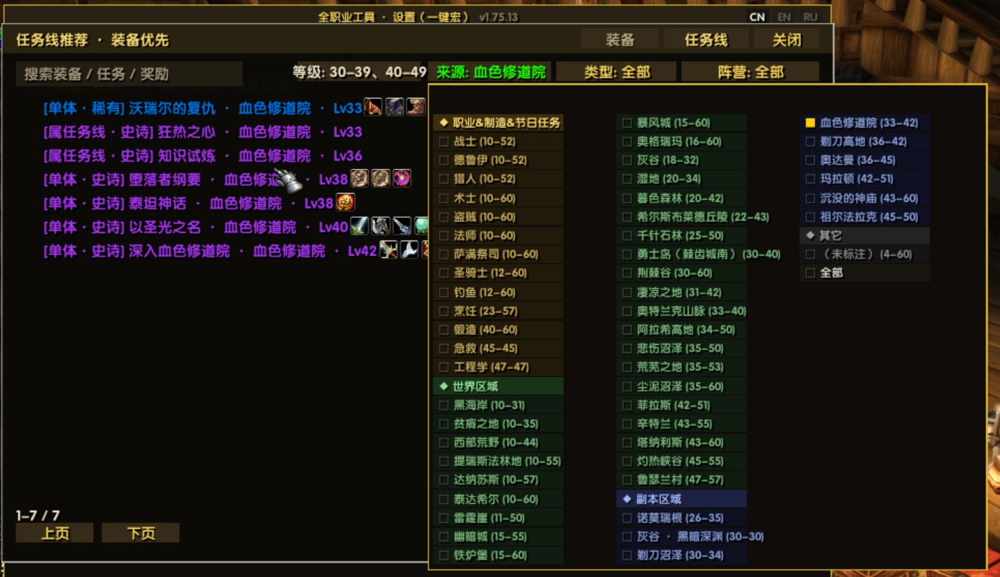

# EvalHelp — Инструмент для всех классов

> 🌍 Языки: [中文](README.md) · [English](README_en.md) · **Русский**（язык в игре: флаги в правом верхнем углу окна настроек）

> Аддон-инструмент **для всех классов** EmberVeil (1.12.1 / Lua 5.1): тело макроса — одна строка `/run EVAL_GO()`, движок правил — **пять категорий навыков** (действия персонажа / навыки персонажа / поведение питомца / выбор цели / использование предметов) × **49 типов условий** (выпадающий список с группами; плюс 4 типа условий «кандидат», появляются только в строке выбора участника) × несколько профилей на разных клавишах. Полностью визуальная настройка, без привязки к классу. Плюс пять встроенных страниц: **Инструменты** (торговец / общение / задания / три помощника / трансляция редких / **добыча под курсором**), **Квесты и вещи** (цепочки · снаряжение · четыре вида поиска + слой меток на карте мира, нужен UnrealQuest), **Библиотека иконок** (встроенные иконки макросов клиента: группировка по префиксу, путь при наведении, поиск и постраничный просмотр), **Помощник питомцев** (способности → источник приручения → точки спауна) и **Суб-аддоны** (включение / отключение необязательных суб-аддонов).
>
> 📌 Текст правил (имена навыков / слова условий / импорт-экспорт) остаётся на языке клиента — переводится только оболочка интерфейса.

| Модуль | Вход | Кратко |
| :-- | :-- | :-- |
| 🗡️ **Универсальный макрос** | макрос `/run EVAL_GO()` | Пять категорий навыков: действия персонажа (атака / автовыстрел / выстрел жезлом / отмена каста / смена стойки) / навыки / команды питомца / выбор цели / предметы; число навыков в профиле не ограничено (список прокручивается); до 12 профилей, каждый на своей клавише с прямым запуском |
| ⚙️ **Окно настроек** | значок EH у миникарты · `/eh cfg` | Профили/навыки/условия — полностью визуальное редактирование (**связи четырёх состояний** `&` / `|` / `&&` / `||` — ИЛИ внутри И), текстовый импорт/экспорт; **семь вкладок**: Общие · Макрос · Инструменты · Квесты и вещи · Иконки · Помощник питомцев · Суб-аддоны |
| 📤 **Обмен профилями** | `[Поделиться]` на вкладке макроса / ссылка в чате | посылает частями в гильдию/группу/сказать (с ограничением частоты), получатель жмёт [Импорт]; **ранговая обложка** (`[ранг · имя]` кликабельной ссылкой + окно-подтверждение) · **ранги по очкам** (с 1.74.21: ≥50 очков **и** охват 4+ из 5 групп условий для Божественного · 5 цветов) · **гача титулов** (5×15 · свой титул) · пасхалка «Создатель» · получатель лотерейно отвечает ролевой репликой (ранг титула × ранг трактата) |
| 🧩 **Шаблоны примеров** | окно настроек, вкладка «Макрос», кнопка `[Шаблоны]` внизу | **12 групп, 38 штук**, сгруппированы по классам, **группы в две колонки + перенос строк внутри группы**; клик = мгновенный импорт готового профиля |
| 🧰 **Инструменты** | окно настроек, вкладка 3 | **UI-инструменты** (масштаб карты / ручки перетаскивания / правки слоёв / **добыча под курсором**: сдвиг окна + один клик = следующий) · помощник торговца (авторемонт / продажа серых / покупка и удаление по имени) · группа и общение (автоподтверждение готовности / скрытие уведомлений о согильдийцах / скрытие уведомлений «вход в канал / выход из канала» (мультивыбор) / окраска имён по классу / меню по правому клику / запрос /who) · задания (автоприём и сдача, Shift — пауза / канал уведомлений) · **три помощника** (кормление питомца / расходники / спешивание) · **трансляция редких** (строка в чат, когда аддон заданий заметил редкого — клик по имени выбирает цель) |
| 🧭 **Квесты и вещи** | окно настроек, вкладка 4 | **Вид цепочек**: цепочка узел за узлом (задание · уровень · награда, у каждого узла лупа); **вид снаряжения**: доступные предметы по уровням (оружие вперёд · мультивыбор видов · заглушка без иконки); **четыре вида поиска**: задания / предметы / существа·NPC / объекты (сразу по вводу, вложенность без ограничений); **вкладка «Древо»** (иерархия заданий родитель-потомок: объединение строк «открывает / требует», отступ = уровень, несколько предков помечены); **мультивыбор зон и уровней**; в конце строки **иконки наград и нужных материалов** (значок «нуж» показывает весь список при наведении, предметы заданий отфильтрованы); **слой меток на карте мира** (16 категорий, перерисовка вместе с картой; **лупа справа открывает список категорий**, клик вне закрывает; метки **рисуются и на миникарте**; нужен UnrealQuest) |
| 🖼️ **Библиотека иконок** | окно настроек, вкладка 5 | Встроенные иконки макросов клиента сгруппированы по префиксу, при наведении показывается путь, есть поиск и постраничный просмотр |
| 🐾 **Помощник питомцев** | окно настроек, вкладка 6 | Поиск способностей питомцев (иконка + список рангов) → описание / нужный уровень / **источник приручения** (какой моб, где) → лупа ведёт в «Квесты и вещи» к точкам спауна |
| 🧩 **Суб-аддоны** | окно настроек, вкладка 7 | Включение / отключение необязательных суб-аддонов и вход в их интерфейс (сейчас **отладка слоёв** EH_DebugBox); простая карта и прочее стали модулями инструментов основного аддона |
| 🔍 **Панель состояния** | `/eh st` | Обзор переменных состояния в реальном времени + разбор условий последнего срабатывания √× |
| 📝 **Журнал состояния** | `/eh` | Двойная запись: чат + файл журнала |

> 📌 Аддон активно развивается — отзывы и тесты приветствуются!　🐞 [Отчёты об ошибках / предложения](https://gitee.com/xeval/emberveil_eval_help.git)（Issues）　🤖 Разработано при поддержке DeepSeek Harness AI (см. «Участие в разработке» в конце)

## 🏁 Вехи (1.52.0 → 1.75.35)
- **🔎 «Автоатака» больше не слетает + порядок в пробах** (1.75.31 → 1.75.35): долив автоатаки теперь **перепроверяет дистанцию перед нажатием** и держит **ограниченное окно перепроверки** — когда цель входит в радиус или заклинание/смена цели её сбрасывают, она возвращается сама за ≤1.25 с (лишнее нажатие не нужно); также удалено **487 осиротевших тестовых read-port'ов (−185 КБ исходников)** и 23 команды-пробы перенесены в `tools/Probes.lua` (предзагрузка из .toc, **нулевые побочные эффекты при загрузке**); ячейки боевого UI — тёмный фон + рамка 4×1px.

- **🔀 Двухуровневые связи условий (план B) + бесшовное обновление кэша имён** (1.75.28): ячейка связи стала **четырёхтактным переключателем** `&` / `|` / `&&` / `||` (приоритет `& > | > && > ||`) — теперь можно писать **ИЛИ внутри И**: `(A|B) & C`; ★ **нулевая миграция** (старый текст вычисляется идентично, harness из 152 случаев); кэш имён в чате **не удаляет старые значения и обновляется в фоне**; ★ **четыре реальных исправления** (шлюз знал только старый формат ⇒ правило становилось безусловным и срабатывало на каждое нажатие по себе · экспорт терял условия · совместный выбор союзников применялся по члену, а не по старой группе · поиск аур нормализует двоеточия); справка по операторам в редакторе; шаблон «Хранитель одного» заменён живым профилем «Вечная стража» (12 навыков).

- **🎨 Дополнения к цветным именам + починка аур по имени** (1.75.27): у строки «Цвета имён в чате» появился мультивыбор **[Настройки]** (Уровень / Зона; Уровень включён по умолчанию) — формат `[зона][уровень][имя]` (зона = зелёная на вашей карте · уровень = цвет сложности · имя = цветная ссылка, кликабельна); кэш имён получил колонки уровня и зоны с **ленивым TTL 5 минут** (просроченное имя дозапрашивается при следующем появлении: локальный добор + активный /who — без полного опроса ростера); ★«Снятие своего баффа: X пишет „нет на себе“, хотя он есть» исправлено в трёх слоях: читалка имени проверяла **возвращаемое значение** `SetPlayerBuff` (всегда nil ⇒ путь по имени не работал никогда — настоящая причина) · нормализация двоеточия теперь с обеих сторон · разбор префикса больше не переписывает само имя (`item:`/`stance:` — так же).
- **🧲 Добыча под курсором (один клик = следующий предмет)** (1.75.26): окно добычи **при открытии встаёт под мышью**, дальше **каждый клик подводит следующий предмет под курсор** (о конце сообщается только после последнего); ★ обработчик висит **после родного `OnClick`**, не на нажатии (сдвиг окна при нажатии ⇒ отпускание попадает в другую ячейку ⇒ **подбирается следующий предмет, а этот пропускается**); ★ **уплотнение слотов доказывается на ходу** (карты имён слотов до/после клика: если клиент уплотняет, окно возвращается на место и смена идёт на месте); плюс **метки качества** (золото = монеты) и режим **следования за мышью**; ★ окно только **сдвигается на месте, без `ClearAllPoints`** (старый способ позволял клиенту вернуть свой якорь ⇒ две вертикальные привязки **растягивали окно**; теперь очистка при открытии + `/eh go lootcursor fix`). Категория «Задания» в ящике инструментов тоже сведена к одной группе.
- **🎨 Раскраска журнала + автоатака по умолчанию выключена + синхронизация шаблона** (1.75.25): ① журнал навыков профиля теперь красится **по содержимому** — **сработало = красный**, **пропуск = серый** (единственный выход `wlog`: сначала проверяется «пропуск», затем «сработало»; оранжевый префикс `war:` и прочие строки без изменений); ② переключатель «**Автоатака**» теперь **по умолчанию выключен** (`w.attack == true`, **nil = выкл** ⇒ старые сохранения, где его не трогали, автоматически выключаются; явное `true` остаётся включённым; подсказки в трёх языках обновлены); ③ шаблон «Громовая кара» синхронизирован построчно с **последней версией автора** (Разрывающая `tHp<5 & ярость>24` · Героический удар `ярость>35` · Громовой удар перед Подрезанием · новая последняя строка `Атака` ⇒ 13 записей).
- **🗺 Дозахват слоя исследования** (1.75.24): свёртка при масштабе карты больше **не останавливается на защёлке** — если слой **используется, но исходного значения ещё нет**, захват открывается снова (ограниченно, раз в секунду), что исправляет «**слои 13 и 14 не масштабируются**»; ★**причина**: защёлка считала только готовые *в тот момент* слои, поэтому **скрытые или ещё без текстуры** слои позже **уже никогда не получали исходное значение**, а свёртка работает только с записанными слоями ⇒ при одном и том же масштабе часть слоёв свернулась, а часть — нет; `/ehm mapfit dump` теперь **называет** ожидающие слои (если значение не падает до 0 — геометрия не читается или клиент не дал текстуру).
- **🤝 Совместный выбор цели по условиям группы/рейда** (1.75.23): строка с **2+ условиями по группе** теперь выбирает цель **одним проходом** — каждый кандидат проверяется по **всем** условиям, берётся первый полностью подходящий (**одна смена цели**); ★ раньше каждое условие сканировало состав само и побеждало последнее (правило мало-HP **и** нет-бафа могло скастовать на участника с полным здоровьем — даже на вас); одиночные условия и все не-групповые условия работают как раньше, `/eh go 联合 on|off` — переключатель для сравнения.
- **🎯 Квесты и вещи: древо заданий (родитель/потомок) + полоса нужных материалов + настоящая причина пустых описаний** (1.75.14 → 1.75.22): теперь находятся и открываются **все** задания — полная таблица выросла с «751 задания с наградой-снаряжением» до **4018**; ★**настоящая причина** «некоторые описания заданий пустые»: обновление описания разбиралось по **вкладке вида**, поэтому описание одного задания попадало в ветку описания цепочки и искало nil-ключ (**достаточно было прокрутить описание**) ⇒ теперь разбор по трём истинным значениям, данные получили «нужный уровень + награды (выбор/выдача) + имена предметов», а текст переписан на пять разделов; ★**дедупликация списка цепочек**: шаги цепочки **вливаются в её строку** (Ульдаман: 34 строки → 20, с честной подсказкой «влито N»); ★**новая вкладка «Древо»**: строки сайта «открывает / требует» объединяются в **граф родитель-потомок** (1096 связей / 758 родителей / без циклов), отступ = уровень, у нескольких предков пометка «(%d предка)»; ★в строках появился значок «**нуж**» и **полоса иконок нужных материалов** (в одной строке с наградами, тёплый оттенок, при наведении — весь список; **предметы заданий отфильтрованы** по метке `Quest Item` на странице предмета); плюс мультивыбор источника (зоны) и уровней, прокрутка списка колесом и заглушки иконок.
- **🔍 Метки на карте: лупа справа + список категорий + закрытие кликом вне окна** (1.75.13): лупа у правого края карты (текстура взята у аддона заданий, с подтверждением `GetTexture()` и текстовым запасным вариантом) по ЛКМ открывает список категорий с множественным выбором, рядом всегда видно число категорий; ★список закрывается кликом **в любом месте вне него** (новый полноэкранный перехватчик плюс подъём уровня каждого дочернего элемента — подъём родителя **не поднимает детей**, иначе получается чёрный прямоугольник или нерабочие строки); метки **рисуются и на миникарте** (используется собственный рецепт миникарты аддона заданий); ★также: вспышка затемнения карты убрана через `alpha 0 + Hide` (при закрытии не восстанавливается), тестовый каркас полностью удалён (единственный гейт — `node luacheck.js`).
- **🗺️ Исходные значения слоя исследования: только память сессии · очистка при закрытии · перечитывание и пересчёт при каждом открытии** (1.75.5): исходные значения **больше не сохраняются** (старые ключи удаляются, штамп версии не пишется); по требованию пользователя запись **очищается в момент закрытия карты** и **перечитывается с повторным применением масштаба при следующем открытии** — очистка выполняется только после **возврата свёрнутой геометрии к натуральному масштабу и строгой проверки** (иначе свёрнутые значения были бы приняты за исходные = двойное масштабирование); исправлено «**при /reload 0 записей считались завершённым захватом**» (нет подходящих слоёв ⇒ без защёлки, повтор раз в 1 с, затем автодобор); захват больше не перезапускается каждый кадр, масштаб карты не дрожит; исправлено «**текстуры слоя исследования рисуются поверх игрового мира**» (якоря теперь разрешаются в объекты фреймов); новая команда **`/ehm fitnow`** (карта → натуральный масштаб → 2 с → чтение → масштаб → свёртка, с печатью каждого шага) + тихий/подробный режим.
## Журнал обновлений

| Версия | Тема | Главное одной строкой |
| :-- | :-- | :-- |
| **1.75.35** | 🔎 **Починка автоатаки + порядок в пробах** | ① автоатака: **живая проверка дистанции перед нажатием + ограниченное окно перепроверки** (сама возвращается за ≤1.25 с); ② удалено **487 осиротевших read-port'ов** (−185 КБ); ③ 23 команды-пробы перенесены в `tools/Probes.lua` (нулевые побочные эффекты при загрузке); ④ ячейки боевого UI: тёмный фон + рамка 4×1px (портрет цели сохранён). |
| **1.75.28** | 🔀 **Двухуровневые связи условий (план B: четыре оператора) + бесшовное обновление кэша + фикс «правило стало безусловным»** | ① ячейка связи: **четырёхтактный переключатель** `&` / `|` / `&&` / `||` (приоритет `& > | > && > ||`) ⇒ ИЛИ внутри И: `(A|B)&C`; ② **нулевая миграция**: хранилище — линейный `rule.expr` (старые `groups` выводятся на ходу), старый текст вычисляется **идентично** (harness **152 случая**); ③ ★ три реальных регрессии: **шлюз знал только старый формат** (правила нового формата попадали в старую ветку `when`, где `condOK({})` всегда истина ⇒ **срабатывало на каждое нажатие и кастовало по себе**) · **экспорт терял условия** · **совместный выбор применялся по члену, а не по старой группе**; плюс нормализация двоеточий в `auraTexOf`; ④ кэш имён **не удаляет старые значения, обновляется в фоне** (`tbNameStale`, 60 с на имя); ⑤ справка по операторам в редакторе; ⑥ шаблон «Хранитель одного» → «**Вечная стража**» (12 навыков, построчно из живого сейва, сквозная проверка 12/12). |
| **1.75.27** | 🎨 **[Настройки] цветных имён (уровень/зона) + ленивый TTL кэша 5 минут + фикс «снятие баффа пишет, что его нет»** | ① у строки «Цвета имён в чате» мультивыбор [Настройки] (Уровень — по умолчанию вкл / Зона): формат `[зона][уровень][имя]` (зона = зелёная на вашей карте · уровень = цвет сложности · имя = цветная кликабельная ссылка); ② кэш имён получил колонки уровня/зоны (единая точка записи `tbNameClassPut`) + **ленивый TTL 5 минут** (единый судья `tbNameFresh`; просроченные дозапрашиваются при появлении через HEAL + активный /who — без полного опроса); ③ ★трёхслойный фикс «Снять свой бафф: X — пишет „нет“»: **читалка имени доверяла возврату `SetPlayerBuff`** (всегда nil ⇒ путь по имени не работал) · двоеточие нормализуется с обеих сторон (`auraNameHit` тоже) · разбор префикса не переписывает имя (`itemOf`/`stanceOf` — так же). |
| **1.75.26** | 🧲 **Добыча под курсором: сдвиг окна + один клик = следующий предмет + метки качества (новый модуль)** | ① новый `tools/LootCursor.lua` (ящик → «UI-инструменты» → «Добыча под курсором»): окно **встаёт под мышью при открытии**, дальше **каждый клик подводит следующий предмет** (ответ сервера не ждём); ② ★ обработчик висит **после родного `OnClick`** (не на `OnMouseDown`: сдвиг при нажатии ⇒ отпускание попадает в другую ячейку = подобран следующий предмет, этот пропущен); ③ «следующий» = `lcNextSlot` (минимальный занятый слот после i, иначе по кругу) + ★ **уплотнение доказывается на ходу**; ④ метки качества (вкл. по умолчанию · золото для монет · чтение текстуры обратно) + режим следования за мышью (выкл. по умолчанию); ⑤ ★ **только сдвиг на месте, без `ClearAllPoints`** (старый способ позволял клиенту вернуть свой якорь ⇒ две вертикальные привязки **растягивали** окно) ⇒ очистка при открытии + `/eh go lootcursor fix`; ⑥ при выключении — ноль действий (снять обёртки / скрыть метки / вернуть позицию); ⑦ категория «Задания» сведена к одной группе. |
| **1.75.25** | 🎨 **Раскраска журнала (сработало — красный / пропуск — серый) + автоатака выключена по умолчанию + синхронизация шаблона** | ① журнал навыков профиля красится по содержимому: **сработало = красный**, **пропуск = серый** (единственный выход `wlog`); ② «**Автоатака**» **по умолчанию выключена** (`w.attack == true`, **nil = выкл** ⇒ старые сохранения автоматически выключаются); ③ шаблон синхронизирован с последней версией автора (`tHp>5/ярость>24` · `ярость>35` · строка `Атака`, 12 → **13**). |
| **1.75.24** | 🗺 **Дозахват слоя исследования (фикс «слои 13/14 не масштабируются»)** | ① защёлку **можно снять**: счётчик «используется, но без исходного значения» (раньше считался и выбрасывался) снова открывает захват (ограниченный повтор раз в 1 с + ожидание стабилизации раскладки), и слой сворачивается сразу после записи; ② ★**причина**: защёлка смотрела только на текущий `todo`, а он **не включает** скрытые слои и слои с `GetTexture()==nil` ⇒ получив готовность позже, они никогда не получали исходное значение, а свёртка работает только с записанными; ③ в `/ehm mapfit dump` добавлена строка с **именами** ожидающих слоёв — одной диагностики достаточно. |
| **1.75.22** | 🎯 **Древо заданий (родитель/потомок) + полоса нужных материалов + настоящая причина пустых описаний · дедупликация списка цепочек** | ① полная таблица выросла до **4018 заданий**; ② ★**причина «пустых описаний» = разбор по вкладке вида** ⇒ описание одного задания попадало в ветку цепочки с nil-ключом (**прокрутка описания воспроизводила это**) ⇒ разбор по трём истинным значениям, текст описания переписан на пять разделов; ③ **дедупликация**: шаги вливаются в строку своей цепочки (Ульдаман 34 → 20); ④ **новая вкладка «Древо»**: граф родитель-потомок из строк «открывает / требует» (1096 связей / 758 родителей / без циклов); ⑤ значок «**нуж**» + **иконки нужных материалов** в строке (тёплый оттенок, полный список при наведении, **предметы заданий отфильтрованы** — из 2564 целей убрано 1614); ⑥ плюс мультивыбор зон и уровней, прокрутка колесом и заглушки. |
| **1.75.13** | 🔍 **Метки на карте: лупа справа + список категорий + закрытие кликом вне окна · фикс вспышки затемнения · удаление тестового каркаса** | ① **лупа** справа от карты мира (текстура — `search-icon` аддона UnrealQuest, с подтверждением `GetTexture()` и текстовым запасным вариантом; выравнивание по правому краю окна карты, свои константы DX/DY) — **ЛКМ открывает список категорий** с множественным выбором, рядом всегда видно число категорий; ★список закрывается кликом **в любом месте вне него** (полноэкранный перехватчик `EVAL_HELP_DD_CATCH`, единый выход с `EVAL_DD_HIDE`); ② метки **рисуются и на миникарте** (собственный рецепт миникарты аддона заданий, `Client.CreateMinimapPin`; метки — дочерние элементы Minimap и скрываются вместе с ней); ③ у панели настроек SimpleMap то же **закрытие кликом вне** (`EH_SM_CFG_CATCH`); ④ ★**два твёрдых факта о всплывающих окнах**: подъём родительского фрейма **не поднимает детей** ⇒ строки и поле поиска нужно поднимать **по одному** (иначе фон закрывает строки = чёрный прямоугольник, либо строки остаются под ним = не нажимаются); ⑤ завершение борьбы со вспышкой затемнения (`SetAlpha(0)` против вспышки + `Hide()` ради мыши — прозрачный полноэкранный фрейм всё равно перехватывает клики; ограниченное повторение 0.6 с покадрово; **при закрытии карты ничего не восстанавливается**, только при выключении функции, и исходная alpha сначала считывается с проверкой); ⑥ тестовый каркас удалён (`tests/` + `test_assert.lua` + `test_engine.js` + `check.js` + `mutate.js`); единственный гейт — `node luacheck.js`. |
| **1.75.5** | 🗺️ **Исходные значения слоя исследования — только в памяти сессии + очистка при закрытии карты (перечитываются и пересчитываются при каждом открытии)** | ① исходные значения больше не сохраняются (память сессии по картам; старые ключи удаляются один раз, штамп версии не пишется); ② **при закрытии карты запись очищается, при следующем открытии значения перечитываются и масштаб применяется заново** (сначала возврат свёрнутой геометрии к натуральному масштабу и строгая проверка — если проверка не прошла, ничего не очищается); ③ исправлено «**при /reload 0 записей считались завершённым захватом**» (без защёлки + повтор раз в 1 с, затем автодобор); ④ захват больше не перезапускается каждый кадр, масштаб карты не дрожит, переходный es не пересчитывается, приняты оба варианта чтения; ⑤ исправлено «**текстуры слоя исследования рисуются поверх игрового мира**» (якоря теперь разрешаются в объекты фреймов); ⑥ новая команда `/ehm fitnow` (5 шагов вручную) + тихий/подробный режим логов. |
| **1.75.4** | 🔔 **Ретрансляция редких = уведомление (в обход общего гейта журнала) + исходные значения слоя исследования с привязкой к карте (фикс «потеря координат / всё свалено влево-вниз»)** | ① ретрансляция редких теперь идёт через **независимый от гейта выход** — это **уведомление**, а не отладочный журнал, поэтому она звучит и при выключенном общем гейте (причина: `say`/`logLine` глушились вместе, из-за чего сообщалось «нет уведомления о редком» **и** в кольце журнала не было следов); плюс отдельное кольцо диагностики `rareProbe` (30 строк, без гейта), **самопроверка хука** (переустанавливается, если нашу обёртку сняли), совместимость с переименованным входом теста `Test` у соседнего аддона и **честный подсчёт ошибок колбэка**; ② **Масштаб карты / слой исследования**: исходные значения теперь **разложены по идентичности карты** (`GetMapInfo`: имя файла + размер текстуры), **сбрасываются при каждой смене карты** и считываются заново, затрагиваются только слои, **реально используемые текущей картой** (`IsShown`/`GetTexture`), захват ждёт стабилизации раскладки (0.4 с), восстановление пишет только те слои, которые мы сами меняли на этой карте, а штамп сохранения 2→3 **автоматически отбрасывает грязные значения**; новая команда только для чтения **`/ehm mapfit dump`**. |

> 📜 Подробности по каждой версии — в **[CHANGELOG.md](CHANGELOG.md)**; более ранняя история — в записях git.

## 🧩 Шаблоны примеров (12 групп, 38 готовых профилей)

> Не нужно собирать с нуля. Окно настроек → вкладка «Макрос» → внизу **`[Шаблоны]`** → выберите по классу, **щелчок — и профиль импортирован**.

| Пункт | Описание |
| :-- | :-- |
| **Вход** | Окно настроек, вкладка «Макрос», кнопка `[Шаблоны]` внизу |
| **Содержимое** | **12 групп / 38 профилей**: 战士 / 骑士 / 猎人 / 盗贼 / 牧师 / 萨满 / 法师 / 术士 / 德鲁伊 / 通用法系 / 通用 / 队伍·团队（заголовки групп — внутренние имена аддона） |
| **Раскладка** | Две колонки по группам, перенос внутри группы; **наведение** показывает навыки и условия шаблона |
| **Импорт** | Один щелчок создаёт профиль — дальше правьте, переименовывайте, назначайте клавишу |

Группа **«Отряд·Рейд»** (6 профилей) — это лечение и развеивание одной кнопкой. Все они записаны как
«**конкретный навык + условие по участнику отряда (рейда)**»: условие само сканирует группу, выбирает
самого раненого, переключает цель, кастует и возвращает прежнюю цель — **по союзникам кликать не нужно**.

> 💬 Есть удачный профиль? Делитесь им в комментариях к аддону или используйте `[Поделиться]` в окне настроек.

## Предпросмотр интерфейса

**Окно настроек · вкладка «Общие»**（`/eh cfg` или значок EH у миникарты）: переключатели журнала/интерфейса + встроенная справка


**Окно шаблонов**（кнопка `[Шаблоны]` внизу вкладки макроса）: 12 групп / 38 готовых профилей, **две колонки по группам + перенос внутри группы**, один клик — и профиль импортирован


**Редактор навыка**（кнопка [Изм.] или клик по иконке навыка）: условия настраиваются построчно — тип условия/параметры только из выпадающих списков (49 типов условий по группам Себя / Цель / Ауры / члены группы·рейда / Навык, плюс 4 типа условий «кандидат», появляющихся только в строке выбора участника), колонка связи — **цикл из четырёх состояний**: `&` И внутри пункта / `｜` ИЛИ внутри пункта / `&&` И между пунктами / `｜｜` ИЛИ между блоками (приоритет `& > ｜ > && > ｜｜` — теперь можно писать «ИЛИ внутри И»), превью в реальном времени


**Двухуровневый список навыков · четыре вида** (строка навыка в редакторе = `[категория ▾][пункт ▾]` — два списка рядом, пункты с иконками):

- **Навыки персонажа**: белый список + сканирование всей панели действий
- **Команды питомца**: 8 команд питомца (прямой вызов Pet API, слот панели не нужен), иконки самообучаются по панели питомца
- **Выбор цели**: 9 способов переключения (ближайший враг / предыдущая цель / цель цели / по имени / сброс цели…); макрос сначала переключает цель, затем действует
- **Предметы**: сканирование сумок в реальном времени (иконки + количество) + ручной ввод имени — расходники используются сразу, экипировка надевается автоматически

**Проверки аур (4 типа)**: свой бафф / дебафф цели / бафф цели / свой дебафф (переключатель да/нет, реальные ◆○●▲) — «无buff:再生» запускает выпить зелье, «无目标buff:奥术智慧» — раздачу баффов:

**Боевая панель + панель состояния**（`/eh ui` / `/eh st`）: полосы HP/энергии/цели + строка профилей + строка иконок навыков (наведите — tooltip с условиями срабатывания, золото = условия выполнены прямо сейчас, клик по иконке открывает редактор); панель состояния показывает все переменные в реальном времени + журнал последних срабатываний (навык/цель/поусловный разбор √× для каждого действия)

**Инструменты (вкладка 3)**: **UI-инструменты** (масштаб карты / ручки перетаскивания / правки слоёв / **добыча под курсором**: сдвиг окна + один клик = следующий) · помощник торговца (авторемонт / продажа серых / покупка и удаление по имени) · группа и общение (автоподтверждение готовности / скрытие уведомлений о согильдийцах / скрытие уведомлений о каналах / окраска имён по классу / меню по правому клику / запрос /who) · автоприём и сдача заданий + канал уведомлений (выкл / себе / сказать / группа; Shift — пауза) · **три помощника** (кормление питомца / расходники / спешивание) · **трансляция редких**


> ⚠️ **Требуется** аддон **UnrealQuest** — все записи на этой странице (задания / предметы / существа / NPC) берутся из его базы. Если он не установлен или отключён, страница покажет только инструкцию, а элементы управления будут скрыты.

**Квесты и вещи (вкладка 4)**: **вид цепочек** (цепочка от начала до конца, узел за узлом: задание · уровень · награда, у каждого узла лупа) + **вид снаряжения** (доступные предметы по уровням, оружие вперёд, мультивыбор видов) + **четыре вида поиска** (задания / предметы / существа·NPC / объекты; сразу по вводу, первые 10 совпадений, вложенность без ограничений, подсказка предмета при наведении); **слой меток на карте мира** (16 категорий, перерисовка вместе с картой)року предмета показывает игровой tooltip

**Вид снаряжения**: подробности задания / предмета / существа — цели и описание, NPC выдачи и завершения, требуемые предметы; каждая ссылка кликабельна для дальнейшего перехода, у строк с координатами есть значок карты


**Вид цепочек**: кнопка «Метки карты (N)» = общий переключатель + выбор категорий (16 категорий: 5 ресурсов + 11 городских услуг, с быстрыми «все включить / все выключить»); отмеченные категории рисуются вместе с картой



**Дерево квестов (родитель / потомок)**: клик по названию квеста внутри цепочки раскрывает **предусловия ⇄ продолжения** — какие квесты он открывает и какие нужно выполнить раньше (на сайте две строки связей + фолбэк «следующий в цепочке»); дерево ограничено 600 строками, а «несколько предусловий» и «упёрлись в лимит» считаются отдельно и честно


**Помощник питомцев (вкладка 6)**: поиск способностей питомцев (иконка + список рангов) → на странице деталей описание / нужный уровень / **источник приручения** (какой моб, где) → лупа ведёт в «Квесты и вещи» к точкам спауна — от «какой питомец учит способность» до «где приручить»


## Быстрый старт

1. Перетащите нужные навыки на панель действий
2. В игре введите `/eh go rescan`, чтобы аддон распознал слоты (`/eh go` — посмотреть результат распознавания)
3. **Привязка клавиши (рекомендуется, только клики)**: ПКМ по любому профилю (строка профиля в боевом интерфейсе или список в настройках) → управление профилем → выберите клавишу → [Сохранить]. **Альтернатива** для любителей макросов: `/run EVAL_GO()` одной строкой и перетащить на клавишу.
4. Быстрый старт с шаблонов: окно настроек → вкладка «Макрос» → [Импорт/Экспорт] → **[Шаблоны]** — библиотека сгруппирована по классам, клик = импорт готового профиля, дальше подгоните под себя
5. **Впервые здесь?** Введите `/eh guide` — руководство из четырёх шагов (боевой интерфейс → первый профиль → привязка клавиши → журнал способностей); при первом входе оно показывается автоматически.
6. `/eh debug` — в чате показывается причина каждого решения при нажатии, удобно настраивать пороги

## Установка

**Способ 1: скачать релиз (рекомендуется)** — скачайте свежий `EvalHelp-vX.Y.Z.zip` со [страницы Releases](https://gitee.com/xeval/emberveil_eval_help/releases), распакуйте в `Interface/AddOns/` (после распаковки должно получиться `AddOns/EvalHelp/EvalHelp.toc`):

```
https://gitee.com/xeval/emberveil_eval_help/releases/download/v1.75.1/EvalHelp-v1.75.1.zip
```

**Способ 2: клонировать исходники** — `git clone git@gitee.com:xeval/emberveil_eval_help.git`, поместите весь каталог в `Interface/AddOns/` и убедитесь, что каталог называется `EvalHelp`.

Структура каталога:

```
Interface/AddOns/
└── EvalHelp/
    ├── EvalHelp.toc     ← правило каталогов: Folder/Folder.toc
    ├── EvalHelp.lua
    └── README.md
```

## Самопомощь при сбоях (при проблемах смотрите сюда)

1. **Сначала `/reload`**: навыки не распознаются, глючит интерфейс, только что обновили файлы аддона — в большинстве случаев перезагрузка всё чинит (конфиг сохранён и не пропадёт);
2. Навыки сменили позицию / новые перетащены на панель → `/eh go rescan` пересканировать;
3. Включите отладку и смотрите процесс решений → `/eh debug` (почему каждый навык кастуется / не кастуется, поусловно √×);
4. Не решено → заведите Issue на <https://gitee.com/xeval/emberveil_eval_help.git> (скриншот состояния `/eh st` + файл журнала сильно помогают локализации).
5. **Чужой профиль не применяет часть способностей**: обычно текстура ауры не изучалась на этой машине — теперь она ищется по имени и запоминается; `/eh go tex` — список, `/eh go texdel <имя>` — удалить одну, `/eh go texclear` — очистить;

## Участие в разработке (добро пожаловать!)

- Репозиторий: <https://gitee.com/xeval/emberveil_eval_help.git> (после `git clone` свяжите или скопируйте `EvalHelp/` в `Interface/AddOns/` — можно разрабатывать и отлаживать);
- **Руководство разработчика**: см. `DEVELOPMENT.md` (карта архитектуры / проверенные на этом клиенте рецепты UI / движок правил и структуры данных профилей / обязательная проверка синтаксиса перед коммитом);
- **Память для ИИ-совместной работы**: `CLAUDE.md` — тело памяти ИИ-разработки этого проекта (DeepSeek Harness / Claude Code и другие ИИ-ассистенты быстро входят в контекст, прочитав его);
- Соглашения процесса: каждое изменение увеличивает номер версии (комментарий в шапке lua + `local VERSION` + toc — три места синхронно), после правок прогонять `node luacheck.js` — полный разбор синтаксиса;
- Расширение на новые классы: никаких белых списков навыков нет — навыки берутся чистым сканированием панели действий, поэтому любой класс работает из коробки: перетащите навыки на панель, пересканируйте и соберите профиль (движок правил/профили/UI полностью класс-независимы);
- Этот аддон разработан при поддержке **DeepSeek Harness AI** — приходите и вы вместе со своим ИИ.

## Поддержать нас

EvalHelp был и всегда будет бесплатным и открытым.

Если аддон вам помог и хочется поддержать автора, можно проспонсировать немного вычислительных ресурсов ☕. Всё идёт в дело: аккуратная полировка, быстрые исправления и готовые шаблоны для новых классов.

И конечно, даже звезда, замечание или рассказ согильдийцу — уже большая поддержка. Спасибо, что дочитали.

| Alipay | WeChat |
| :---: | :---: |
|  |  |

## Благодарности

- Рецепты UI из практики: UnrealQuest (ClientAPI.lua); дизайн переменных состояния: Cat (TurtleWoW); самый первый ориентир: OneJudge.
- Спасибо каждому игроку за тесты и отзывы.
