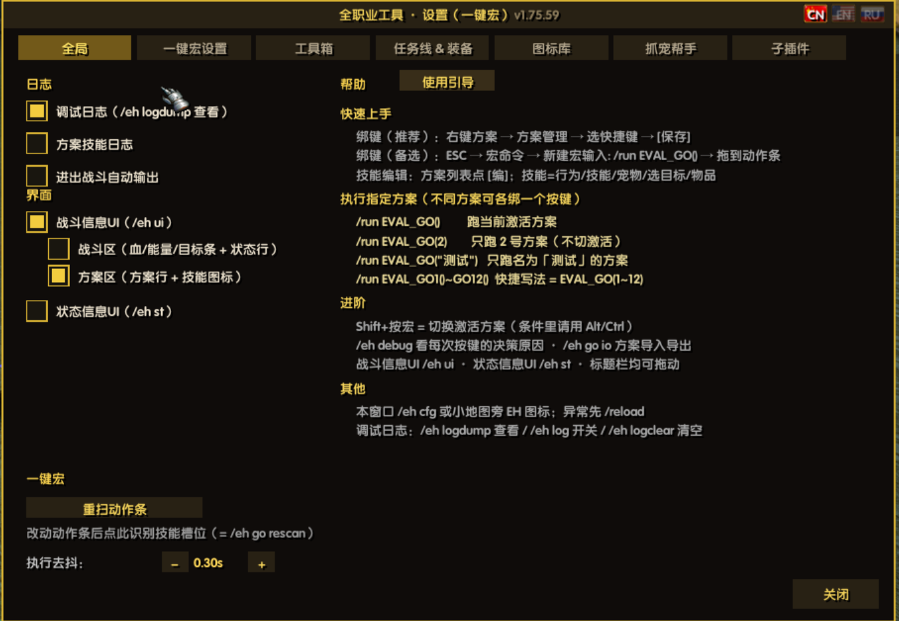
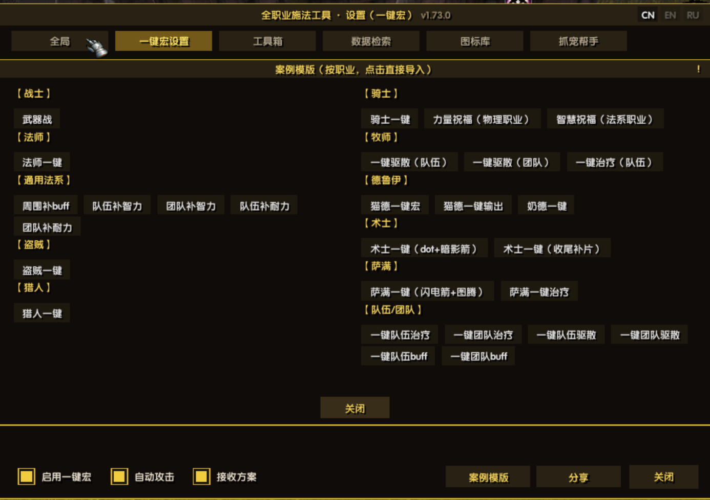
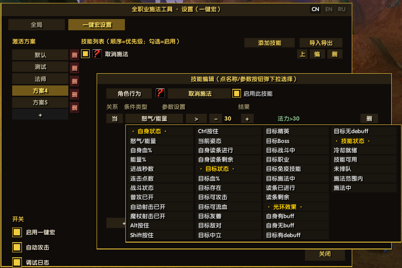
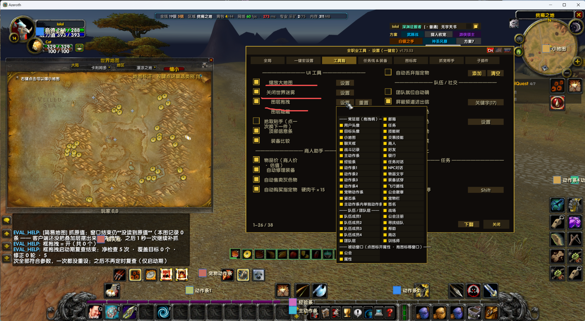
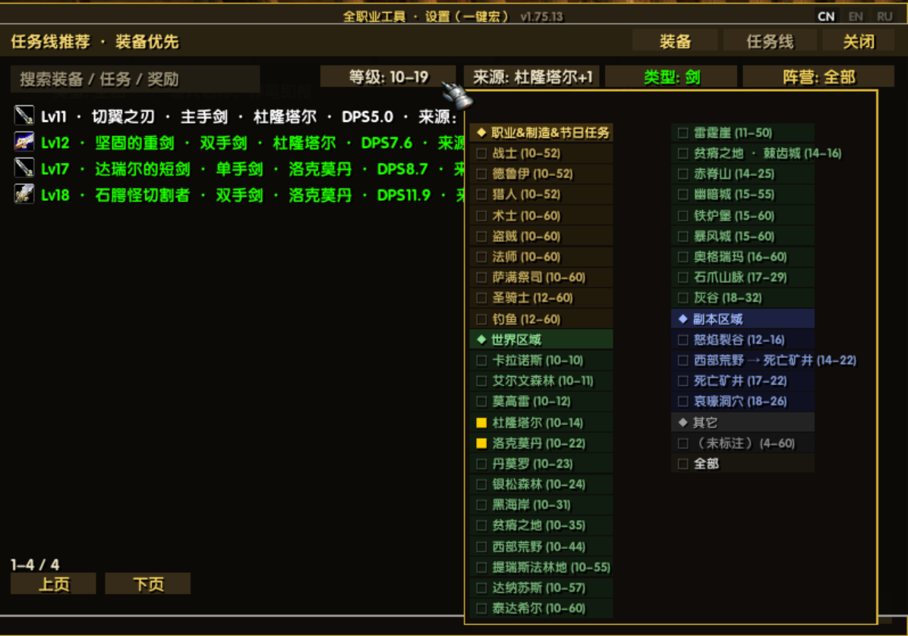
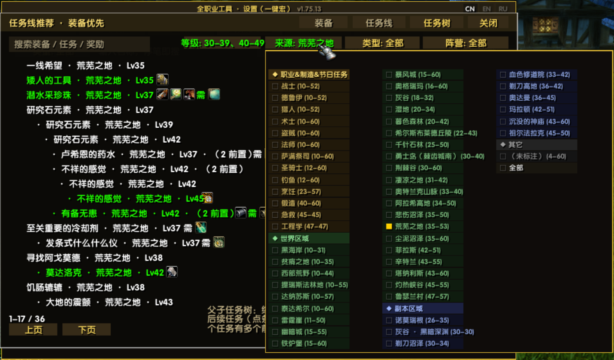
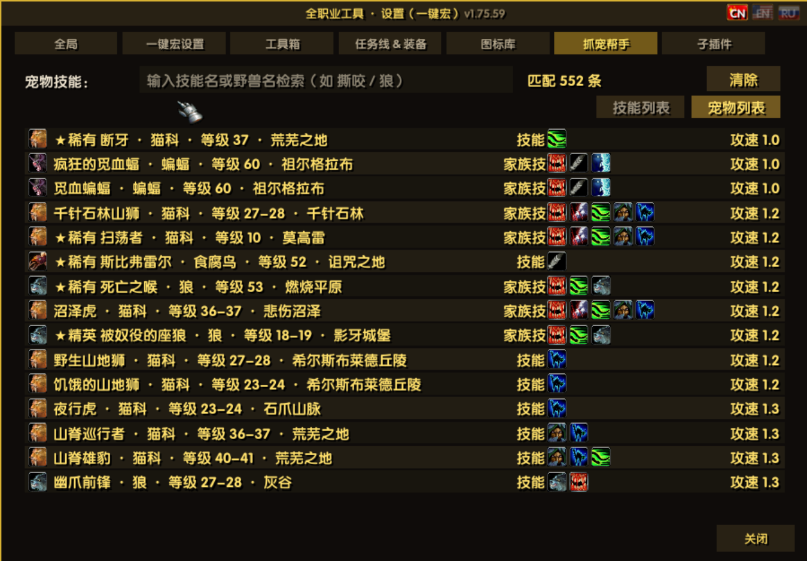
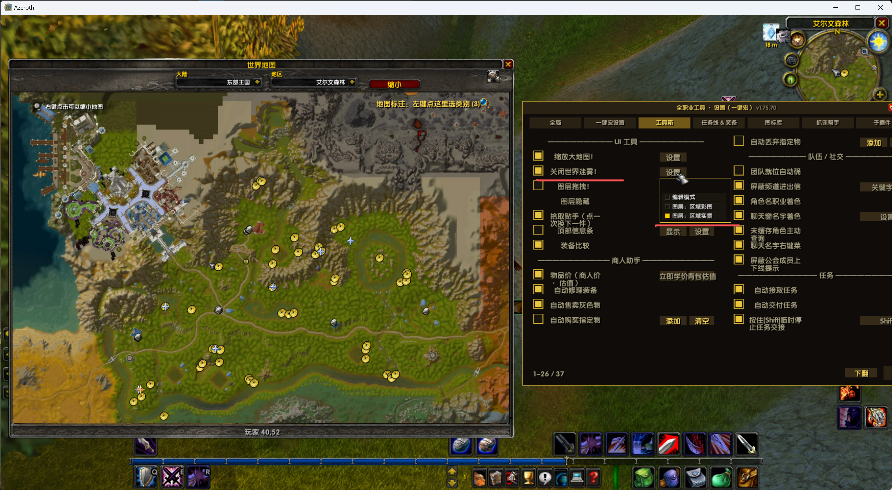

# EvalHelp — Инструмент для всех классов

> 🌍 Языки: [中文](README.md) · [English](README_en.md) · **Русский**（язык в игре: флаги в правом верхнем углу окна настроек）

> Аддон-инструмент **для всех классов** EmberVeil (1.12.1 / Lua 5.1): тело макроса — одна строка `/run EVAL_GO()`, движок правил — **пять категорий навыков** (действия персонажа / навыки персонажа / поведение питомца / выбор цели / использование предметов) × **60 типов условий** (6 групп выпадающего списка: свои · цели · ауры · группа/рейд · навык/чтение · кандидат — 4 типа «кандидат», появляются только в строке выбора участника) × несколько профилей на разных клавишах. Полностью визуальная настройка, без привязки к классу. Плюс пять встроенных страниц: **Инструменты** (**UI-инструменты** · торговец · группа / общение · задания · три помощника · трансляция редких — **полный список строк в таблице ниже**), **Квесты и вещи** (цепочки · снаряжение · четыре вида поиска + слой меток на карте мира, нужен UnrealQuest), **Библиотека иконок** (встроенные иконки макросов клиента: группировка по префиксу, путь при наведении, поиск и постраничный просмотр), **Помощник питомцев** (способности → источник приручения → точки спауна) и **Суб-аддоны** (включение / отключение необязательных суб-аддонов).
>
> 📌 Текст правил (имена навыков / слова условий / импорт-экспорт) остаётся на языке клиента — переводится только оболочка интерфейса.

| Модуль | Вход | Кратко |
| :-- | :-- | :-- |
| 🗡️ **Универсальный макрос** | макрос `/run EVAL_GO()` | Пять категорий навыков: действия персонажа (атака / автовыстрел / выстрел жезлом / отмена каста / смена стойки) / навыки / команды питомца / выбор цели / предметы; число навыков в профиле не ограничено (список прокручивается); до 12 профилей, каждый на своей клавише с прямым запуском (**по персонажу**) |
| ⚙️ **Окно настроек** | значок EH у миникарты · `/eh cfg` | Профили/навыки/условия — полностью визуальное редактирование (**связи четырёх состояний** `&` / `|` / `&&` / `||` — ИЛИ внутри И), текстовый импорт/экспорт; **семь вкладок**: Общие · Макрос · Инструменты · Квесты и вещи · Иконки · Помощник питомцев · Суб-аддоны |
| 📤 **Обмен профилями** | `[Поделиться]` на вкладке макроса / ссылка в чате | посылает частями в гильдию/группу/сказать (с ограничением частоты), получатель жмёт [Импорт]; **ранговая обложка** (`[ранг · имя]` кликабельной ссылкой + окно-подтверждение) · **ранги по очкам** (с 1.74.21: ≥50 очков **и** охват 4+ из 5 групп условий для Божественного · 5 цветов) · **гача титулов** (5×15 · свой титул) · пасхалка «Создатель» · получатель лотерейно отвечает ролевой репликой (ранг титула × ранг трактата) |
| 🧩 **Шаблоны примеров** | окно настроек, вкладка «Макрос», кнопка `[Шаблоны]` внизу | **12 групп, 40 штук**, сгруппированы по классам, **группы в две колонки + перенос строк внутри группы**; клик = мгновенный импорт готового профиля |
| 🧰 **Инструменты** | окно настроек, вкладка 3 | **Список строго по фактической панели** (заголовки групп = строки «—— xx ——»; сейчас **37 строк / 8 групп**): **Инструменты UI**: **Масштаб мировой карты** (флажок + [настройки]: перезапуск GUI; Shift+колесо=прозрачность · Ctrl+колесо=зум · золотая полоса=перетаскивание) · **Отключить туман мира** (флажок + [настройки]: **Режим редактирования / Слой: рисованная карта · Слой: реальная местность** — два взаимоисключающих пункта; **в этом релизе по умолчанию = галочка + реальная местность**, без галочки = исходная карта клиента; переключение вызывает окно «нужен /reload») · **Перетаскивание слоёв** (флажок + [настройки]: выбор слоёв) · **Скрытие элементов слоёв** (**общего флажка нет** — какие слои скрывать, выбирается в [настройках]) · **Добыча под курсором (клик = следующий)** (флажок + [настройки]: следование / значок качества) · **Верхняя инфо-панель** (флажок + [настройки]: шесть сегментов зона·деньги·сумки·сеть·профессии·память + [сброс позиции]) · **Сравнение предметов** (флажок, включено по умолчанию) · **—— Торговец ——**: **Цена предмета (у торговца)** (флажок + изучить / очистить) · **Авто-починка снаряжения** · **Авто-продажа серых предметов** · **Авто-покупка из списка** ([добавить] / [очистить]) · **Авто-выброс из списка** (то же) · **—— Группа / Общение ——**: **Авто-подтверждение готовности** · **Скрыть вход/выход из каналов** ([ключевые слова (N)] мультивыбор) · **Скрыть вход/выход гильдии** (CVar `guildMemberNotify`) · **Цвета по классу** · **Цвета имён в чате по классу** ([настройки]: уровень / зона) · **Авто-/who для неизвестных имён** · **Меню по правому клику на имя** · **—— Задания ——**: **Авто-приём заданий** · **Авто-сдача заданий** · **Удерживать [Shift] для паузы авто-сдачи** (кнопка справа меняет клавишу; снятие флажка = выключить) · **Канал оповещений** (выкл / себе / сказать / группа) · **—— Помощник охотника ——**: **Кормить питомца в один клик** (справа [сброс позиции]) · **Автокормление** · **—— Помощник расходников ——**: **Помощник расходников** ([сброс позиции]) · **—— Верховая езда ——**: **Слезть с транспорта одним кликом** · **Авто-спешивание** · **—— Оповещение о редких ——**: **Трансляция редких** (строка в чат, когда аддон заданий заметил редкого — клик по имени выбирает его) |
| 🧭 **Квесты и вещи** | окно настроек, вкладка 4 | **Вид цепочек**: цепочка узел за узлом (задание · уровень · награда, у каждого узла лупа); **вид снаряжения**: доступные предметы по уровням (оружие вперёд · мультивыбор видов · заглушка без иконки); **четыре вида поиска**: задания / предметы / существа·NPC / объекты (сразу по вводу, вложенность без ограничений); **Детали задания**: блок **NPC начала / завершения** (имя · зона · координаты), **клик по строке открывает карту мира на этом NPC**; **вкладка «Древо»** (иерархия заданий родитель-потомок: объединение строк «открывает / требует», отступ = уровень, несколько предков помечены); **мультивыбор зон и уровней**; в конце строки **иконки наград и нужных материалов** (значок «нуж» показывает весь список при наведении, предметы заданий отфильтрованы); **слой меток на карте мира** (16 категорий, перерисовка вместе с картой; **лупа справа открывает список категорий**, клик вне закрывает; метки **рисуются и на миникарте**; нужен UnrealQuest) |
| 🖼️ **Библиотека иконок** | окно настроек, вкладка 5 | Встроенные иконки макросов клиента сгруппированы по префиксу, при наведении показывается путь, есть поиск и постраничный просмотр |
| 🐾 **Помощник питомцев** | окно настроек, вкладка 6 | Поиск способностей питомцев (иконка + список рангов) → описание / нужный уровень / **источник приручения** (какой моб, где) → лупа ведёт в «Квесты и вещи» к точкам спауна |
| 🧩 **Суб-аддоны** | окно настроек, вкладка 7 | Включение / отключение необязательных суб-аддонов и вход в их интерфейс (сейчас **единый инвентарь EH_Bag** — отдельное окно сумок, повторяющее OneBag, `/ebag` — и **отладка слоёв** EH_DebugBox, `/edb` — **перетаскиваемая панель, остающаяся при закрытии карты**: мультивыбор источников сканирования · фильтры · золотая рамка у выбранного / красная рамка и своя строка сведений при наведении · масштаб/прозрачность/размер/смещения для слоя · журнал своих значений со сбросом одним нажатием); суб-аддон загружается только с галочкой, без неё файлы даже не читаются, у каждого свои `README` / `CLAUDE` / `CHANGELOG` и два отдельных архива при релизе |
| 🔍 **Панель состояния** | `/eh st` | Обзор переменных состояния в реальном времени + разбор условий последнего срабатывания √× |
| 📝 **Журнал состояния** | `/eh` | Двойная запись: чат + файл журнала |

> 📌 Аддон активно развивается — отзывы и тесты приветствуются!　🐞 [Отчёты об ошибках / предложения](https://gitee.com/xeval/emberveil_eval_help.git)（Issues）　🤖 Разработано при поддержке DeepSeek Harness AI (см. «Участие в разработке» в конце)

## 🏁 Вехи (1.52.0 → 1.75.101)

- **🎒 EH_Bag: покачественная яркость + одноканальное свечение (открытие == возврат фокуса) + интервал ячеек в меню настроек · Макрос: условия «смена / свой предмет / своя экипировка»** (1.75.100 → 1.75.101 / EH_Bag 0.3.31): яркость по ступеням настраивается вручную (`B.QUAL_K`, зелёный 0.80 / синий 1.3225, без авто-нормализации); альфа свечения переведена на **один канал** (4-й аргумент цвета вершины, `SetAlpha` всегда 1 ⇒ **вид при открытии совпадает с видом после фокуса**, коэффициенты действуют линейно); «интервал ячеек» переключается из меню настроек (`B.cgap`). Три новых условия: **смена:слот:предмет** (после выбора предмета выпадает список слотов), **свой предмет** (сумма всех стопок ≥ N), **своя экипировка готова** (эффект использования + кулдаун, читается из невидимой подсказки); высота/ширина кнопок профиля вынесены в две константы в начале файла (`UI_PROF_BTN_H` / `UI_PROF_MIN_W`). DragFrames: одиночный левый клик по значку настроек **сбрасывает свойства рамки** (`dfResetOne`).
- **🎒 Суб-аддон EH_Bag: от нуля до полного набора, и сравнение предметов поддерживает оба механизма** (1.75.91 → 1.75.99 / EH_Bag 0.3.22 → 0.3.30): на вкладке 7 вырос **единый инвентарь**, повторяющий OneBag по пунктам (непрерывная раскладка · свечение качества · сортировка одной кнопкой · обзор по персонажам · отсчёт перезарядки · строка денег со значками монет · **абсолютно самодостаточные ресурсы**: свои текстуры + проба с **негативным контролем** + откат на клиентскую копию, если не определить); в этой партии закрыты три причины = «пустые ячейки при первом открытии ярче, чем после наведения» (**4-й аргумент цвета вершины и `SetAlpha` перемножаются и применяются в разное время** ⇒ alpha идёт через цвет вершины, `SetAlpha` жёстко = 1) · свечение выходило за ячейку и подсвечивало соседей и линии фона (снаружи **должно быть 0**: 492 → 0 пикселей) · «нормализация яркости» свечения **полностью откатана** по просьбе пользователя (яркие ступени больше не затемняются); у каждого суб-аддона теперь свои `README`/`CLAUDE`/`CHANGELOG` и **два отдельных архива**; сравнение предметов исправлено для «слепоты внутри прокси-сумки» (суб-аддон сам сообщает о наведении, оба механизма по одной мерке).
- **🧭 Три правки вёрстки в редакторе навыков + строка профилей в боевом UI держит иконку и имя вместе** (1.75.79 → 1.75.82): у строк условий появились **▲/▼ для перестановки** (записи меняются целиком, а связка `conn` остаётся на месте — она относится к позиции, а не к условию) + цвета функциональных кнопок (перестановка = тёмное золото / добавить = зелёный / удалить = красный) и более широкое окно (с пошаговым откатом, если не помещается); справка о связках стала **одним листом для трёх мест, простыми словами и без `**`** (GameTooltip — простой текст, звёздочки рисуются как есть); три нижние кнопки теперь **в одну строку и по левому краю**; строка профилей измеряет «иконку + имя» **как одну плотную группу** через `max(замер, оценка по символам)` (китайский `GetStringWidth` занижает, и 1 px достаточно, чтобы имя сжалось до «神…»).
- **🏷 Единая формулировка условий «группа / рейд» + 🎨 пять цветов ступеней «белый/зелёный/синий/фиолетовый/оранжевый» + 💎 призывы в помощнике расходников + 🎯 строка профилей боевого UI центрируется группой** (1.75.83 → 1.75.90): **отображаемые имена условий больше не содержат направления** (его задаёт да/нет), и **имя = текстовое обозначение = `cd.name` совпадают** — переименование никогда не трогает сохранения и текст обмена (проверка `tmp/team_label_check.js`: 64 пина + 34 мутации); цвета ступеней = **белый / зелёный / синий / фиолетовый / оранжевый** (божественная перешла с ярко-синего на оранжевый, все четыре места рисования и строка обмена читают один источник); помощник расходников пропускает призывы **по id предмета** (4 самоцвета маны мага + 5 камней здоровья чернокнижника — правило по классу их отсекает: в реальных данных агат маны числится «бронёй»); строка профилей боевого UI центрирует группу «иконка + имя» внутри кнопки (текстовое поле обязано использовать `SetJustifyH("LEFT")`, а не якорь `CENTER`).
- **🎹 Привязки клавиш по персонажу + 💰 цены в наградах за задания + 📋 копирование/вставка в списке навыков + ✂️ экранирование вертикальной черты** (1.75.74): клиент хранит привязки **на аккаунт** (один файл на всех персонажей) ⇒ клавиша, привязанная на персонаже A, остаётся и на B, поэтому аддон ведёт **записи по персонажу и сверяет их при каждой загрузке** (`war.bindByChar[персонаж][профиль]`; **идемпотентно, сохраняем только при реальном изменении**; перед снятием чужого остатка проверяем, есть ли у **этого персонажа** навык в слоте, и мы **никогда не снимаем `ACTIONBUTTON1~12` оптом** — эти имена команд и есть клавиши панели игрока; правило слота — «у команды вообще нет клавиши», а если ничего не подходит, мы **честно сообщаем, что привязать нельзя**, и даём выход (освободить слот / макрос), не отбирая клавиши; новый порт только для чтения `/eh go bind` печатает все 12 слотов); в том же выпуске: цены предметов теперь и в **наградах за задания** (исправление такта + защита от падения), в списке навыков появились правый клик **копировать / вставить** (между профилями, с плашкой буфера и подсказкой у заголовка), а поле импорта/экспорта стало **многострочным** с **экранированием вертикальной черты** (измерено: клиент заменяет полуширинную `|` внутри EditBox на символ той же длины — экспорт в 918 байт совпал с офлайн-рендером побайтово).
- **🧭 В деталях задания появились NPC «начало / завершение» с координатами зоны и переход на карту по клику; 🔇 предпросмотр макроса больше не засоряет чат** (1.75.72 → 1.75.73): в деталях задания добавлен блок **NPC начала / завершения** (имя · зона · координаты), **клик по строке открывает карту мира на этом NPC** (тот же путь, что и у списка поиска); если это одно и то же лицо, строка одна и помечена «(начало и завершение)» (по замерам совпадает в 60% заданий), а координаты берутся из **собственной зоны NPC, а не из зоны задания** (иначе выдающий задание в Лок Модане оказался бы внутри Ульдамана); в сравнении предметов добавлены **два условия «стоит ли вообще сравнивать»** (только классы снаряжения и только когда у второй стороны действительно есть сравнимые атрибуты) и исправлено «**не показывается ни подсказка клиента, ни наша рамка сравнения**» (нативный вход обёрнут в pcall · видимость только через `IsVisible` · ранние выходы теперь обнуляют сводную таблицу); а строка журнала «совместное попадание» убрана из **функции вычисления** — предпросмотр боевого интерфейса вычисляет каждые 0,15 с, поэтому строка выдавала **6~7 строк в секунду**, пока условие выполнялось (при этом на этом пути **ни один навык не применялся**), а реальные применения по-прежнему сообщает единственная строка «trigger: joint:…».
- **🎚 Умолчания карты мира: «непрозрачно + исходный масштаб» + библиотека «реальной местности» заменена набором, перерисованным ИИ** (1.75.71): умолчания строки «Масштаб мировой карты» меняются с **0,7 / 0,7** (полупрозрачно) на **непрозрачность 1,00 / масштаб 1,00** — непрозрачность ниже 1 не тонирует карту, а накладывает её полупрозрачно на фон, поэтому **исходные цвета размываются** (истинная причина жалобы «карта теряет цвет»; та же причина давала «мерцание текстуры при 0,7»); в старых сохранениях обновляются только **старые значения по умолчанию** (0,75 / 0,7) — **значения, выставленные самим пользователем, не трогаются** — с честным уведомлением; библиотека «реальной местности» заменена на **набор, перерисованный ИИ**, с ограничением ширины 1500 px (21 слишком большой файл: 76,4 → 44,8 МБ), а ключ `Balor` удалён вместе с картинкой (**57 → 56 карт**).
- **🗺️ Слой «реальная местность»: карта мира теперь заливается снимком региона (+ спецификация ассетов)** (1.75.61 → 1.75.70): в «Отключить туман мира → [настройки]» добавлены **два взаимоисключающих пункта** (**рисованная карта** клиента / **реальная местность** = по одному JPG на регион из `media\WorldMapJpg`, заполняющему базовую рамку 1002×668 и записываемому в слой отрисовки `OVERLAY`, поэтому он перекрывает остальные слои группы); **в этом релизе по умолчанию = галочка + реальная местность** (без галочки = исходная карта клиента; переключение флажка вызывает окно «нужен /reload», а смена слоя действует **сразу**); данные позиционирования = `MapOverlayJPGData.lua` + отдельная база смещений `MapOverlayOffsetJPG.lua`, правка через **тот же режим редактирования**, что и у тайлов тумана (перетаскивание / стрелки / размер / двухуровневый сброс), оба набора смещений полностью разделены, а любое переключение выполняет **чек-лист отключения**; библиотека выросла до **57 карт** (из столиц только три открытые: Штормград · Дарнас · Громовой Утёс), все ассеты теперь **шириной ≤1500 px + сжатие с контролем качества** (27,6 МБ → 11,0 МБ, SSIM ≥0,98). Заодно: метка качества добычи стала **обводкой по рамке** (только «необычное» и выше), а весь инструмент «тест форматов текстур» удалён.
- **🖌 «Режим редактирования» тумана мира + отдельная база смещений + список аннотаций карты теперь выше карты** (1.75.60): перетаскивание каждого тайла прямо на карте (невыбранный тайл первым нажатием только выделяется — тянуть нужно вторым; правый клик в любом месте отпускает перетаскивание; Shift выделяет всю группу) · номера остаются видимыми, **наведение подсвечивает соответствующую рамку, а удержание начинает перетаскивание** · панель из десяти рядов (стрелки позиции · размер · выделение · **двухуровневый сброс** · переключатели вида · **общая прозрачность** · **Сохранить (запись на диск + перезагрузка)**); правки можно «запечь» в отдельную базу смещений (`MapOverlayOffset.lua`), поставляемую с аддоном (приоритет: сохранение > файл > нет); ★для всплывающего окна из карты нужен **хост `WorldFrame` + `FULLSCREEN_DIALOG` + вычисляемый уровень** — истинная причина в том, что **открытие полноэкранной карты скрывает UIParent** (фреймы внутри него вообще не рисуются, поднятие strata не помогает).
- **🗺️ Туманы мира переименованы в «Отключить туман мира» · оба переключателя карты по умолчанию сняты** (1.75.51 → 1.75.59): две строки в наборе инструментов → UI-инструменты приведены к формулировке пользователя (**снят = исходная карта клиента; включает только установленный флажок**, вторая строка переименована в «**Отключить туман мира**»), **оба по умолчанию не отмечены** (в прежних версиях по умолчанию было включено ⇒ при загрузке nil превращается в явный false и **об этом честно сообщается один раз**; если старая запись сама включала чистку остатков, этот явный выбор уважается); переключение любого из них показывает **окно «нужен /reload»** (единственная реализация `EVAL_RELOAD_ASK`, «Перезагрузить» идёт через `RunScript` в обход защищённого `ReloadUI`); весь туманный блок вынесен в отдельный модуль `tools/WorldFog.lua` (свой такт + своё поддерево настроек, **без жёсткой связи с масштабом карты**) с полным **порядком выключения** (вернуть ресурсы / реально снять такт: `MDQ.beatSync` — единственный вход, поэтому при выключенном по умолчанию не выполняется ни одного пустого такта / сбросить данные / убрать слои: свои скрыть, переиспользованные слоты вернуть по пяти параметрам, всё скрытое показать обратно); сдержана производительность (окно всплеска по собственной реальной подписи движка + повторное взведение ≥0.5 с + лимит кадров, сравнение перед записью ⇒ в устойчивом режиме нулевых записей).


## Журнал обновлений

| Версия | Тема | Главное одной строкой |
| :-- | :-- | :-- |
| **1.75.101** | ⚔️ **Макрос: условие «смена» + константы строки профилей · EH_Bag: интервал ячеек в меню настроек** | «смена:слот:предмет» (после выбора предмета выпадает список слотов; имена слотов из `SW_SLOT_NAMES`) · высота/ширина кнопок профиля = `UI_PROF_BTN_H`/`UI_PROF_MIN_W` · EH_Bag 0.3.31g/h: `B.cgap` три единственных + строка-цикл в меню (ступени {0,1,2,4}) |
| **1.75.100** | 🎒 **EH_Bag: покачественная яркость + одноканальное свечение (открытие == возврат фокуса) · два новых условия · сброс рамки левым кликом** | `B.QUAL_K` вручную по ступеням (зелёный 0.80 / синий 1.3225, без авто-нормализации) · альфа свечения только в 4-м аргументе цвета вершины, `SetAlpha` всегда 1 ⇒ открытие == возврат фокуса, коэффициенты линейны · условия «свой предмет / своя экипировка готова» + зонд экипировки · левый клик по значку настроек сбрасывает рамку |
| **1.75.99** | 🎒 **EH_Bag: нормализация яркости свечения полностью откатана по просьбе пользователя — больше не затемняем** | В 0.3.29 **записываемое α** каждой ступени умножалось на `(яркость эталона ÷ своя яркость)^0.5` (зелёный 0.65 / оранжевый 0.69 / золото при наведении 0.56) ⇒ пользователь попросил вернуть; теперь α пишется **как базовое значение** (качество 0.85 / наведение 0.85), а вся машинерия (`GLOW_REF_Q`/`GLOW_POW`/`GLOW_L_MIN`/`GLOW_A_MAX`/`glowRefLuma`) вместе с формулировками нормализации в `/ebag status` удалена; ★**цена сообщается честно**: яркие ступени (зелёная / оранжевая / золото) снова выглядят толще и ярче синей (отчёт 0.3.28 возвращается) — «все ступени одинаково тонкие» возможно только нормализацией, а нормализация по эталону = затемнение ярких; единственный вариант без затемнения (эталон = самая яркая ступень) **не** применялся без согласия. |
| **1.75.98** | 🎒 **EH_Bag: все ступени качества выглядят как синяя** (свечение нормализовано по яркости цвета) | Причина = **«один и тот же alpha» ≠ «один и тот же вид»**: свечение идёт через **ADD** и поднимает **собственную яркость цвета** (Rec.601, яркая ступень: синий 0.338 · зелёный 0.587 · фиолетовый 0.315 · оранжевый 0.519 · золото 0.783) ⇒ при одном α **зелёная рамка ярче синей в 1.7 раза**; исправление = нормализация в единственном месте записи по `(яркость эталона ÷ своя яркость)^0.5` ⇒ α = синий **0.85** (эталон, ни байта не сдвинулся) / зелёный 0.65 / фиолетовый 0.88 / оранжевый 0.69 / золото 0.56, а **база восприятия (эффективная α² × яркость) = 62.3 у всех пяти**. ★В следующей версии полностью откатано по просьбе пользователя. |
| **1.75.97** | 🎒 **EH_Bag: свечение выходило за ячейку — зелёная рамка подсвечивала линии фона вокруг** | Текстура свечения **производная** от `slotframe.tga` и хранила **вес 0.35 вне заливки** = свечение наружу, попадавшее **за границу ячейки** (замер `tmp/slotglow_out_probe.js`: **492 пикселя** вне полосы рамки, максимум alpha 52) ⇒ под ADD **зелёный (0.587) виден, синий (0.114) нет**, поэтому только зелёная ячейка получала лишнее кольцо; исправление = жёсткий запрет в генераторе («вне заливки — 0») и перегенерация текстуры (3708 → 1893 байт) при **неизменной последовательности затухания внутри**; повторный замер: снаружи **0**. |
| **1.75.96** | 🎒 **EH_Bag: «пустые ячейки при первом открытии ярче, чем после наведения» — два альфа-канала применяются в разное время** | Клиент **перемножает** **4-й аргумент цвета вершины** и `SetAlpha`, причём **цвет вершины применяется на первом кадре, а `SetAlpha` — нет** (остаётся 1 по умолчанию) ⇒ старая схема (вершина = 1, весь alpha на `SetAlpha`) открывалась **чисто белой**; исправление = **alpha через цвет вершины**, **`SetAlpha` всегда = 1** + **начальные значения при создании = состояние пустой ячейки**; обе отменённые схемы закрыты обратными пинами. |
| **1.75.95** | 🎒 **EH_Bag: ресурсы абсолютно самодостаточны** — 15 фиксированных текстур клиента в `media\` + единое чтение «своё → клиент» | Аудит = два **скрипта только для чтения** (литералы путей и места вызова клиентских ресурсов, комментарии срезаны); эти 15 (WHITE8X8 · ChatFrameBackground · UI-Tooltip-Border · значки сумок/связки ключей · знак вопроса · 8 иконок категорий) извлечены **побайтово** из `interface.MPQ` TurtleWoW (50.3 КБ, исходные имена сохранены); в коде всё сведено в **один механизм и одно чтение**: `B.MEDIA` + две формы пути + проба + **негативный контроль** (не определить ⇒ всегда откат на клиентскую копию = побайтово как «не копировали») + единственный список `B.RES_LIST` + единственное чтение `B.res()`; проверка `/ebag res`. |
| **1.75.94** | 🎒 **EH_Bag: «рамка пустой ячейки бледнеет после наведения» (alpha перемножается) + атлас денег в суб-аддоне** | `applySlotTint` писал одно и то же alpha и в **4-й аргумент цвета вершины**, и в `SetAlpha`, а клиент эти каналы **перемножает** ⇒ пустая рамка показывала 0.35 × 0.35 ≈ **0.12** (у ячеек с предметом a = 1, то есть 1 × 1 = 1 — совпадает с «бледнеют только пустые»); исправление = alpha **по одному каналу**, цвет вершины всегда 1; в той же партии атлас `UI-MoneyIcons.blp` извлечён побайтово из MPQ (2580 байт · BLP2 · 64×16, четыре ячейки) и теперь имеет приоритет. |
| **1.75.93** | 🎒 **EH_Bag: «предметы банка показываются как ?» в обзоре + аудит независимости ресурсов + зонд только для чтения** | По реальному сохранению: ссылки в сумках полные, а в **секции банка `l` (ссылка) отсутствует полностью, имена — `"?"`** ⇒ клиент **не отдаёт ссылку** для слотов банка (`GetInventoryItemLink("player", 40..63)`; путь текстуры при этом работает); исправление = **обратный поиск в четыре шага** (своя скрытая подсказка для имени → ссылка контейнера только при **дословном совпадении имени** → вытащить `item:<id>` из строки → иначе сохранить **строки**, и обзор печатает именно тот текст, что нарисовал клиент); в той же партии: **0** ссылок на папки сторонних аддонов и зонд `/ebag bankread` (детали в ограниченном кольце). |
| **1.75.92** | 🎒 **EH_Bag: две правки вёрстки** — разрез рамки поиска на три части / диалог разделения без «Отмены», [OK] в той же строке | Причина = растянутая на длинную полосу рамка 64×64 увеличивает **вертикальные линии ≈12 раз** и расплющивает горизонтальные ⇒ две толстые полосы по краям; исправление = **горизонтальный разрез на три части** (левый край u 12..16 / середина 16..47 / правый 47..51, по вертикали только полоса рамки 13..52 ⇒ у каждой части свои пропорции, толщина линий одинакова) с единственным входом геометрии `B.sboxEdgeFit`; диалог разделения **теряет кнопку «Отмена»** (вместе с ключами всех трёх языков), **[OK] в одной строке** с −/＋/половина/всё (отмена — только клик вне окна). |

> 📜 Подробности по каждой версии — в **[CHANGELOG.md](CHANGELOG.md)**; более ранняя история — в записях git.

## 🧩 Шаблоны примеров (12 групп, 40 готовых профилей)

> Не нужно собирать с нуля. Окно настроек → вкладка «Макрос» → внизу **`[Шаблоны]`** → выберите по классу, **щелчок — и профиль импортирован**.

| Пункт | Описание |
| :-- | :-- |
| **Вход** | Окно настроек, вкладка «Макрос», кнопка `[Шаблоны]` внизу |
| **Содержимое** | **12 групп / 40 профилей**: 战士 / 骑士 / 猎人 / 盗贼 / 牧师 / 萨满 / 法师 / 术士 / 德鲁伊 / 通用法系 / 通用 / 队伍·团队（заголовки групп — внутренние имена аддона） |
| **Раскладка** | Две колонки по группам, перенос внутри группы; **наведение** показывает навыки и условия шаблона |
| **Импорт** | Один щелчок создаёт профиль — дальше правьте, переименовывайте, назначайте клавишу |

Группа **«Отряд·Рейд»** (6 профилей) — это лечение и развеивание одной кнопкой. Все они записаны как
«**конкретный навык + условие по участнику отряда (рейда)**»: условие само сканирует группу, выбирает
самого раненого, переключает цель, кастует и возвращает прежнюю цель — **по союзникам кликать не нужно**.

> 💬 Есть удачный профиль? Делитесь им в комментариях к аддону или используйте `[Поделиться]` в окне настроек.

## Предпросмотр интерфейса

**Окно настроек · вкладка «Общие»** (`/eh cfg` или значок EH у миникарты): левая колонка — **Журнал** (журнал отладки `/eh logdump`, журнал навыков профиля, авто-вывод при входе/выходе из боя) + **Интерфейс** (Боевой информационный UI `/eh ui` с подпунктами «боевая зона / зона профиля» и Статусный UI `/eh st`) + группа «макрос в один клик» внизу ([пересканировать панели] + задержка 0.30 с); правая колонка — **Справка** ([обучение] + четыре раздела: быстрый старт / запуск конкретного профиля / продвинутое / прочее); в заголовке — версия и переключатель языка (CN / EN / RU) с [закрыть]; ★ снимок сделан на **v1.75.59** (**семь вкладок**: Общие · Макрос · Инструменты · Квесты и вещи · Иконки · Помощник питомцев · Суб-аддоны; раскладка с тех пор не менялась, версия в заголовке — просто старое значение).



**Окно шаблонов** (окно настроек → вкладка «Макрос» → `[Шаблоны]`): **12 групп / 40 готовых профилей** по классам (воин / маг / общий кастер / общий / разбойник / охотник / паладин / жрец / друид / чернокнижник / шаман / группа·рейд), раскладка **в две колонки с переносом внутри группы**; клик импортирует, при наведении видно содержимое; ★ **снимок сделан на v1.74.0** (имя вкладки и версия в заголовке — старые) ⇒ **нужно переснять**



**Редактор навыка** (клик по `[ред]` или по иконке навыка): условия настраиваются построчно — тип / параметры выбираются из списков (**60 типов условий · 6 групп**: свои / цели / ауры / группа·рейд / навык·чтение / кандидат; 4 типа «кандидат» появляются только в строке выбора участника), справа от имени навыка можно выбрать **ранг чтения**, справа вверху `[включить навык]`; столбец связи — **цикл из четырёх состояний** `&` И внутри пункта / `｜` ИЛИ внутри пункта / `&&` И между пунктами / `｜｜` ИЛИ между секциями (приоритет `& > ｜ > && > ｜｜`, теперь можно писать ИЛИ внутри И); ★ **снимок сделан на v1.74.0**: столбец связи на нём ещё старый, имя вкладки и версия тоже ⇒ **нужно переснять**



**Двухуровневый список навыков · четыре вида** (строка навыка в редакторе = `[категория ▾][пункт ▾]` — два списка рядом, пункты с иконками):

- **Навыки персонажа**: белый список + сканирование всей панели действий
- **Команды питомца**: 8 команд питомца (прямой вызов Pet API, слот панели не нужен), иконки самообучаются по панели питомца
- **Выбор цели**: 9 способов переключения (ближайший враг / предыдущая цель / цель цели / по имени / сброс цели…); макрос сначала переключает цель, затем действует
- **Предметы**: сканирование сумок в реальном времени (иконки + количество) + ручной ввод имени — расходники используются сразу, экипировка надевается автоматически

**Проверки аур (4 типа, имена — мультивыбор)**: свой бафф / дебафф цели / бафф цели / свой дебафф (переключатель да/нет, реальные ◆○●▲) — **ячейка имени принимает несколько аур** (переключение нажатием, поиск, свой ввод; галочки сохраняются при повторном открытии): **достаточно любого выбранного** (ИЛИ), а направление «нет / нехватка» требует, чтобы **каждый** пункт нуждался в обновлении; первая строка списка объясняет правило, подсказка перечисляет все выбранные + направление, лог пишет «любой сработал → X» / «нужны все → X» — «无buff:再生/治疗药水» запускает выпить зелье, «无目标buff:奥术智慧/野性印记» — раздачу баффов:

**Боевая панель + панель состояния**（`/eh ui` / `/eh st`）: полосы HP/энергии/цели + строка профилей + строка иконок навыков (наведите — tooltip с условиями срабатывания, золото = условия выполнены прямо сейчас, клик по иконке открывает редактор); панель состояния показывает все переменные в реальном времени + журнал последних срабатываний (навык/цель/поусловный разбор √× для каждого действия)

**Инструменты (вкладка 3)**: панель разложена как **заголовки групп + строки** (сейчас 37 строк / 8 групп) — на снимке видны **Инструменты UI** (**Масштаб мировой карты** / **Отключить туман мира** / **Перетаскивание слоёв** / **Скрытие элементов слоёв** / **Добыча под курсором (клик = следующий)** / **Верхняя инфо-панель** / **Сравнение предметов**) и **—— Торговец ——** (**Цена предмета (у торговца)** / **Авто-починка снаряжения** / **Авто-продажа серых предметов** / **Авто-покупка из списка**, справа [добавить] / [очистить]); слева полноэкранная карта мира (открытый список в её правом нижнем углу — мультивыбор категорий меток), а меню справа — это «**Перетаскивание слоёв → [настройки]**»; ★ **снимок нужно переснять**: оба переключателя карты на нём ещё **отмечены**, а в заголовке — **v1.75.53** на момент съёмки (сейчас **Масштаб мировой карты** снят, а **Отключить туман мира** отмечен и работает в режиме **реальной местности**); режим «блоки-якоря» у перетаскивания слоёв и новая полоса кормления в снимок тоже не попали — актуальный вид набора инструментов и переключателей карты показан на новом снимке **v1.75.70** ниже



> ⚠️ **Требуется** аддон **UnrealQuest** — все записи на этой странице (задания / предметы / существа / NPC) берутся из его базы. Если он не установлен или отключён, страница покажет только инструкцию, а элементы управления будут скрыты.

**Квесты и вещи (вкладка 4)**: **вид цепочек** (цепочка от начала до конца, узел за узлом: задание · уровень · награда, у каждого узла лупа) + **вид снаряжения** (доступные предметы по уровням, оружие вперёд, мультивыбор видов) + **четыре вида поиска** (задания / предметы / существа·NPC / объекты; сразу по вводу, первые 10 совпадений, вложенность без ограничений, подсказка предмета при наведении); **слой меток на карте мира** (16 категорий, перерисовка вместе с картой) — строка управления «**Метки карты (N)**» на самой карте = мультивыбор категорий (5 ресурсов + 11 услуг, с быстрыми «включить все / выключить все»)

**Вид снаряжения**: строка поиска (снаряжение / задание / награда) и четыре фильтра — **уровень** (например `10-19`) / **источник** (мультивыбор дерева регионов: профессии·ремесло·праздничные задания · зоны мира · подземелья · прочее) / **тип** (например меч) / **фракция**; список **доступного снаряжения** по уровням (оружие вперёд; строка = `Lv · имя · тип · зона · DPS · источник`), внизу **постранично** (`1-4 / 4` + назад / вперёд); клик показывает, какая цепочка его даёт и какие задания нужны; предметы, которых ещё нет в кэше иконок, рисуются **заглушкой** — клик ставит их в очередь; ★ **снимок сделан на v1.75.13** (добавленные позже метки материалов «**нужно**» в него не попали) ⇒ нужно переснять



**Дерево квестов (родитель / потомок)**: подвкладка «Дерево квестов» — **отступ = уровень иерархии** (предусловия ⇄ продолжения строятся по объединению «открывает / требует» с сайта плюс следующий шаг цепочки как запасной вариант), у заданий с несколькими предусловиями стоит **(N предусловий)**, в конце строк — иконки награды и метка материалов «**нужно**»; фильтры уровней (например `30-39, 40-49`) / источника / типа / фракции и **постраничность** (`1-17 / 36`) такие же, как в других видах, а нижняя строка объясняет правила дерева; дерево ограничено 600 строками, «много предусловий» и «упёрлись в лимит» считаются отдельно и сообщаются честно; ★ **снимок сделан на v1.75.13** ⇒ нужно переснять



**Помощник питомцев (вкладка 6) · список питомцев**: поле поиска (имя способности или зверя, например 撕咬 / 狼) со счётчиком «**совпадений: 552**» и [очистить], справа вверху два переключателя **список способностей ⇄ список питомцев** (на снимке — список питомцев); каждая строка = `★редкий имя · семейство · уровень · зона` + **полоса иконок способностей** (метка `技能` = чему он реально учит по таблице приручения / `家族技` = врождённое для семейства) + справа столбец **скорости атаки** (**по возрастанию**, 1.0 первым); список способностей — другой путь: способность → список рангов → источник приручения, на странице деталей описание / нужный уровень / **источник приручения** (какой моб, где) и лупа, ведущая в «Квесты и вещи» за точками появления; ★ этот снимок сделан на **v1.75.59** (в этом релизе здесь изменился только номер версии в заголовке)



**Слой «реальная местность» на карте мира + набор инструментов → «Отключить туман мира → [настройки]»** (с 1.75.64): при открытии карты мира она заполняется целиком одной картинкой региона из `media\WorldMapJpg` (**по одной на регион**, растянутой на рамку 1002×668 — на снимке Элвиннский лес, нижняя строка `Игрок: 40,52`; слой пишется в `OVERLAY`, поэтому внутри своей группы он **самый приоритетный** и перекрывает остальные); строка управления «**Метки карты (N)**» у правого края карты перерисовывается вместе с картой (16 категорий, левый клик по ней выбирает категории); справа — набор инструментов с открытым списком `[настройки]` строки «**Отключить туман мира**»: **Режим редактирования / Слой: рисованная карта / Слой: реальная местность** (на снимке отмечена **реальная местность**; это два взаимоисключающих пункта, переключение действует **сразу**, без /reload; тонкая правка — через режим редактирования, **теми же** средствами, что и у тайлов тумана); ★ снимок сделан на **v1.75.7x** (текущая версия; правый край снимка обрезал последнюю цифру версии): слой «реальная местность» — **набор, перерисованный ИИ** (библиотека ужата до ширины 1500 px), а строка набора инструментов показывает **умолчания этого релиза** (непрозрачность 1.00 / исходный масштаб 1.00)



> 📷 **Пока нет снимков**: **режима редактирования** тумана мира (список тайлов справа от карты и панель из десяти рядов со стрелками позиции / размером / двухуровневым сбросом) и **блоков-якорей** перетаскивания слоёв ⇒ **нужно переснять** — функции работают; после съёмки достаточно заменить файл в `preview/`, текст менять не нужно.


## Быстрый старт

1. Перетащите нужные навыки на панель действий
2. В игре введите `/eh go rescan`, чтобы аддон распознал слоты (`/eh go` — посмотреть результат распознавания)
3. **Привязка клавиши (рекомендуется, только клики)**: ПКМ по любому профилю (строка профиля в боевом интерфейсе или список в настройках) → управление профилем → выберите клавишу → [Сохранить]. **Альтернатива** для любителей макросов: `/run EVAL_GO()` одной строкой и перетащить на клавишу. ★**Привязки — по персонажу**: у каждого персонажа аккаунта свои клавиши (сверка выполняется автоматически при входе, чужие привязки с собой не переносятся).
4. Быстрый старт с шаблонов: окно настроек → вкладка «Макрос» → [Импорт/Экспорт] → **[Шаблоны]** — библиотека сгруппирована по классам, клик = импорт готового профиля, дальше подгоните под себя
5. **Впервые здесь?** Введите `/eh guide` — руководство из четырёх шагов (боевой интерфейс → первый профиль → привязка клавиши → журнал способностей); при первом входе оно показывается автоматически.
6. `/eh debug` — в чате показывается причина каждого решения при нажатии, удобно настраивать пороги

## Установка

**Способ 1: скачать релиз (рекомендуется)** — скачайте свежий `EvalHelp-vX.Y.Z.zip` со [страницы Releases](https://gitee.com/xeval/emberveil_eval_help/releases), распакуйте в `Interface/AddOns/` (после распаковки должно получиться `AddOns/EvalHelp/EvalHelp.toc`):

```
https://gitee.com/xeval/emberveil_eval_help/releases/download/v1.75.101/EvalHelp-v1.75.101.zip
```

**Способ 2: клонировать исходники** — `git clone git@gitee.com:xeval/emberveil_eval_help.git`, поместите весь каталог в `Interface/AddOns/` и убедитесь, что каталог называется `EvalHelp`.

Структура каталога:

```
Interface/AddOns/
└── EvalHelp/
    ├── EvalHelp.toc     ← правило каталогов: Folder/Folder.toc
    ├── EvalHelp.lua
    └── README.md
```

## Самопомощь при сбоях (при проблемах смотрите сюда)

1. **Сначала `/reload`**: навыки не распознаются, глючит интерфейс, только что обновили файлы аддона — в большинстве случаев перезагрузка всё чинит (конфиг сохранён и не пропадёт);
2. Навыки сменили позицию / новые перетащены на панель → `/eh go rescan` пересканировать;
3. Включите отладку и смотрите процесс решений → `/eh debug` (почему каждый навык кастуется / не кастуется, поусловно √×);
4. Не решено → заведите Issue на <https://gitee.com/xeval/emberveil_eval_help.git> (скриншот состояния `/eh st` + файл журнала сильно помогают локализации).
5. **Чужой профиль не применяет часть способностей**: обычно текстура ауры не изучалась на этой машине — теперь она ищется по имени и запоминается; `/eh go tex` — список, `/eh go texdel <имя>` — удалить одну, `/eh go texclear` — очистить;

## Участие в разработке (добро пожаловать!)

- Репозиторий: <https://gitee.com/xeval/emberveil_eval_help.git> (после `git clone` свяжите или скопируйте `EvalHelp/` в `Interface/AddOns/` — можно разрабатывать и отлаживать);
- **Руководство разработчика**: см. `DEVELOPMENT.md` (карта архитектуры / проверенные на этом клиенте рецепты UI / движок правил и структуры данных профилей / обязательная проверка синтаксиса перед коммитом);
- **Память для ИИ-совместной работы**: `CLAUDE.md` — тело памяти ИИ-разработки этого проекта (DeepSeek Harness / Claude Code и другие ИИ-ассистенты быстро входят в контекст, прочитав его);
- Соглашения процесса: каждое изменение увеличивает номер версии (`local VERSION` + `## Version` в toc + `MDQ.BUILD` в `tools/WorldFog.lua` — три места должны совпадать (в шапке lua версии больше нет)), после правок прогонять `node luacheck.js` — полный разбор синтаксиса;
- Расширение на новые классы: никаких белых списков навыков нет — навыки берутся чистым сканированием панели действий, поэтому любой класс работает из коробки: перетащите навыки на панель, пересканируйте и соберите профиль (движок правил/профили/UI полностью класс-независимы);
- Этот аддон разработан при поддержке **DeepSeek Harness AI** — приходите и вы вместе со своим ИИ.

## Поддержать нас

EvalHelp был и всегда будет бесплатным и открытым.

Если аддон вам помог и хочется поддержать автора, можно проспонсировать немного вычислительных ресурсов ☕. Всё идёт в дело: аккуратная полировка, быстрые исправления и готовые шаблоны для новых классов.

И конечно, даже звезда, замечание или рассказ согильдийцу — уже большая поддержка. Спасибо, что дочитали.

| Alipay | WeChat |
| :---: | :---: |
|  |  |

## Благодарности

- Рецепты UI из практики: UnrealQuest (ClientAPI.lua); дизайн переменных состояния: Cat (TurtleWoW); самый первый ориентир: OneJudge.
- Спасибо каждому игроку за тесты и отзывы.
