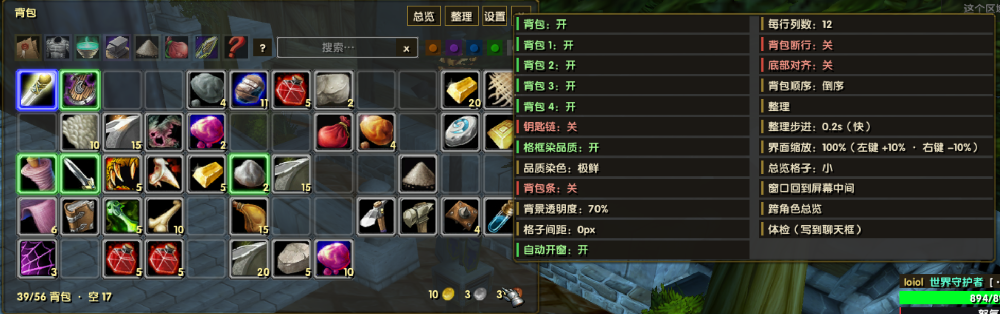
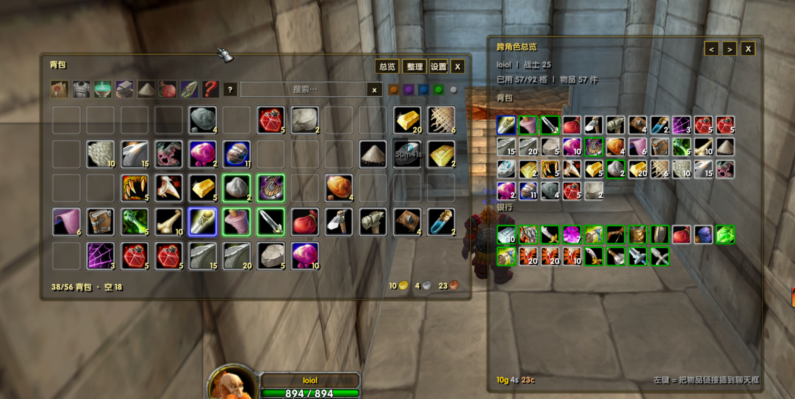

# EH_Bag 整合背包子插件

EmberVeil 客户端的**整合背包**：把**背包 0~4 · 钥匙链(-2) · 银行主格(-1，24 格) · 银行包 5~10** 合成**一扇窗**，
功能按 TurtleWoW **OneBag** 逐项对齐（品质染色 · 类型/品质筛选 · 搜索 · 一键整理 · 金钱 · 计数 · 悬停高亮 ·
跨角色总览 · 右键设置菜单），并且**零依赖、绝对自包含**（贴图素材全部自带，绝不引用别的插件目录）。

> 本插件是 EvalHelp 的独立子插件：自带 `.toc`、自带存档 `EH_BAG_CFG`（`SavedVariables\EH_Bag.lua`）、
> 自带三份文档 —— 本文件（面向使用者）· `CLAUDE.md`（开发记忆体）· `CHANGELOG.md`（改动记录，`0.3.x` ↔ 宿主 `1.75.y`）。
>
> ★**与其它整合背包插件（OneBag / OneBank / Bagnon …）互斥**：载入期检测到就**自动让位**（不接管背包、不碰原生容器帧）
> 并在聊天框强制提示；确要同开就敲 `/ebag force`（风险自负）。

## 打开方式

- 客户端自带背包键：`B`（背包）/ `F8`~`F11`（各背包）/ `C`
- **开银行 / 商贩 / 交易 / 拍卖** ⇒ 自动开窗（可关：设置菜单「自动开窗」或 `/ebag auto off`）
- 窗口**右上四颗**按钮：**[总览]**（跨角色总览）· **[整理]**（一键整理）· **[设置]**（设置菜单）· **[×]**（关窗）
- `/ebag` 开/关窗 · `/ebag help` 打印全部命令

## 界面构成

- **标题行**（玩家名 / 头衔 / 方案名那一族不在此窗）→ 本窗：标题「背包」+ **容量行**（已用 N/M 格 ｜ 空 K）+ **金钱行**（金/银/铜三对「数字 + 图标」）
- **标题行右上四颗按钮**：**[总览]** · **[整理]** · **[设置]** · **[×]**（关窗）—— 与顶栏那排是两层，别混
- **顶栏一排**：**8 类类型图标**（任务/装备/消耗/贸易/试剂/容器/投掷/其它）· **操作提示「?」** · **搜索框** · **5 颗品质圆点**（右对齐）
  - 窄窗一排塞不下 ⇒ 搜索框与圆点**自动掉到第二排**，窗口高度跟着长
- **内容区**：网格（列数 4~20，默认 12）；格子 = 自带圆角白框 + 品质辉光（ADD） + 图标（格子的 90%）+ 数量 + 冷却
- **左侧背包条 / 右侧银行包条**（包图标；未购买的银行包画红环 + 状态行报下一格花费）
- **拖拽柄**：标题行左侧（拖动整窗；位置记忆落存档，越界自动回正中）

## 界面预览

**主窗 + 右键「设置」菜单**（图里菜单是展开状态）：

- **顶栏一排**（左 → 右）= **8 类类型图标** · **操作提示「?」** · **搜索框** · **5 颗品质圆点**（右对齐）；窗口窄时搜索框与圆点**自动掉到第二排**，窗口跟着长高
- **格子** = 自带圆角白框 + **品质辉光**（品质 ≥2 才点亮，白装/灰装/空格是中性框）+ 图标 + 数量
- **容量行**（左下）`38/56 背包 · 空 18` · **金钱行**（右下）= 金/银/铜三对「数字 + 图标」
- **设置菜单 = 两列共 24 行**：逐背包显隐（背包 / 背包 1~4）· 钥匙链 · 格框染品质 · 品质染色 · 背包条 · 背景透明度 · **格子间距** · 自动开窗 ｜ **右键直投窗口** · 每行列数 · 背包断行 · 底部对齐 · 背包顺序 · 整理 · 整理步进 · 界面缩放 · 总览格子 · 窗口回到屏幕中间 · 跨角色总览 · 体检
- 菜单行字色：**开 = 绿 · 关 = 红 · 纯数值行 = 中性金**（截图里「品质染色: 极鲜」「界面缩放: 100%」就是数值行）
- ★**点完一行菜单不关**，点菜单外面才关（方便连着调好几项）

**主窗 + 跨角色总览**（`/ebag view` 或点窗口右上「总览」按钮）：

- 总览窗右上三颗 = `<` `>` `X`（切换角色 / 关闭窗口）
- 往下 = **角色行**（`名字 ｜ 职业 等级`）· **容量行**（`已用 57/92 格 ｜ 物品 57 件`）
- **「背包」与「银行」两段**：段内是一个**连续网格**（不按包另起一行；钥匙链归背包段）；段里放不下时容量行会追加「只显示 N/M 件」，**绝不静默截断**
- 格子大小可在设置菜单「总览格子」里切 `小 / 中 / 大`
- **底部提示**「左键 = 把物品链接插到聊天框」—— 总览是**只读**的账号级快照，点格子只把链接插进聊天框（不会移动物品）

## 功能

- **布局**：默认**连续排布**（不按包另起一行）；设置菜单可切「背包断行」「底部对齐」「背包顺序（正序/倒序）」
- **品质染色**（两件独立的事）
  - **格框染品质**（开关）：品质 ≥2 的格子点亮**品质色辉光**（白装/灰装/空格保持中性）
  - **品质染色浓淡**：`标准 / 鲜丽 / 极鲜` 三档，只改「提纯 + 亮度」，**点了立刻生效**（不需要 `/reload`）
  - ★0.3.30 起**不再按颜色亮度归一**（0.3.29 那版会把比蓝亮的档**调暗**，已按用户要求撤销）⇒ 各档写的是**同一个强度**，颜色不同、**亮色档（绿/橙/悬停金）看起来更亮更粗**（`/ebag status` 有两行读数）
  - ★0.3.31 起，**每档品质有独立亮度系数** `B.QUAL_K`（默认：**绿 0.80 / 蓝 1.15**，其余档 = 1 不变）—— 乘在**底色颜色**与**辉光写值 α** 上（色相不变、只变明暗）；微调只改 `EH_Bag.lua` 里这一张表，`/ebag status` 的「外观」行会列出当前系数
- **筛选**：8 类类型（单选）· 5 档品质（单选）· 搜索框（支持名字/类型）
- **一键整理**：`/ebag sort` · 窗口右上 **[整理]** 按钮 · 菜单「整理」行（三处同一个口；再触发一次 = 停止）；**一件一件搬给你看**（每步一对 `PickupContainerItem`，步进可调）；★**实时显示（0.3.35）**：每搬一件**当场**用已知记录直接画动过的那两格（源格变空、落格亮出刚搬进的那件 —— 本客户端容器读回在整理中滞后，不等它），戳记保护期内周期重刷不会把它盖回空格；★**排布口径（0.3.32）**：物品按「大类 → 品质 → 名称」排好后**靠背包区末尾对齐**（空位留在靠前那一段）—— 默认「背包顺序 = 倒序」时，等于**从窗口左上角开始填满**
- **跨角色总览**：账号级快照（每个角色进游戏时把自己的包/银行压成一份快照），**只读**——点格子把物品链接插进聊天框；打开 = 窗口右上 **[总览]** 按钮 · 菜单「跨角色总览」行 · `/ebag view`
- **右键设置菜单**：点完一行**不关菜单**，点菜单外面才关
- **右键直投窗口**（0.3.33，默认**开**）：**拍卖行「出售」页 / 写邮件页 / 交易窗**开着时，**右键背包物品直接放进去**（不必拖）；
  只在这三扇窗开着时才接管 —— 窗口都关着时右键**行为一个字节没变**（照旧使用物品）。
  `Shift+右键`照旧 = 使用物品；开关 = 设置菜单「右键直投窗口」行 或 `/ebag drop on|off`；只读体检 = `/ebag drop`
- **悬停**：格子出客户端原生气泡（沿用客户端的信息，不自己拼简版）；空格不弹提示
- **悬停背包条图标** ⇒ 整个包高亮

## 命令全表（`/ebag …`）

| 命令 | 作用 |
| :-- | :-- |
| `/ebag` | 开 / 关背包窗 |
| `/ebag on` ｜ `off` | 打开 / 关闭接管（`off` = 还给原生背包） |
| `/ebag force` ｜ `yield` | 强行接管 / 恢复自动让位（与其它整合背包插件同开时用） |
| `/ebag sort` | 一键整理（再敲一次 = 停止） |
| `/ebag cat <类型>` | 类型筛选（`all`｜`quest`｜`equip`｜`consume`｜`trade`｜`reagent`｜`container`｜`projectile`｜`other`） |
| `/ebag qual <档>` | 品质筛选（`all`｜`0`~`6`） |
| `/ebag cols N` | 每行列数（4~20） |
| `/ebag dir fwd` ｜ `rev` | 背包顺序（正序 / 倒序） |
| `/ebag gap [秒｜档位]` | 整理步进（`0.45`｜`45`（百分秒）｜档位名 `逐项`/`标准`/`快`/`极快`；无参数 = 只读播报） |
| `/ebag auto on` ｜ `off` | 开银行/商贩/交易/拍卖时自动开窗 |
| `/ebag scale [N]` | 界面缩放（50%~120%，认 `85` 也认 `0.85`） |
| `/ebag alpha <0~100>` | 窗口背景透明度（也认小数 `alpha 0.45`） |
| `/ebag cgap [0~16]` | 格子间距（0 = 格子紧贴，只影响主背包网格） |
| `/ebag tint 标准｜鲜丽｜极鲜` | 品质染色浓淡（也认序号 1/2/3） |
| `/ebag vsize 小｜中｜大` | 跨角色总览格子大小 |
| `/ebag center` | 窗口回到屏幕中间（越界自愈的手动兜底） |
| `/ebag reset` | 窗口位置回正中 + 全部背包/钥匙/银行包恢复显示 |
| `/ebag view` | 跨角色总览（只读） |
| `/ebag menu` | 设置菜单（与右上「设置」同一个口） |
| `/ebag chars` | 列出存档里已记录的角色 |
| `/ebag snap` | 立刻记录本角色快照 |
| `/ebag status` | **体检**（开关/让位/挂钩/容器/格子数/构建 + 空格框自证 + 辉光读数 + 外观 + 资源来源 …） |
| `/ebag trace [N｜clear]` | 开合取证环（按键到底调了哪个函数） |
| `/ebag tip` | 物品信息最近一次判定（走的哪条路 / 客户端口读到几行） |
| `/ebag split` | 拆分确认窗最近的取证（问了几个 / 移动了几个 / 取消还是落格） |
| `/ebag cd` | 冷却体检（在走几格 / 客户端写了几次 / 写前比对跳过几次 / 取证环） |
| `/ebag bankread` | 银行读数体检（**只读**：银行主格逐格的链接/贴图/气泡名；明细落存档） |
| `/ebag res` | 资源体检（**只读**：15 条固定贴图的「自带/客户端」来源 + 负对照，逐条摊开） |
| `/ebag drop [on｜off]` | **右键直投窗口**开关（无参数 = **只读**体检：帧名/页签/三个 `Click*` 口在不在 + 取证环） |

## 默认档（第一次使用 / 老存档一次性升级时会播报一次怎么改回去）

背包顺序 **倒序** · 整理步进 **0.2s（快）** · 界面缩放 **80%** · 背包条 **关** · 钥匙链 **关** ·
格框染品质 **开** · 品质染色 **鲜丽** · 自动开窗 **开** · **右键直投窗口 开** · 每行列数 **12** · 总览格子 **小** ·
背包断行 **关** · 底部对齐 **关** · 背景透明度 **45%**

## 设置项（右键「设置」= 窗口右上那颗按钮）

逐背包显隐（背包 / 背包1~4）· 钥匙链 · 格框染品质 · 品质染色 · 背包条 · 背景透明度 · 自动开窗 ·
**右键直投窗口** · 每行列数 · 背包断行 · 底部对齐 · 背包顺序 · 整理 · 整理步进 · 界面缩放 · 总览格子 · 窗口回到屏幕中间 ·
跨角色总览 · 体检。
（★**行清单的唯一来源 = 代码里的 `B.menuItems()`**；开关行的字色：开 = 绿 / 关 = 红 / 数值行 = 中性金。）

## 已知边界（如实告知）

1. **没搬参考插件的四样**：① `!Libs` 依赖（本子插件零依赖、自己实现）；② `bindings.xml` 自带绑定（直接用客户端自带的背包键）；
   ③ `scale/alpha/strata/clamped` 那组窗口外观配置（本插件只做**位置记忆**）；④ MrPlow 之类外部联动。其余（含开/关窗音效）全部照搬。
2. **整理步进 0.2s ≈ 10 次写动作/秒**（高于本项目「服务器写动作 > 1~2 次/s 必限频」的在案规则）——
   要稳就 `/ebag gap 逐项`（0.45s）或 `标准`（0.30s）。
3. **物品/法术/宏图标**的贴图路径是**客户端数据现给**的（几万张，没法自带）；分类图标的第二顺位是客户端的 UE 资产路径。
   15 张固定贴图已全部自带（`media\`），`/ebag res` 可现场核。
4. **银行主格**走人物装备槽 `40..63`；本客户端 `GetInventoryItemLink` 对银行槽**不给链接** ⇒ 跨角色快照靠「自建隐形气泡反查」补齐（`/ebag bankread` 体检）。
5. **跨角色总览**是**只读**的账号级快照：同名物品**不合并**成一格，点格子 = 把链接插进聊天框；总览窗的金钱行仍是纯文本。
6. **左侧条按钮固定 30px**（与总览格子大小解耦）——这是当初点名的大小，改总览档位不会带动它。
7. **悬停**只由**辉光贴图的颜色与亮度**表达（不描像素宽度的边框）；空格悬停 = 金色辉光，不弹气泡。
8. **右键直投窗口**只在**拍卖行「出售」页 / 写邮件页 / 交易窗**开着时接管，且**判不出就不动手**：
   页签读不出、`Click*` 口拿不到（拍卖行 UI 是按需加载的）、交易格满 ⇒ **这一下既不投、也不使用物品**（如实出声）；
   **本插件绝不清光标** —— 万一东西还留在光标上，会如实提醒你自己放（清掉就等于把东西弄丢）。
9. 与其它整合背包插件**互斥**（见文件开头）。

## 排查（碰到问题先看这两步）

1. 先确认客户端跑的是**当前这份代码**：改动后要 `/reload`（截图/读数与源码对不上时，先重载再拍）。
2. 敲 **`/ebag status`** —— 它把「开关 / 让位 / 挂钩 / 容器 / 格子数 / 构建版本 + 空格框自证 + 辉光读数 + 外观 + 冷却 + 悬停格 + 资源来源 + 快照反查」一次摊开；
   细分取证走 `/ebag trace`｜`tip`｜`split`｜`cd`｜`bankread`｜`res`。
   存档在 `SavedVariables\EH_Bag.lua`（**只在 `/reload` / 退出时写盘**）。

## 素材与预览图

- `media\README.txt` = 每张贴图的**出处 / 用途 / 几何 / 生成脚本 / 复算判据**（含「辉光向外泛光必须 = 0」那条改判）。
- `preview\` = 本文上面那两张**界面预览截图**（`info.png` 设置菜单 / `bank.png` 跨角色总览），
  **仅供说明、不入发布包**，游戏里也不会载入它们（只有 `.toc` 里列出的文件才载入）。
  ★换功能后截图会过期 ⇒ 重拍时**文件名照旧用这两个名字**（说明文字与图必须对得上，不许旧图配新文案）。
