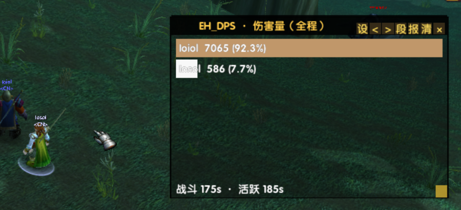
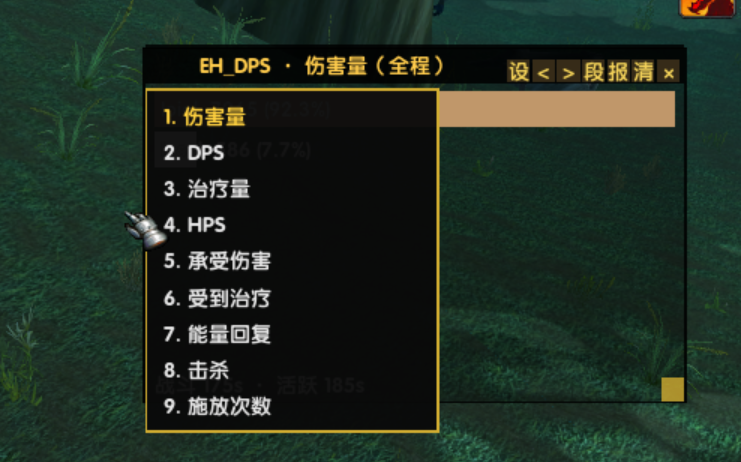

# EH_DPS · 队伍伤害统计（自娱自乐版）

> 📢 **发布 / 下载地址**：[emberveil 一键宏 · 插件发布（KOOK）](https://www.kookapp.cn/app/channels/7071527711947717/5336773639081280) —— 本子插件每版都在那里单独发帖（更新概要 + 封面/截图 + 下载包链接）；发布页见 [GitHub](https://github.com/lihaibo123as/emberveil_eval_help/releases) ｜ [Gitee](https://gitee.com/xeval/emberveil_eval_help/releases)。

EmberVeil 客户端的**队伍级伤害统计**独立子插件：解析战斗文本（SCT 模式），
把队伍/团队里每个人的伤害 / DPS / 治疗 / HPS / 承受伤害 / 受到治疗 / 能量回复 / 击杀 / 施放次数
按玩家出条目，点条目下钻到该玩家的技能分解。

> ⚠️ **自娱自乐版：准确度不保证。** 本客户端没有结构化战斗事件与 GUID API，
> 所有数据来自战斗聊天文本的句式解析（zhCN）。自己的数据最全；队友数据依赖
> 战斗日志文本是否派发与句式是否对得上，缺漏用 `/edps 捕获` + `/edps 事件` 校准。
> 数据口径参考 ShaguDPS（TurtleWoW）。

## 打开方式

- 宿主插件 EvalHelp → 配置窗 → ⑦ 子插件 → 战斗组勾选「伤害统计（EH_DPS）」→ 重载界面。
- **启用后窗口默认直接显示**；点 [×] 关闭会记住（下次载入不再自动弹），`/edps` 再开即恢复。

## 功能地图

- **9 个视图**（标题栏 `<` `>` 循环，或**右键标题栏弹下拉菜单直接选**），全部按玩家出条目：
  伤害量 · DPS · 治疗量 · HPS · 承受伤害 · 受到治疗 · 能量回复 · 击杀 · 施放次数。
  ★击杀/能量回复/施放次数只有自己的数据（战斗文本不署别人的名，如实告知）。
- **下钻明细**：点击玩家条目 → 该玩家的技能/来源分解；标题左侧 [返] 回退（换视图/换段自动退回）。
- **悬停明细**：总量/占比 + 技能前 5 名。
- **职业染色**：条目按玩家职业染色（**标准经典职业色、不透明**）；**每个视图标题配不同颜色**。
- **双段数据**（标题栏 [段] 切换）：当前战斗 / 全程；脱战自动记战斗时长，全程段跨重载保留。
- **DPS 口径**：活跃时间制（每名玩家各自的 EDPS，5 秒规则，与 ShaguDPS 同一算法）。
  ★活跃时间不足 1 秒时（还没有可信读数）该行**不折算每秒**，而是显示**本段总量**并在数字后加 `*`（悬停有说明）。
- **[报]**：把当前视图前 5 行发到聊天（说/队伍/团队；0.6 秒逐条，发完才能再报）。
- **[设]**：配置面板（条目高度 22~30 · 背景透明度 0.30~1.00），即时生效并记忆。
- **窗口**：标题栏拖拽移动（左上角锚）· 右下角拖拽改尺寸 · Ctrl+滚轮整窗缩放（0.6~1.6）。

## 命令表

| 命令 | 作用 |
| :-- | :-- |
| `/edps` / `/edps ui` | 打开/关闭统计窗 |
| `/edps 视图 [序号或名]` | 切换视图（不带参数 = 下一个） |
| `/edps 当前` / `/edps 全程` | 切换数据段 |
| `/edps 重置` | 清空全部统计 |
| `/edps 报告 [说|队伍|团队]` | 发送当前视图前 5 行 |
| `/edps 开` / `/edps 关` | 总开关（关 = 收窗 + 停节拍 + 摘事件） |
| `/edps 捕获` | 开关「未识别战斗文本落环」诊断 |
| `/edps 事件` | 查看捕获环（最近 15 条） |
| `/edps 状态` | 版本 / 开关 / 视图 / 名册 / 捕获环状态（+ 时钟倒退取证，正常恒 0） |

## 界面预览

> 📷 图 1 = 统计窗实战（伤害量：条目按玩家职业染色 · 占比与进度条 · 底部战斗/活跃时间 ·
> 标题栏 [设] 配置 · `<` `>` 切视图 · 段/报/清/× · 右下角尺寸拖拽柄）；
> 图 2 = 右键标题栏弹出的视图菜单（9 个视图，当前项金色，点行即切、点外即关）。
> `preview\` 只是说明文件的图源，**不进发布包**。

## 本客户端已知边界

- 事件源 = `CHAT_MSG_*` **文本**事件（zhCN 句式匹配）；个别句式与模式表不符时会漏记，
  用 `/edps 捕获` + `/edps 事件` 把原文发给作者校准。
- **没有**：仇恨视图、精确溢出伤害、护盾吸收转治疗 —— 客户端没有对应 API，不是没做。
- 队伍数据 = 文本解析，准确度低于 ShaguDPS 的 Nampower 结构化数据（本客户端没有那个补丁）。
