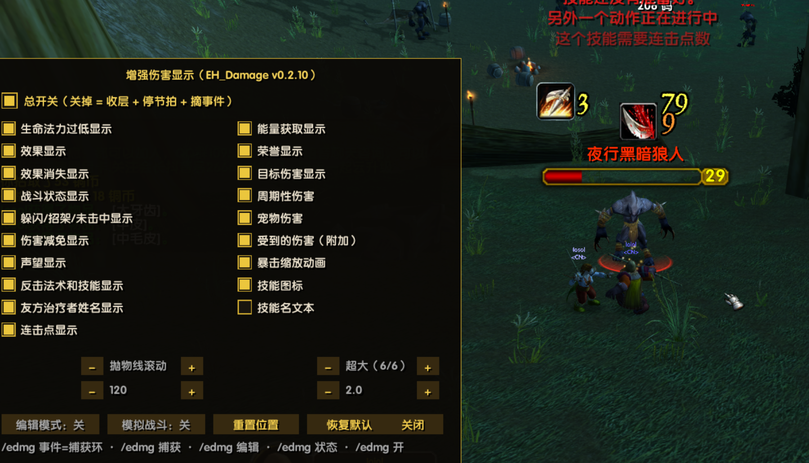
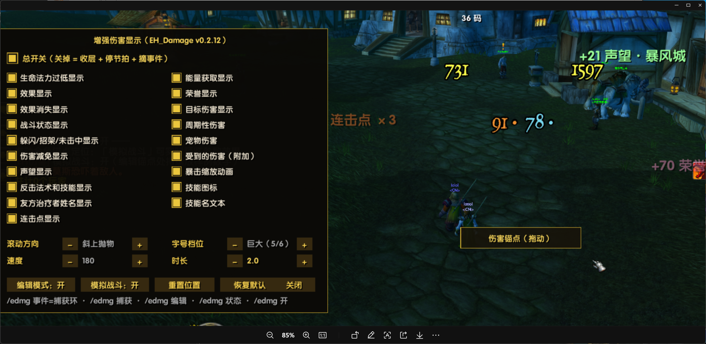

# EH_Damage · 增强伤害显示（浮动战斗信息）

EmberVeil 客户端的**增强浮动战斗文字**独立子插件：把你造成的伤害/治疗/效果/战斗状态等信息
以可配置的动画形式飘在屏幕上。动画引擎参考 DamageEx（Nampower 版），事件解析走 SCT 模式
（本客户端没有结构化战斗事件与 GUID API，也没有可附着的姓名板帧）。

## 打开方式

- 宿主插件 EvalHelp → 配置窗 → ⑦ 子插件 → 战斗组勾选「增强伤害显示（EH_Damage）」→ 重载界面。
- 命令 **`/edmg`**（或 `/edamage`）打开配置面板。

## 功能地图

- **19 项勾选**（网格两列）：15 类显示项（与游戏「浮动战斗信息」设置页对齐）——
  生命法力过低 · 效果显示 · 效果消失 · 战斗状态 · 躲闪/招架/未击中 · 伤害减免 · 声望 ·
  反击法术和技能 · 友方治疗者姓名 · 连击点 · 能量获取 · 荣誉 · 目标伤害 · 周期性伤害 · 宠物伤害，
  另有附加项「受到的伤害」；+ 3 个开关：**暴击缩放动画 · 技能图标 · 技能名文本（默认关）**。
- **参数 2×2 两列**：滚动方向 **8 种循环**（向上 / 向下 / 抛物线 / 斜上抛物 / 斜下抛物 / 水平散开 /
  洒水散开 / 正弦上升）· 字号档位 **6 档**（小/中/大/特大/巨大/超大 —— 特大档数字用 `NumberFontNormalHuge`、
  中文用 `GameFontNormalHuge`；本客户端不认「改字号」，只有分档字体对象有效）· 速度 · 时长。
- **技能图标**：法术书扫描建「技能名→图标」缓存，图标锚在文字左缘、尺寸随档位公式现算
  （`行距 × 0.45`）、垂直对齐字面；查不到/关着一律不画（绝不画 ? 图）。
- **编辑模式**：`/edmg 编辑` 出现金色锚点（拖动定位）；`/edmg 模拟` 在锚点处持续放样例数字，
  改参数立刻看到效果 —— 不需要真打怪就能调好手感。
- **动画**：smoothstep 淡入淡出 · 暴击抬档 · 彩虹抛物线等 8 种轨迹 · 同车道防重叠（新字恒从锚点出发）。

## 命令表

| 命令 | 作用 |
| :-- | :-- |
| `/edmg` / `/edmg ui` | 打开/关闭配置面板 |
| `/edmg 编辑` | 编辑模式开关（拖拽锚点） |
| `/edmg 模拟` | 模拟战斗开关（自动进编辑模式） |
| `/edmg 开` / `/edmg 关` | 总开关（关 = 收层 + 停节拍 + 摘事件） |
| `/edmg 测试` | 放 3 条样例字 |
| `/edmg 字号探针` | 字号机制取证：A~H 八种机制并排画样本（10 秒自动收）—— 哪行明显大就把字母发给作者 |
| `/edmg 捕获` | 开关「未识别战斗文本落环」诊断 |
| `/edmg 事件` | 查看捕获环（最近 10 条） |
| `/edmg 状态` | 当前配置与槽池状态 |

## 界面预览

> 📷 图 1 左 = 配置面板（19 项勾选网格：16 显示项 + 暴击动画/技能图标/技能名文本 3 开关 · 2×2 参数：滚动方向/字号档位/速度/时长 · 底部编辑模式/模拟战斗/重置位置/恢复默认）；
> 图 1 右 = 实战效果（伤害数字 + 技能图标）；图 2 = 标签版式面板 + 实战同屏（伤害 / 声望·暴风城 / 连击点 / 荣誉 / 暴击大字 · 右下角金色「伤害锚点（拖动）」= 编辑模式）。
> `preview\` 只是说明文件的图源，**不进发布包**。

## 本客户端已知边界

- 伤害来源事件 = `CHAT_MSG_*` **文本**事件（zhCN 模式匹配）；个别事件的文本格式若与模式表不符，
  数字会出不来 ⇒ 用 `/edmg 捕获` + `/edmg 事件` 把原文发给作者校准。
- **没有**姓名板附着（本客户端姓名板不是 Lua 帧）与 GUID 级目标识别（客户端无 GUID API）——
  这不是没做，是客户端给不了。
