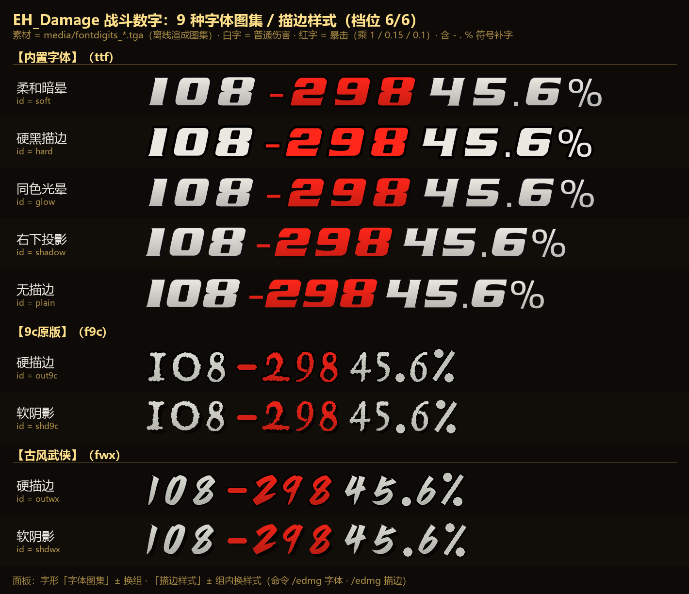
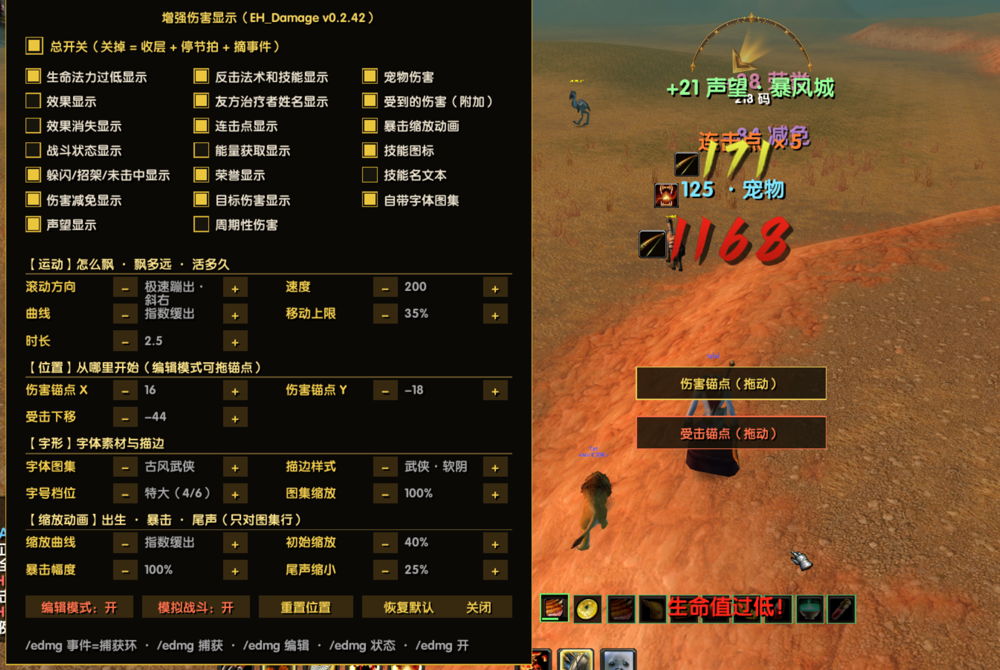

# EH_Damage · 增强伤害显示（浮动战斗信息）

> 📢 **发布 / 下载地址**：[emberveil 一键宏 · 插件发布（KOOK）](https://www.kookapp.cn/app/channels/7071527711947717/5336773639081280) —— 本子插件每版都在那里单独发帖（更新概要 + 封面/截图 + 下载包链接）；发布页见 [GitHub](https://github.com/lihaibo123as/emberveil_eval_help/releases) ｜ [Gitee](https://gitee.com/xeval/emberveil_eval_help/releases)。

EmberVeil 客户端的**增强浮动战斗文字**独立子插件：把你造成的伤害/治疗/效果/战斗状态等信息
以可配置的动画形式飘在屏幕上。动画引擎参考 DamageEx（Nampower 版），事件解析走 SCT 模式
（本客户端没有结构化战斗事件与 GUID API，也没有可附着的姓名板帧）。

## 打开方式

- 宿主插件 EvalHelp → 配置窗 → ⑦ 子插件 → 战斗组勾选「增强伤害显示（EH_Damage）」→ 重载界面。
- 命令 **`/edmg`**（或 `/edamage`）打开配置面板。

## 功能地图

> ★**默认档**（2026-10-08 按作者真机配置整份定稿，`恢复默认` 也回到这一套）：
> 勾选 = 生命法力过低 · 躲闪/招架/未击中 · 伤害减免 · 声望 · 反击法术和技能 · 友方治疗者姓名 · 连击点 ·
> 荣誉 · 目标伤害 · 宠物伤害 · 受到的伤害 · 暴击缩放动画 · 技能图标 · **自带字体图集**；
> 不勾选 = 效果显示 · 效果消失 · 战斗状态 · 能量获取 · 周期性伤害 · 技能名文本。
> 参数 = 极速蹦出·斜右 · 字号档位 特大(4/6) · 速度 200 · 时长 2.5 · 曲线 指数缓出 · 移动上限 35% ·
> 受击下移 -44 · 图集缩放 100% · 描边 **同色光晕** · 缩放曲线 指数缓出 · 初始缩放 40% · 暴击幅度 100% · 尾声缩小 25%。
> ★**已有存档不受影响**（只补「缺的键」，你自己调过的值一个字节都不动）。

- **19 项勾选**（网格两列）：15 类显示项（与游戏「浮动战斗信息」设置页对齐）——
  生命法力过低 · 效果显示 · 效果消失 · 战斗状态 · 躲闪/招架/未击中 · 伤害减免 · 声望 ·
  反击法术和技能 · 友方治疗者姓名 · 连击点 · 能量获取 · 荣誉 · 目标伤害 · 周期性伤害 · 宠物伤害，
  另有附加项「受到的伤害」；+ 3 个开关：**暴击缩放动画 · 技能图标 · 技能名文本（默认关）**。
- **宠物伤害**：宠物打出的数字同样按上面两条判断；**提不出数字的宠物文本一律不显示**
  （0.2.27 修：旧版会把整句原文当伤害值画出来），原文句形会进诊断环供校准。
- **参数按功能分四组**（2026-10-09 分组：面板上每组有**金色小标题 + 分隔线**，一眼能找到要调的东西）：
  - **【运动】怎么飘 · 飘多远 · 活多久**：滚动方向 **11 种循环**（向上 / 向下 / 抛物线 / 斜上抛物 / 斜下抛物 / 水平散开 /
    洒水散开 / 正弦上升 / **极速蹦出 / 极速蹦出·斜左 / 极速蹦出·斜右**）· 速度 · 时长 ·
    **曲线函数 4 种**（缓出立方（默认）/ 缓出平方 / **回弹过冲（蹦出途中过冲再回落，最像官方）** / 指数缓出（起步最暴）—— 只对蹦出系方向生效）·
    **移动上限**（数字最多飘出屏幕的百分比，到顶原地停住继续淡出，5~60%）
  - **【位置】从哪里开始**：**伤害锚点 X / Y**（0.2.39 新增的面板旋钮，±10 步进；此前**只能**在编辑模式拖金色锚点）·
    **受击下移**（「受到的伤害」那一行相对主锚点往下多少；旧默认 -170 太靠下 ⇒ 0.2.28 收到 -120，
    **2026-10-08 起出厂默认 -44**）
  - **【字形】字体素材与描边**：**字体图集**（换字形素材：内置字体 / 9c原版 / 古风武侠）· **描边样式**（组内样式）·
    **字号档位 6 档**（小/中/大/特大/巨大/超大 —— 特大档数字用 `NumberFontNormalHuge`、
    中文用 `GameFontNormalHuge`；本客户端不认「改字号」，只有分档字体对象有效）· **图集缩放**（连续细调）
  - **【缩放动画】出生 · 暴击 · 尾声（只对图集行生效）**：缩放曲线 · 初始缩放 · 暴击幅度 · 尾声缩小
  - ★两个锚点字段（伤害锚点 X/Y、受击下移）都是**整数**：面板步进与编辑模式拖拽都会取整 —— 光标本身是浮点，
    不取整就会把 `-43.86591064453` 这种值写进存档、面板上折两行显示。
- **技能图标**：法术书扫描建「技能名→图标」缓存，图标锚在文字左缘、尺寸随档位公式现算
  （`行距 × 0.45`）、垂直对齐字面；查不到/关着一律不画（绝不画 ? 图）。
  **宠物技能也算**（0.2.27）：图标缓存同时扫**宠物动作条**，所以 `Cat的撕咬击中…` 会带出撕咬的图标；
  宠物普攻与玩家平砍不给名字 = 不带图标。宠物换/学技能会自动重扫（不用重载界面）。
- **没伤害的文本一条都不画**（0.2.27）：提不出伤害数字的战斗文本（例如「你施放毒蛇钉刺失败：尚未恢复」
  「Cat的撕咬没有击中雌性草原狮。」）不再被当成伤害画到屏幕上；它们的原文句形会进诊断环供校准。
  同理，**宠物挨打**（「雌性草原狮击中Cat造成8点伤害。」）不会被显示成「你受到的伤害」。
- **编辑模式**：`/edmg 编辑` 出现**两个锚点** —— **金色 = 伤害行起点**（拖动定位）、
  **红色 = 受击行起点**（拖动只改上下距离，也就是面板里的「受击下移」）；`/edmg 模拟` 在锚点处持续放样例数字，
  改参数立刻看到效果 —— 不需要真打怪就能调好手感。
  - 模拟战斗的伤害/持续/宠物三行会**带上你学过的攻击技能名**（轮着换）⇒ **图标 + 数字一起出现**，
    这样连「图标跟着缩放动画一起动」「图标贴着数字组左缘」这些也能在模拟里直接看；
    开了面板「技能名文本」那行会变成「技能名 + 数字」（走中文字体那条路，图标锚在文字左缘）—— 两条路都能测。
  - 样例技能是从**你的法术书里真实解析出图标**的候选（英勇打击/致死打击/背刺/火球术… 宠物：撕咬/爪击…）；
    一个都解析不出（这个角色没学过任何候选）就**如实播报并退回不配图标**（绝不画错图）；学了新技能不用 `/reload`。
- **动画**：smoothstep 淡入淡出 · 暴击抬档 · 彩虹抛物线等 11 种轨迹 + 4 种缓出曲线 · 同车道防重叠（新字恒从锚点出发）。

## 自带字体（战斗数字）

本客户端**不支持**插件给文字换字体 —— `FontString:SetFont` 是**静默失败** API（保持原字体、读回还骗人），
而「自建 Font + SetFontObject(插件自带的 TTF)」被客户端自带插件实测为**文字直接消失**（其知识库明文：
addon 自带 TTF 在本客户端加载不了）。所以自定义战斗字体走**贴图路**：把你选的 TTF **离线渲成数字图集**，
插件用纹理画数字 —— 完全自包含、只影响本插件的战斗数字、**不动客户端任何文件**。

- **开关**：配置面板最下面那个空位 → 勾选「**自带字体图集**」（**2026-10-08 起默认开**，关着就是客户端字体）；命令等价入口 `/edmg 图集开` / `/edmg 图集关`
- **大小两条控制**：
  - **字号档位**（粗调）= 换更粗的一档图，6 档与既有字号档位一一对应；**暴击会自动抬一档**（与字体模式一致）
  - **图集缩放**（细调）= 面板「图集缩放」±5%，60%~200%
- **风格 9 种 = 两行分开选**（2026-10-09：**【字形】组里的「字体图集」选字形，「描边样式」选样式**）：

  **① 面板「字体图集」**（± 循环 / `/edmg 字体 [内置|9c|武侠]`）= 换的是**字形素材**（贴图）：

  | 字体图集 | 可选描边样式 |
  | :-- | :-- |
  | **内置字体** | `soft` 柔和暗晕 · `hard` 硬黑描边 · `glow` 同色光晕 · `shadow` 右下投影 · `plain` 无描边（默认这一组，默认样式 = 同色光晕） |
  | **9c原版** | 硬描边 / 软阴影（成品字形位图，纸片感白字） |
  | **古风武侠** | 硬描边 / 软阴影（成品字形位图，书法斜体、笔画有粗细变化） |

  **② 面板「描边样式」**（± 循环 / `/edmg 描边 <风格>`）= 只在**当前字体图集里**换样式（换字形请用上面那一行）。

  ★**配置真值只有一个**（`faEdge` = 完整图集 id）：上面两行都是它的显示；所以「字体图集」那行只负责换组、
  「描边样式」那行只负责换组内样式 —— 不会出现「两处设置打架」。

  ★**成品字形那 6 种**（9c / 古风武侠 × 硬描边/软阴影）来自**位图素材**（`fonts\` 里的成品图，**不是 TTF**）⇒ 由
  `python tmp/gen_fontatlas_custom.py --install` 离线切成 6 档 TGA + 逐字度量（生成物 `FontDigitsExtra.lua`）。三点如实说明：
  ① 素材里只有 **0-9**，`- . % :` 这四个符号是**按素材的配色/描边宽程序化补**的（否则含 `-` 的「受到伤害」会回落客户端字体）；
  ② 小档位（18/24）是从 512 素材缩下来的 ⇒ 描边只剩 1px 级、比大档略软；
  ③ 素材版权请自行确认：`fonts\` **不进发布包**，但**烘出来的 `media\*.tga` 会进发布包**。

  ★描边颜色与暗晕是**烘进图里**的，仍然按数字颜色自动相配：染色是乘法 ⇒ 白→灰的渐变会变成「你那个颜色的亮→暗」，
  暗色边乘上颜色后依旧是暗色（所以红暴击 = 红字 + 深红边，不会出现一块死黑）。
- **体检**：`/edmg 图集` —— 逐档探「这张贴图到底能不能加载」（**带负对照**：本客户端对不存在的文件也可能报尺寸）、
  **每种风格各探一张**，并放一条样例数字；`/edmg 字体` 看/切字形，`/edmg 描边` 看/切样式
- **缩放动画**（**只对图集行生效** —— 客户端文字那条路缩放已被真机逐条证死，所以不开图集就看不到这段动画）：
  - **出生弹入**：面板「**初始缩放**」= 数字刚出现那一瞬的尺寸，0.35s 内平滑回到 100%（缓出）。
    **默认 40%**（由小涨大）· **100% = 不弹入**（出生即原尺寸）· **>100% = 由大缩回**（另一种观感，最大 150%）
  - **暴击鼓包**：面板「**暴击幅度**」= 暴击数字放大再落回的幅度（0.35s），替代原来那种「啪一下换一张更大的图」；
    **默认 100%**（鼓到 2 倍再平滑回正）· **0% = 不鼓包**（显示「关」）· **范围 0~200%**（2026-10-09 起上限由 100 提到 200，
    面板 ±5 一档）；
    ★0.2.35 起改用**平滑包络**：起手、峰值、回正三处斜率都是 0 ⇒ 放大和回正都不「顿」
  - **尾声缩小**：面板「**尾声缩小**」= 数字生命最后那一段（**与淡出同一相位**：淡出占后 50% 寿命，它就跟着那 50% 走）
    从原尺寸缩到 **(100 − 该值)%，到点正好随文字一起消失** ⇒ 观感就是「缩小切隐藏」；
    **0% = 不缩** · **100% = 缩到下限**（10%，不会出现 0 宽高的纹理），默认 25%
  - ★三个参数**互相独立**：只要「初始缩放」不是 100%，出生弹入就一直在；把「暴击幅度」调到 0 只关掉鼓包；
    「尾声缩小」调到 0 就只淡出不缩小
  - **面板「缩放曲线」**：缓出立方 / 缓出平方 / 回弹过冲 / 指数缓出（与「滚动方向的曲线」同一套），用在出生弹入上
  - 放大时数字会**换用更大的档图再缩下来**（位图字体放大会发虚，这样峰值也不虚）；两个参数都是「不放大」时**不换档**，稳态最清晰
    ★**上限边界（如实）**：素材最大档是 84px ⇒「字号档位 5~6 + 幅度拉很大」时峰值会超过素材（那一下会有点糊），
    要极致清晰就把档位降到 4~5 再配大幅度；幅度 200% 时峰值最高（初始缩放 150% × 3）⇒ 池位帧已加到 2048×512，
    **8 位数字 + 最大档位 + 200% 仍可能略微超宽**（超出部分客户端裁不裁**没验过**）
- **覆盖范围**：数字与 `+ - . % :`；**含中文或字母的整条仍走客户端字体**（技能名、治疗者名、`连击点 ×3` 等）—— 有意不做半吊子混排
- **素材**：`media\fontdigits_1..6.tga`（= `hard`，旧文件名）与 `media\fontdigits_<风格>_1..6.tga`
  （type-10 RLE + alpha，cell 高 = 各档行距）。两条生成路，**互不覆盖**：
  - **换字体（TTF 路）** = 把新 TTF 放进 `fonts\` 再重跑 `python tmp/gen_fontatlas.py`（出 5 种参数式描边）
  - **加成品字形（位图路）** = 把成品图目录放进 `fonts\`、在生成器 `SOURCES` 里登记，再跑
    `python tmp/gen_fontatlas_custom.py --install`（出 6 档 TGA + 生成物 `FontDigitsExtra.lua`）
  ★两条路的**生成器与上游素材都不进发布包**（`fonts\` 除外的是 `media\` 里烘好的图集 —— 那个进包）

  

  > 上图 = **9 种字形 / 描边的实际长相**（档位 6/6，与游戏里同一份素材）：白字 = 普通伤害，红字 = 暴击
  > （乘 `1 / 0.15 / 0.1`），还带上 `-` `.` `%` 三个**程序化补出来**的符号。
  > ★这张图是**拼出来的实物**、不是设计稿：`node tmp/dump_fontmetrics.js`（fengari 真跑两份生成物，
  > 拿游戏真正用的那份逐字度量）+ `python tmp/gen_fontpreview.py`（按 `cx/cw` 逐字切 `media\fontdigits_*.tga`）。
  > 三组 = 面板「字体图集」那一行的三个选项：**内置字体**（5 种参数式描边）/ **9c原版** / **古风武侠**（各 2 种）。

## 命令表

| 命令 | 作用 |
| :-- | :-- |
| `/edmg` / `/edmg ui` | 打开/关闭配置面板 |
| `/edmg 编辑` | 编辑模式开关（拖拽**金色**伤害锚点 / **红色**受击锚点） |
| `/edmg 模拟` | 模拟战斗开关（自动进编辑模式） |
| `/edmg 开` / `/edmg 关` | 总开关（关 = 收层 + 停节拍 + 摘事件） |
| `/edmg 测试` | 放 3 条样例字 |
| `/edmg 捕获` | 开关「未识别战斗文本落环」诊断 |
| `/edmg 事件` | 查看捕获环（最近 10 条） |
| `/edmg 状态` | 当前配置与槽池状态 |
| `/edmg 图集` | 自带字体图集体检（逐档 + 每种风格探贴图 + 负对照 + 放样例） |
| `/edmg 字体` | 看当前**字体图集**（字形素材）+ 列出三组各可选哪些样式 |
| `/edmg 字体 <内置\|9c\|武侠>` | 切换字体图集（等价于面板「字体图集」那一行；也认组 id `ttf`/`f9c`/`fwx`） |
| `/edmg 描边` | 看当前描边样式 + 按字体图集分组列出全部可选 |
| `/edmg 描边 <风格>` | 切换描边样式（仅限当前字体图集里的样式，也认中文名） |
| `/edmg 图集开` / `/edmg 图集关` | 图集模式开关（等价于面板勾选） |

## 界面预览

> 📷 **左 = 配置面板（v0.2.42 现版）**：21 项勾选（**总开关** + 16 类显示项 + **暴击缩放动画 / 技能图标 / 技能名文本 / 自带字体图集** 四个开关，
> **2026-10-09 起按三列排列**：7 + 7 + 6 行）·
> 参数区 **4 组 9 行**（**【运动】** 滚动方向 / 速度 · 曲线 / 移动上限 · 时长 —— **【位置】** 伤害锚点 X / 伤害锚点 Y · 受击下移 ——
> **【字形】** 字体图集 / 描边样式 · 字号档位 / 图集缩放 —— **【缩放动画】** 缩放曲线 / 初始缩放 · 暴击幅度 / 尾声缩小）·
> 底部 `编辑模式` `模拟战斗` `重置位置` `恢复默认` `关闭` + 一行用法提示。
> 图里那台配置：**方向 极速蹦出·斜右** · 速度 200 · 时长 2.5 · 移动上限 35% · 锚点 (16, −18) · 受击下移 −44 ·
> **字体图集 = 古风武侠 · 描边样式 = 武侠·软阴影** · 档位 特大(4/6) · 缩放 100% · 初始 40% · 暴击 100% · 尾声 25%。
> **右 = 实战**：声望 `+21 声望 · 暴风城`（绿）· 宠物伤害 `125 · 宠物`（带技能图标）·
> **暴击大字 `1168`**（红色 + 图标，放大后平滑回正）· 金色「伤害锚点（拖动）」与红色「受击锚点（拖动）」= 编辑模式的两个原点。
> 图里的数字就是**古风武侠·软阴影**那套字形（对照上一节的 9 种对照图）。
> > `preview\info.png` 是 0.2.35 时代的旧面板截图（7 行平铺版），**留档对照、不再引用**；
> > 本节的 `font1.png` 为 v0.2.42 现版（面板功能与图一致）。
> > 图里「时长 2.5」「尾声缩小 25%」是作者当时的手调值，与出厂默认一致（以本文件上面「默认档」那一栏为准）。
> `preview\` 只是说明文件的图源，**不进发布包**。

## 本客户端已知边界

- 伤害来源事件 = `CHAT_MSG_*` **文本**事件（zhCN 模式匹配）；个别事件的文本格式若与模式表不符，
  数字会出不来 ⇒ 用 `/edmg 捕获` + `/edmg 事件` 把原文发给作者校准。
- **没有**姓名板附着（本客户端姓名板不是 Lua 帧）与 GUID 级目标识别（客户端无 GUID API）——
  这不是没做，是客户端给不了。
- 伤害数字**只会出现在固定锚点**（本插件自绘，屏幕空间）；**做不到**让它跟着怪头顶那条浮动姓名板 ——
  本客户端姓名板是引擎（UE）自己画的 widget，插件侧拿不到它的句柄，也没有单位世界坐标/世界→屏幕 API。
  这是客户端能力边界，不是没做（取证与结论见子插件 `CLAUDE.md` 的对应判据）。
- 「受到的伤害」那几行**从锚点出发后还会继续往下漂**（这个车道固定向下滚）：
  起点用**红色受击锚点 / 「受击下移」**定，**漂多远**用**「移动上限」**定（默认 30% 屏高）；
  两个都调过还是觉得跑太远，就把「移动上限」压到 10% 左右。
